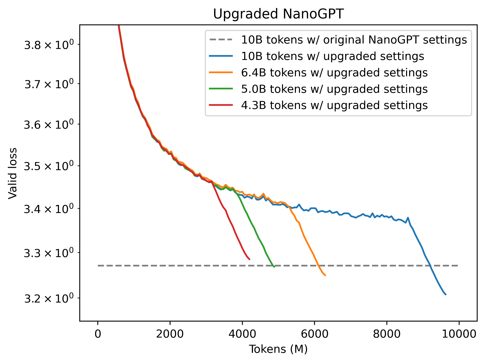

# Modded-NanoGPT

This is a variant of the [PyTorch GPT-2 trainer](https://github.com/karpathy/llm.c/blob/master/train_gpt2.py) from
Andrej Karpathy's [llm.c](https://github.com/karpathy/llm.c) repo. It:
* Trains 2x more efficiently (taking only 5B tokens instead of 10B to reach the same validation loss).
* Has simpler code (413 lines instead of 858).
* Implements modernizations like rotary embeddings.



To run it:
```
python data/cached_fineweb10B.py
./run.sh
```

This will produce a 124M-parameter transformer trained on 5B tokens, which has 3.2818 validation loss on the Fineweb validation set.
For comparison, the original llm.c trainer yields 3.2847 validation loss after training for 10B tokens.

To simplify the code, some features have been removed, including text generation. And to obtain a training speed improvement, we have diverged
a bit architecturally and in terms of hyperparameters from being a strict reproduction of the GPT-2 paper.

The speedup is due to the following changes:
- Increased learning rate by 3x
- Switched to trapezoidal learning rate schedule following [2405.18392](https://arxiv.org/abs/2405.18392)
- Switched to rotary embeddings
- Removed the special initialization for linear layers before residuals. Instead, just scale down the output of the attention block by a fixed scalar.
- Removed all affine scale and bias parameters from the architecture, and switched to RMSNorm (actually this causes a slight slowdown, and I just did it to reduce code complexity)

