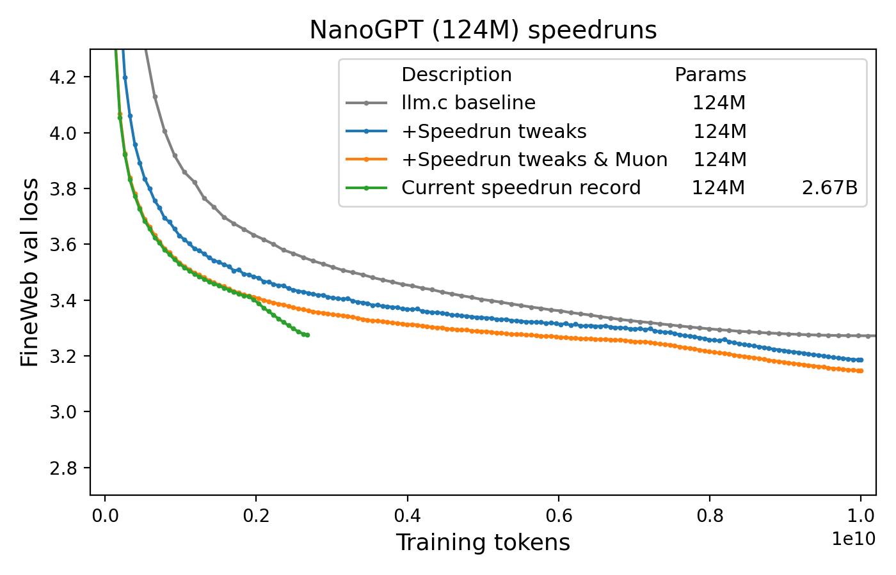
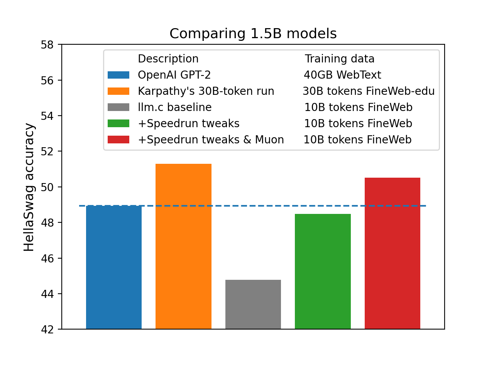
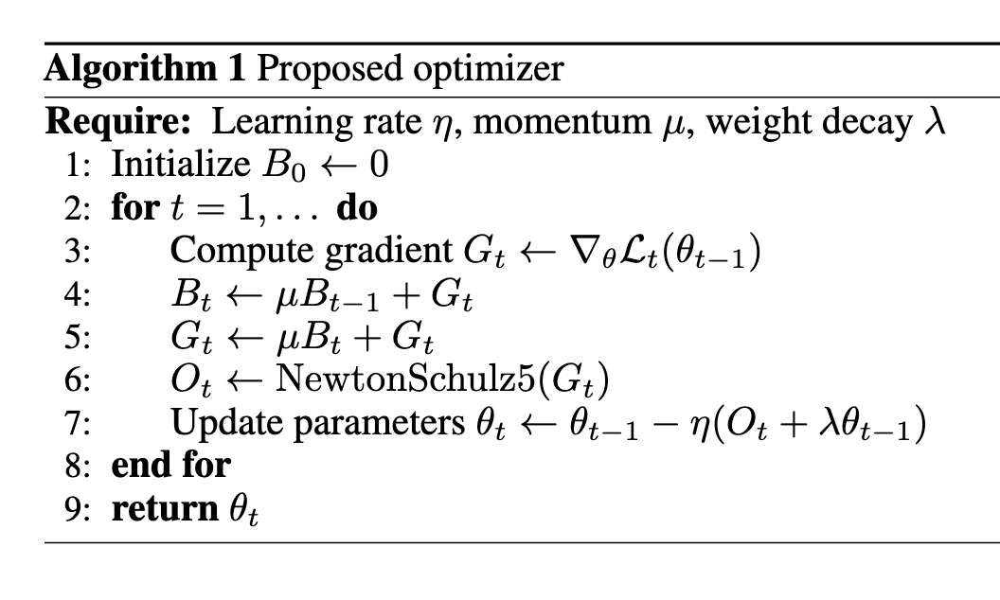

# Modded-NanoGPT

This repository hosts the *NanoGPT speedrun*, in which we (collaboratively|competitively) search for the fastest algorithm to use 8 NVIDIA H100 GPUs to train a language model that attains 3.28 cross-entropy loss on the [FineWeb](https://huggingface.co/datasets/HuggingFaceFW/fineweb) validation set.

The target (3.28 validation loss on FineWeb) follows Andrej Karpathy's [GPT-2 replication in llm.c, which attains that loss after running for 45 minutes](https://github.com/karpathy/llm.c/discussions/481#:~:text=By%20the%20end%20of%20the%20optimization%20we%27ll%20get%20to%20about%203.29).
The speedrun code also descends from llm.c's [PyTorch trainer](https://github.com/karpathy/llm.c/blob/master/train_gpt2.py), which itself descends from NanoGPT, hence the name of the repo.
Thanks to the efforts of many contributors, this repo now contains a training algorithm which attains the target performance in:
* 2 minutes on 8xH100 (the llm.c GPT-2 replication needed 45)
* under 500M tokens (the llm.c GPT-2 replication needed 10B)

This improvement in training speed has been brought about by the following techniques:
* Modernized architecture: Rotary embeddings, QK-Norm, and ReLU²
* The Muon optimizer [[writeup](https://kellerjordan.github.io/posts/muon/)] [[repo](https://github.com/KellerJordan/Muon)]
* Use FP8 matmul for head, and asymmetric rescale and softcap logits
* Initialization of projections to zero (muP-like)
* Skip connections from embedding to every block as well as from block 3 to 6
* Extra embeddings which are mixed into the values in attention layers (inspired by Zhou et al. 2024)
* Flash Attention 3 with long-short sliding window attention pattern (inspired by Gemma 2) and window size warmup with YaRN
* Align training batch starts with EoS and set a max document length
* Accumulate gradients for 2 steps for embedding and lm_head before updating parameters
* Enable model to back out contributions from first 2/3 layers before prediction
* Polar Express implementation in Muon
* Smear module to enable 1 token look back
* Sparse attention gate
* NorMuon
* Cautious Weight Decay w/ schedule tied to LR
* Exponential decay of residual stream
* Batch size schedule
* Partial Key Offset
* Multi token prediction
* Untie embed and lm_head at 2/3 of training
* Additional gating on value embeddings and skip connection
* Paired head attention

As well as many systems optimizations.

Contributors list (growing with each new record): [@bozavlado](https://x.com/bozavlado); [@brendanh0gan](https://x.com/brendanh0gan);
[@fernbear.bsky.social](https://bsky.app/profile/fernbear.bsky.social); [@Grad62304977](https://x.com/Grad62304977); 
[@jxbz](https://x.com/jxbz); [@kellerjordan0](https://x.com/kellerjordan0);
[@KoszarskyB](https://x.com/KoszarskyB); [@leloykun](https://x.com/@leloykun);
[@YouJiacheng](https://x.com/YouJiacheng); [@jadenj3o](https://x.com/jadenj3o);
[@KonstantinWilleke](https://github.com/KonstantinWilleke), [@alexrgilbert](https://github.com/alexrgilbert), [@adricarda](https://github.com/adricarda),
[@tuttyfrutyee](https://github.com/tuttyfrutyee), [@vdlad](https://github.com/vdlad); 
[@ryanyang0](https://x.com/ryanyang0), [@vagrawal](https://github.com/vagrawal), [@classiclarryd](https://x.com/classiclarryd), 
[@byronxu99](https://github.com/byronxu99), [@varunneal](https://x.com/varunneal), [@EmelyanenkoK](https://github.com/EmelyanenkoK), 
[@bernard24](https://github.com/bernard24)/https://www.hiverge.ai/, [@Gusarich](https://x.com/Gusarich), [@li_zichong](https://x.com/li_zichong),
[@akash5474](https://github.com/akash5474), [@snimu](https://x.com/omouamoua), [@roeeshenberg](https://x.com/roeeshenberg),
[@ChrisJMcCormick](https://x.com/ChrisJMcCormick), [@dominikkallusky](https://github.com/dominikkallusky), [@acutkosky](https://github.com/acutkosky), 
[@manikbhandari](https://github.com/manikbhandari), [@andrewbriand](https://github.com/andrewbriand), [@jrauvola](https://github.com/jrauvola),
[@soren_dunn_](https://x.com/soren_dunn_)


---

## Running the current record

To run the current record, run the following commands.
```bash
git clone https://github.com/KellerJordan/modded-nanogpt.git && cd modded-nanogpt
pip install -r requirements.txt
pip install torch==2.10.0.dev20251210+cu126 --index-url https://download.pytorch.org/whl/nightly/cu126
# downloads only the first 900M training tokens to save time
python data/cached_fineweb10B.py 9
./run.sh
```
Add torchrun to path if ./run.sh gives error `torchrun: command not found`.

**Note: torch.compile will add around 7 minutes of latency the first time you run the code.**

Official records are timed on 8 NVIDIA H100 GPUs from https://app.primeintellect.ai/. PrimeIntellect has generously sponsored recent validation runs.

## Alternative: Running with Docker (recommended for precise timing)

For cases where CUDA or NCCL versions aren't compatible with your current system setup, Docker can be a helpful alternative.
This approach standardizes versions for CUDA, NCCL, CUDNN, and Python, reducing dependency issues and simplifying setup. 
Note: an NVIDIA driver must already be installed on the system (useful if only the NVIDIA driver and Docker are available).

```bash
git clone https://github.com/KellerJordan/modded-nanogpt.git && cd modded-nanogpt
sudo docker build -t modded-nanogpt .
sudo docker run -it --rm --gpus all -v $(pwd):/modded-nanogpt modded-nanogpt python data/cached_fineweb10B.py 8
sudo docker run -it --rm --gpus all -v $(pwd):/modded-nanogpt modded-nanogpt sh run.sh
```

To get an interactive docker, you can use
```bash
sudo docker run -it --rm --gpus all -v $(pwd):/modded-nanogpt modded-nanogpt bash
```

---

## World record history

The following is the historical progression of world speed records for the following competitive task:

> *Train a neural network to ≤3.28 validation loss on FineWeb using 8x NVIDIA H100s.*

Note: The 3.28 target was selected to match [Andrej Karpathy's GPT-2 (small) reproduction](https://github.com/karpathy/llm.c/discussions/481).

| # | Record time | Description | Date | Log | Contributors |
| - | - | - | - | - | - |
1 | 45 minutes | [llm.c baseline](https://github.com/karpathy/llm.c/discussions/481) | 05/28/24 | [log](records/track_1_short/2024-10-13_llmc/main.log) | @karpathy, llm.c contributors
2 | 31.4 minutes | [Tuned learning rate & rotary embeddings](https://x.com/kellerjordan0/status/1798863559243513937) | 06/06/24 | [log](records/track_1_short/2024-06-06_AdamW/f66d43d7-e449-4029-8adf-e8537bab49ea.log) | @kellerjordan0
3 | 24.9 minutes | [Introduced the Muon optimizer](https://x.com/kellerjordan0/status/1842300916864844014) | 10/04/24 | none | @kellerjordan0, @jxbz
4 | 22.3 minutes | [Muon improvements](https://x.com/kellerjordan0/status/1844820919061287009) | 10/11/24 | [log](records/track_1_short/2024-10-10_Muon/eb5659d0-fb6a-49e5-a311-f1f89412f726.txt) | @kellerjordan0, @bozavlado
5 | 15.2 minutes | [Pad embeddings, ReLU², zero-init projections, QK-norm](https://x.com/kellerjordan0/status/1845865698532450646) | 10/14/24 | [log](records/track_1_short/2024-10-14_ModernArch/dabaaddd-237c-4ec9-939d-6608a9ed5e27.txt) | @Grad62304977, @kellerjordan0
6 | 13.1 minutes | [Distributed the overhead of Muon](https://x.com/kellerjordan0/status/1847291684016783746) | 10/18/24 | [log](records/track_1_short/2024-10-17_DistributedMuon/22d24867-eb5a-4fcc-ae2c-263d0277dfd1.txt) | @kellerjordan0
7 | 12.0 minutes | [Upgraded PyTorch 2.5.0](https://x.com/kellerjordan0/status/1847358578686152764) | 10/18/24 | [log](records/track_1_short/2024-10-18_PyTorch25/d4bfb25f-688d-4da5-8743-33926fad4842.txt) | @kellerjordan0
8 | 10.8 minutes | [Untied embedding and head](https://x.com/kellerjordan0/status/1853188916704387239) | 11/03/24 | [log](records/track_1_short/2024-11-03_UntieEmbed/d6b50d71-f419-4d26-bb39-a60d55ae7a04.txt) | @Grad62304977, @kellerjordan0
9 | 8.2 minutes | [Value and embedding skip connections, momentum warmup, logit softcap](https://x.com/kellerjordan0/status/1854296101303800108) | 11/06/24 | [log](records/track_1_short/2024-11-06_ShortcutsTweaks/dd7304a6-cc43-4d5e-adb8-c070111464a1.txt) | @Grad62304977, @kellerjordan0
10 | 7.8 minutes | [Bfloat16 activations](https://x.com/kellerjordan0/status/1855267054774865980) | 11/08/24 | [log](records/track_1_short/2024-11-08_CastBf16/a833bed8-2fa8-4cfe-af05-58c1cc48bc30.txt) | @kellerjordan0
11 | 7.2 minutes | [U-net pattern skip connections & double lr](https://x.com/kellerjordan0/status/1856053121103093922) | 11/10/24 | [log](records/track_1_short/2024-11-10_UNetDoubleLr/c87bb826-797b-4f37-98c7-d3a5dad2de74.txt) | @brendanh0gan
12 | 5.03 minutes | [1024-ctx dense causal attention → 64K-ctx FlexAttention](https://x.com/kellerjordan0/status/1859331370268623321) | 11/19/24 | [log](records/track_1_short/2024-11-19_FlexAttention/8384493d-dba9-4991-b16b-8696953f5e6d.txt) | @KoszarskyB
13 | 4.66 minutes | [Attention window warmup](https://x.com/hi_tysam/status/1860851011797053450) | 11/24/24 | [log](records/track_1_short/2024-11-24_WindowWarmup/cf9e4571-c5fc-4323-abf3-a98d862ec6c8.txt) | @fernbear.bsky.social
14 | 4.41 minutes | [Value Embeddings](https://x.com/KoszarskyB/status/1864746625572257852) | 12/04/24 | [log](records/track_1_short/2024-12-04_ValueEmbed) | @KoszarskyB
15 | 3.95 minutes | [U-net pattern value embeddings, assorted code optimizations](https://x.com/YouJiacheng/status/1865761473886347747) | 12/08/24 | [log](records/track_1_short/2024-12-08_UNetValueEmbedsTweaks) | @leloykun, @YouJiacheng
16 | 3.80 minutes | [Split value embeddings, block sliding window, separate block mask](https://x.com/YouJiacheng/status/1866734331559071981) | 12/10/24 | [log](records/track_1_short/2024-12-10_MFUTweaks) | @YouJiacheng
17 | 3.57 minutes | [Sparsify value embeddings, improve rotary embeddings, drop an attn layer](https://x.com/YouJiacheng/status/1868938024731787640) | 12/17/24 | [log](records/track_1_short/2024-12-17_SparsifyEmbeds) | @YouJiacheng
18 | 3.4 minutes | [Lower logit softcap from 30 to 15](https://x.com/kellerjordan0/status/1876048851158880624) | 01/04/25 | [log](records/track_1_short/2025-01-04_SoftCap/31d6c427-f1f7-4d8a-91be-a67b5dcd13fd.txt) | @KoszarskyB
19 | 3.142 minutes | [FP8 head, offset logits, lr decay to 0.1 instead of 0.0](https://x.com/YouJiacheng/status/1878827972519772241) | 01/13/25 | [log](records/track_1_short/2025-01-13_Fp8LmHead/c51969c2-d04c-40a7-bcea-c092c3c2d11a.txt) | @YouJiacheng
20 | 2.992 minutes | [Merged QKV weights, long-short attention, attention scale, lower Adam epsilon, batched Muon](https://x.com/leloykun/status/1880301753213809016) | 01/16/25 | [log](records/track_1_short/2025-01-16_Sub3Min/1d3bd93b-a69e-4118-aeb8-8184239d7566.txt) | @leloykun, @fernbear.bsky.social, @YouJiacheng, @brendanh0gan, @scottjmaddox, @Grad62304977
21 | 2.933 minutes | [Reduced batch size](https://x.com/leloykun/status/1885640350368420160) | 01/26/25 | [log](records/track_1_short/2025-01-26_BatchSize/c44090cc-1b99-4c95-8624-38fb4b5834f9.txt) | @leloykun
21 | 2.997 minutes | 21st record with new timing | 02/01/25 | [log](records/track_1_short/2025-02-01_RuleTweak/eff63a8c-2f7e-4fc5-97ce-7f600dae0bc7.txt) | not a new record, just re-timing #21 with the [updated rules](#timing-change-after-record-21)
21 | 3.014 minutes | 21st record with latest torch | 05/24/25 | [log](records/track_1_short/2025-05-24_StableTorch/89d9f224-3b01-4581-966e-358d692335e0.txt) | not a new record, just re-timing #21 with latest torch
22 | 2.990 minutes | [Faster gradient all-reduce](https://x.com/KonstantinWille/status/1927137223238909969) | 05/24/25 | [log](records/track_1_short/2025-05-24_FasterReduce/23f40b75-06fb-4c3f-87a8-743524769a35.txt) | @KonstantinWilleke, @alexrgilbert, @adricarda, @tuttyfrutyee, @vdlad; The Enigma project
23 | 2.979 minutes | [Overlap computation and gradient communication](https://x.com/kellerjordan0/status/1927460573098262616) | 05/25/25 | [log](records/track_1_short/2025-05-25_EvenFasterReduce/6ae86d05-5cb2-4e40-a512-63246fd08e45.txt) | @ryanyang0
24 | 2.966 minutes | Replace gradient all_reduce with reduce_scatter | 05/30/25 | [log](records/track_1_short/2025-05-30_noallreduce/8054c239-3a18-499e-b0c8-dbd27cb4b3ab.txt) | @vagrawal
25 | 2.896 minutes | Upgrade PyTorch to 2.9.0.dev20250713+cu126 | 07/13/25 | [log](records/track_1_short/2025-07-13_UpgradeTorch190/692f80e0-5e64-4819-97d4-0dc83b7106b9.txt) | @kellerjordan0
26 | 2.863 minutes | Align training batch starts with EoS, increase cooldown frac to .45 | 07/13/25 | [log](records/track_1_short/2025-07-12_BosAlign/c1fd8a38-bb9f-45c4-8af0-d37f70c993f3.txt) | @classiclarryd
27 | 2.817 minutes | Transpose one of the MLP matrices + add Triton kernel for symmetric matmul | 07/18/25 | [log](records/track_1_short/2025-07-18_TritonMuon/record.txt),[PR](https://github.com/KellerJordan/modded-nanogpt/pull/109) | @byronxu99
28 | 2.812 minutes | Sparse attention gate | 08/23/25 | [log](records/track_1_short/2025-08-23_SparseAttnGate/020630eb-2191-4ba2-9ee4-4cdc94316943.txt),[PR](https://github.com/KellerJordan/modded-nanogpt/pull/117) | @classiclarryd
29 | 2.731 minutes | Flash Attention 3, 2048 max_doc_len, update ws schedule | 09/03/25 | [log](records/track_1_short/2025-09-03_FA3/44fc1276-0510-4961-92c0-730c65e5feba.txt),[PR](https://github.com/KellerJordan/modded-nanogpt/pull/118) | @varunneal
30 | 2.717 minutes | Drop first MLP layer | 09/05/25 | [log](records/track_1_short/2025-09-05_SkipMLPBlocks/07e7ae76-b7d0-4481-b149-01e7d81b5ad4.txt),[PR](https://github.com/KellerJordan/modded-nanogpt/pull/120) | @EmelyanenkoK
31 | 2.656 minutes | Dynamically incorporate YaRN during training and validation | 09/10/25 | [log](records/track_1_short/2025-09-10_Yarn/0ecdb695-510b-4c3b-b030-09861a162ce8.txt),[PR](https://github.com/KellerJordan/modded-nanogpt/pull/122) | @classiclarryd
32 | 2.625 minutes | Optimize distributed training, improve skip connection gating, and enhance bfloat16 usage | 09/11/25 | [log](records/track_1_short/2025-09-11_VectSigmoidBFloat16/0d0d9882-c34f-4d82-b961-a17d5659c988.txt),[PR](https://github.com/KellerJordan/modded-nanogpt/pull/125) | @bernard24 & AI system [hiverge.ai](https://www.hiverge.ai/) 
33 | 2.565 minutes | Asynchronously fetch and index data batches, extend final layer attention window for validation | 09/15/25 | [log](records/track_1_short/2025-09-15_AsyncDataLoadAttnFinalWindow/25db37c7-2bab-4ef4-ae63-d593590ef823.txt),[PR](https://github.com/KellerJordan/modded-nanogpt/pull/127) | @classiclarryd
34 | 2.547 minutes | Smear token embeddings 1 position forward | 09/18/25 | [log](records/track_1_short/2025-09-18_Smear/18a1e5c7-947e-479d-bc3a-a57a61a98fc9.txt),[PR](https://github.com/KellerJordan/modded-nanogpt/pull/130) | @classiclarryd
35 | 2.527 minutes | Drop first attn layer, extend all long windows for validation, update schedule | 09/21/25 | [log](records/track_1_short/2025-09-21_DropAttn/01fc4a96-f2a0-47a1-8a6a-c7d10bac99fe.txt),[PR](https://github.com/KellerJordan/modded-nanogpt/pull/131) | @classiclarryd
36 | 2.495 minutes | MuonCustomSizing, perform mlp and attn reduce scatter in shared call | 09/23/25 | [log](records/track_1_short/2025-09-23_MuonCustomSizing/b067b4ac-72a6-4436-a6f8-ea51c1efeef3.txt),[PR](https://github.com/KellerJordan/modded-nanogpt/pull/132) | @classiclarryd
37 | 2.483 minutes | Compute cross entropy in BF16 during training | 09/27/25 | [log](records/track_1_short/2025-09-27_BF16CE/08c0770f-17fc-44cd-971d-734a7a28a3e3.txt),[PR](https://github.com/KellerJordan/modded-nanogpt/pull/133) | @Gusarich
38 | 2.476 minutes | Polar Express, replacement for Newton-Schulz | 09/29/25 | [log](records/track_1_short/2025-09-29_PolarExpress/0e3f0af5-ad08-47a6-813d-0c709b50d422.txt),[PR](https://github.com/KellerJordan/modded-nanogpt/pull/134) | @varunneal
39 | 2.447 minutes | Only update Adam params every other step, reduce batch size | 09/30/25 | [log](records/track_1_short/2025-09-30_CustomBatching/40b101b1-77ea-45ea-a089-1d3a647daa22.txt),[PR](https://github.com/KellerJordan/modded-nanogpt/pull/136) | @classiclarryd
40 | 2.358 minutes | Backout, misc hyperparameter tuning, optimize lambda padding | 10/04/25 | [log](records/track_1_short/2025-10-04_Backout/514e7581-fbd4-4338-a3e4-e556f9c958ce.txt),[PR](https://github.com/KellerJordan/modded-nanogpt/pull/140) | @classiclarryd
41 | 2.345 minutes | [NorMuon](https://arxiv.org/pdf/2510.05491) | 10/24/25 | [log](records/track_1_short/2025-10-24_NorMuon/088a77ee-9b67-475a-bbb9-3e92e4698799.txt),[PR](https://github.com/KellerJordan/modded-nanogpt/pull/144) | @li_zichong
42 | 2.313 minutes | Update NorMuon LR, Step Logic  | 10/27/25 | [log](records/track_1_short/2025-10-27_FixMuonLR/14afd380-d3d9-48d7-ad23-4c13cb96754b.txt),[PR](https://github.com/KellerJordan/modded-nanogpt/pull/146) | @varunneal
43 | 2.284 minutes | Cautious Weight Decay w/ schedule  | 11/10/25 | [log](records/track_1_short/2025-11-10_CautiousWD/1aac0132-a891-4ed9-b358-0fd2abd1b019.txt),[PR](https://github.com/KellerJordan/modded-nanogpt/pull/154) | @varunneal
44 | 2.269 minutes | Backward hooks on Adam, [Profiling 101](https://blog.underfit.ai/profiling-101-nanogpt)  | 11/16/25 | [log](records/track_1_short/2025-10-31_AdamSyncGradientHook/0c17cdfd-772c-4906-8d11-141b370599a0.txt),[PR](https://github.com/KellerJordan/modded-nanogpt/pull/149) | @akash5474
45 | 2.248 minutes | Refine skip arch, update exponential decay init| 11/18/25 | [log](records/track_1_short/2025-11-18_RefineSkip/00f4e1e6-0044-4a08-b88a-3b7ec0624081.txt),[PR](https://github.com/KellerJordan/modded-nanogpt/pull/159) | @classiclarryd
46 | 2.203 minutes | [Batch size schedule](https://x.com/classiclarryd/status/1998212158770065844) | 11/29/25 | [log](records/track_1_short/2025-11-29_BatchSizeSchedule/10e8f7c6-7175-4467-bdb0-a5de25d771a6.txt),[PR](https://github.com/KellerJordan/modded-nanogpt/pull/163) | @varunneal
47 | 2.193 minutes | [Multiply attn lambda with weight instead of data, fix warmup](https://x.com/classiclarryd/status/1999630732814348451) | 12/10/25 | [log](records/track_1_short/2025-12-10_SALambdaOnWeights/15ef5eaf-56e1-40e1-9ddf-af010027c9dd.txt),[PR](https://github.com/KellerJordan/modded-nanogpt/pull/166) | @roeeshenberg
48 | 2.170 minutes | [Speed up Muon, additional pre-multiply lambda, reshape matrices, update lr, update NorMuon axis](https://x.com/classiclarryd/status/2000272495644152317) | 12/11/25 | [log](records/track_1_short/2025-12-11_NorMuonOptimsAndFixes/82edf6be-f343-475d-b93a-47c32acf4de2.txt),[PR](https://github.com/KellerJordan/modded-nanogpt/pull/168) | @ChrisJMcCormick
49 | 2.146 minutes | [Partial Key Offset](https://x.com/classiclarryd/status/2000841339299402142) | 12/14/25 | [log](records/track_1_short/2025-12-14_PartialKeyOffset/150d40bf-c20b-4568-aac9-26eb919e25fd.txt),[PR](https://github.com/KellerJordan/modded-nanogpt/pull/169) | @classiclarryd
50 | 2.128 minutes | [Extend Cautious Weight Decay to Adam parameters](https://x.com/classiclarryd/status/2002482925741486381) | 12/18/25 | [log](records/track_1_short/2025-12-18_CautiousWDAdam/1981d492-bc65-4ba9-a0fa-2b30fc5c3eba.txt),[PR](https://github.com/KellerJordan/modded-nanogpt/pull/172) | @roeeshenberg
51 | 2.075 minutes | [Retie Embed to lm_head, retune fp8 scales](https://x.com/classiclarryd/status/2003167208483209668) | 12/19/25 | [log](records/track_1_short/2025-12-19_RetieLMHead/0828d309-ecfe-4442-9ee9-68fed3a4b599.txt),[PR](https://github.com/KellerJordan/modded-nanogpt/pull/175) | @varunneal
52 | 2.037 minutes | [Smooth scalars via beta increase, decrease smear gate lr, freeze scalars during transitions, adam all reduce](https://x.com/classiclarryd/status/2003863282613190656)  | 12/21/25 | [log](records/track_1_short/2025-12-21_SmoothedScalars/12-21-Smoothed-Scalars/0bc6e909-8ee8-4ae3-ac62-0070e151a808.txt),[PR](https://github.com/KellerJordan/modded-nanogpt/pull/177) | @ChrisJMcCormick
53 | 1.988 minutes | [Multi-token prediction, untie embed/lm_head at 2/3 training, lr update, tweak CWD](https://x.com/classiclarryd/status/2004248941878296580)  | 12/22/25 | [log](records/track_1_short/2025-12-22_MultiTokenPrediction/17aaf854-f338-4d0d-9767-a5db30fd7980.txt),[PR](https://github.com/KellerJordan/modded-nanogpt/pull/178) | @varunneal, feat. @classiclarryd
54 | 1.940 minutes | [Asymmetric Logit Rescale](https://x.com/classiclarryd/status/2004791008098480232)  | 12/26/25 | [log](records/track_1_short/2025-12-26_LogitRescale/03e41c2d-2951-4546-a599-24cd723247fc.txt),[PR](https://github.com/KellerJordan/modded-nanogpt/pull/181) | @classiclarryd
55 | 1.918 minutes | [Gates on value embeds and skip connection](https://x.com/classiclarryd/status/2005659526960492638)  | 12/29/25 | [log](records/track_1_short/2025-12-29_VeSkipGates/2851d7dc-d6a5-4e74-8623-57031425db16.txt),[PR](https://github.com/KellerJordan/modded-nanogpt/pull/186) | @classiclarryd
56 | 1.894 minutes | [Optimize and compile Adam, increase Adam buffer precision, move gates from Muon to Adam parameter banks](https://x.com/classiclarryd/status/2007882371576873445) | 12/31/25 | [log](records/track_1_short/2025-12-31_GatesToCompiledAdam/12-31-gates-to-adam-20stps/219a5f2f-151e-4c56-ab91-3735ae4610b8.txt),[PR](https://github.com/KellerJordan/modded-nanogpt/pull/187) | @ChrisJMcCormick
57 | 1.878 minutes | [Bfloat16 attn/mlp weights, mixed precision Muon, interweave Adam/Muon, finer-grain Adam beta](https://x.com/classiclarryd/status/2008261904566022590) | 01/04/26 | [log](records/track_1_short/2026-01-04_MixedPrecisionInterweavedOptimizer/41f606b6-1b9c-46a3-b46e-2beff1521d18.txt),[PR](https://github.com/KellerJordan/modded-nanogpt/pull/190) | @classiclarryd, feat. @YouJiacheng, @ChrisJMcCormick
58 | 1.820 minutes | [Paired Head Attention](https://x.com/classiclarryd/status/2008963501688324228) | 01/07/26 | [log](records/track_1_short/2026-01-07_PairedHeadAttention/2a5d5cde-db5f-4aab-a4a8-cc8e183ea671.txt),[PR](https://github.com/KellerJordan/modded-nanogpt/pull/191) | @classiclarryd
59 | 1.781 minutes | [Fused triton kernel for linear relu square MLP step](https://x.com/classiclarryd/status/2010545452832407943) | 01/10/26 | [log](records/track_1_short/2026-01-10_FusedLinearReLUSquare/3c47e63b-075e-4b5b-9c76-9dbe7bad9ad4.txt),[PR](https://github.com/KellerJordan/modded-nanogpt/pull/197) | @andrewbriand, @jrauvola
60 | 1.765 minutes | [Fused triton kernel for softcapped multi-token prediction cross entropy step](https://x.com/classiclarryd/status/2012927211448516796) | 01/16/26 | [log](records/track_1_short/2026-01-16_FusedSoftcappedEntropy/45beba56-93e2-4995-bc5b-caff3cb2c1b5.txt),[PR](https://github.com/KellerJordan/modded-nanogpt/pull/199) | @soren_dunn_ & AI System [Locus](https://www.intology.ai/blog/previewing-locus)
## Rules

New records must:

1. Not modify the train or validation data pipelines. (You can change the batch size, sequence length, attention structure etc.; just don't change the underlying streams of tokens.)
2. Attain ≤3.28 mean val loss. (Due to inter-run variance, submissions must provide enough run logs to attain a statistical significance level of p<0.01 that their mean val loss is ≤3.28. Example code to compute p-value can be found [here](records/track_1_short/2025-01-04_SoftCap#softer-softcap). For submissions which improve speed by optimizing the systems performance, without touching the ML, this requirement is waived.)
3. Not use any extra `torch._inductor.config` or `torch.compile` flags. (These can save a few seconds, but they can also make compilation take >30min. This rule was introduced after the 21st record.)
4. Run faster than the prior record when baselined on the same hardware.

Discretionary reasons why a PR may not be accepted:
1. Disproportionately degrades the readability of the codebase. A 200 line kernel to drop 300ms is considered worthwhile. 500 lines that convolute the optimizer layout for a 50ms gain will likely be rejected.
2. The current record is intentionally kept roughly 0.001-0.002 loss below 3.28 to make validation simpler. If a PR substantially consumes this buffer, it should do so in a way that outperforms a simple step count decrease, when measured at equivalent loss.

> Note: `torch._inductor.config.coordinate_descent_tuning` is allowed for GPT-2 Medium track (a.k.a. 2.92 track).

Other than that, anything and everything is fair game!

[further clarifications](https://github.com/KellerJordan/modded-nanogpt/discussions/23?sort=new#discussioncomment-12109560)

---

### Comment on the target metric

The target metric is *cross-entropy loss on the FineWeb val set*. To speak mathematically, the goal of the speedrun is *to obtain a probability model of language which assigns a probability of at least `math.exp(-3.28 * 10485760)` to the first 10,485,760 tokens of the FineWeb valset. Hence, e.g., we allow evaluation at any sequence length, so long as we still have a valid probability model of language.

---

### Timing change after record 21

After the 21st record, we made two changes to the timing. First, there used to be an initial "grace period" of 10 untimed steps to allow kernel warmup. We replaced this with an explicit kernel-warmup section which is untimed and uses dummy data. This results in an extra runtime of 850ms from the 10 extra timed steps.
Second, we banned the use of `torch._inductor.config.coordinate_descent_tuning`. This saves ~25min of untimed pre-run compilation, but results in an extra runtime of ~3s.

<!--Note: The original llm.c baseline is intended to be closer to a replication of GPT-2 than to an optimized LLM training.
So it's no surprise that there is room to improve; as @karpathy has said, 'llm.c still has a lot of pending optimizations.'
In addition, many of the techniques used in these records are completely standard, such as rotary embeddings.
The goal of this benchmark/speedrun is simply to find out which techniques actually work, and maybe come up with some new ones.-->
<!--The goal of this benchmark is simply to find out all the techniques which actually work, because I'm going crazy reading all these
LLM training papers
which claim a huge benefit but then use their own idiosyncratic non-competitive benchmark and therefore no one in the community has any idea if it's legit for months.-->
<!--[LLM](https://arxiv.org/abs/2305.14342) [training](https://arxiv.org/abs/2402.17764) [papers](https://arxiv.org/abs/2410.01131)-->
<!--I mean hello??? We're in a completely empirical field; it is insane to not have a benchmark. Ideally everyone uses the same LLM training benchmark,
and then reviewing LLM training papers becomes as simple as checking if they beat the benchmark. It's not like this would be unprecedented, that's how things
were in the ImageNet days.
The only possible 'benefit' I can think of for any empirical field to abandon benchmarks is that it would make it easier to publish false results. Oh, I guess that's why it happened.
Hilarious to think about how, in the often-commented-upon and ongoing collapse of the peer review system, people blame the *reviewers* --
yeah, those guys doing free labor who everyone constantly musters all of their intelligence to lie to, it's *their* fault! My bad, you caught me monologuing.-->

---

### Notable attempts & forks

**Notable runs:**

* [@alexjc's 01/20/2025 2.77-minute TokenMonster-based record](https://x.com/alexjc/status/1881410039639863622).
This record is technically outside the rules of the speedrun, since we specified that the train/val tokens must be kept fixed.
However, it's very interesting, and worth including. The run is not more data-efficient; rather, the speedup comes from the improved tokenizer allowing
the vocabulary size to be reduced (nearly halved!) while preserving the same bytes-per-token, which saves lots of parameters and FLOPs in the head and embeddings.

**Notable forks:**
* [https://github.com/BlinkDL/modded-nanogpt-rwkv](https://github.com/BlinkDL/modded-nanogpt-rwkv)
* [https://github.com/nikhilvyas/modded-nanogpt-SOAP](https://github.com/nikhilvyas/modded-nanogpt-SOAP)

---

## Speedrun track 2: GPT-2 Medium

The target loss for this track is lowered from 3.28 to 2.92, as per Andrej Karpathy's 350M-parameter llm.c baseline.
This baseline generates a model with performance similar to the original GPT-2 Medium, whereas the first track's baseline generates a model on par with GPT-2 Small.
All other rules remain the same.

> Note: `torch._inductor.config.coordinate_descent_tuning` is turned on after the record 6 (*).

| # | Record time | Description | Date | Log | Contributors |
| - | - | - | - | - | - |
1 | 5.8 hours | [llm.c baseline (350M parameters)](https://github.com/karpathy/llm.c/discussions/481) | 05/28/24 | [log](records/track_2_medium/2025-01-18/main.log) | @karpathy, llm.c contributors
2 | 29.3 minutes | [Initial record based on scaling up the GPT-2 small track speedrun](https://x.com/kellerjordan0/status/1881959719012847703) | 01/18/25 | [log](records/track_2_medium/2025-01-18/241dd7a7-3d76-4dce-85a4-7df60387f32a.txt) | @kellerjordan0
3 | 28.1 minutes | [Added standard weight decay](https://x.com/kellerjordan0/status/1888320690543284449) | 02/08/25 | [log](records/track_2_medium/2025-02-08_WeightDecay/b01743db-605c-4326-b5b1-d388ee5bebc5.txt) | @kellerjordan0
4 | 27.7 minutes | [Tuned Muon Newton-Schulz coefficients](https://x.com/leloykun/status/1892793848163946799) | 02/14/25 | [log](records/track_2_medium/2025-02-14_OptCoeffs/1baa66b2-bff7-4850-aced-d63885ffb4b6.txt) | @leloykun
5 | 27.2 minutes | [Increased learning rate cooldown phase duration](records/track_2_medium/2025-03-06_LongerCooldown/779c041a-2a37-45d2-a18b-ec0f223c2bb7.txt) | 03/06/25 | [log](records/track_2_medium/2025-03-06_LongerCooldown/779c041a-2a37-45d2-a18b-ec0f223c2bb7.txt) | @YouJiacheng
6 | 25.95 minutes* | [2x MLP wd, qkv norm, all_reduce/opt.step() overlap, optimized skip pattern](https://x.com/YouJiacheng/status/1905861218138804534) | 03/25/25 | [log](records/track_2_medium/2025-03-25_ArchOptTweaks/train_gpt-20250329.txt) | @YouJiacheng
7 | 25.29 minutes | [Remove FP8 head; ISRU logits softcap; New sharded mixed precision Muon; merge weights](https://x.com/YouJiacheng/status/1912570883878842527) | 04/16/25 | [log](records/track_2_medium/2025-04-16_Record7/223_3310d0b1-b24d-48ee-899f-d5c2a254a195.txt) | @YouJiacheng
8 | 24.50 minutes | [Cubic sliding window size schedule, 2× max window size (24.84 minutes)](https://x.com/jadenj3o/status/1914893086276169754) [24.5min repro](https://x.com/YouJiacheng/status/1915667616913645985) | 04/22/25 | [log](records/track_2_medium/2025-04-22_Record8/075_640429f2-e726-4e83-aa27-684626239ffc.txt) | @jadenj3o
9 | 24.12 minutes | [Add two value embeddings](https://snimu.github.io/2025/10/07/modded-nanogpt-value-embeddings.html) | 08/28/25 | [log](records/track_2_medium/2025-08-28_NewValemb/036_61ef4351-7b68-4897-b440-a99221a1a629.txt), [PR](https://github.com/KellerJordan/modded-nanogpt/pull/119) | @snimu
10 | 24.07 minutes | [Second input embedding](https://snimu.github.io/2025/10/10/modded-nanogpt-x0.html) | 09/11/25 | [log](records/track_2_medium/2025-09-11_SecondInputEmbed/000_592014ec-6781-4f59-b274-c4af68ccfe75.txt), [PR](https://github.com/KellerJordan/modded-nanogpt/pull/124) | @snimu
11 | 23.45 minutes | Upgrade from torch 2.7 to torch==2.10.0.dev20251210+cu126 | - | - | -
12 | 23.28 minutes | Snoo Optimizer (Outer optimizer around Adam and Muon) | 09/16/25 | [log](records/track_2_medium/2025-09-16_Snoo/000_01db7a67-f715-4114-a7b5-6bfe23bac1b1.txt),[PR](https://github.com/KellerJordan/modded-nanogpt/pull/128) | @dominikkallusky
13 | 23.14 minutes | EMA Wrapper on Muon | 09/17/25 | [log](records/track_2_medium/2025-09-17_UpdateSmoothing/001_8379f695-6bc3-4f76-b58b-8fadd3b6ebb0.txt),[PR](https://github.com/KellerJordan/modded-nanogpt/pull/129) | @acutkosky
14 | 23.08 minutes | Combine both records 12 & 13 | 09/30/25 | [log](records/track_2_medium/2025-09-30_SmoothedSnooMedium/101_5bc91cd0-cb46-428c-a5da-9d8d228f1f97.txt),[PR](https://github.com/KellerJordan/modded-nanogpt/pull/137) | @acutkosky
15 | 23.03 minutes | Backout (Skip from 2/3 point to pre-lm_head) | 10/04/25 | [log](records/track_2_medium/2025-10-04_GPT2MediumLayerReuse/000_cc3943e4-02b5-4ae3-9441-839d32dfd9b2.txt),[PR](https://github.com/KellerJordan/modded-nanogpt/pull/139) | @snimu
16 | 22.99 minutes | Smear-MTP | 11/02/25 | [log](records/track_2_medium/2025-11-02-Smear-MTP/000_3b50518d-d542-44bc-8566-3abf633f83ad.txt),[PR](https://github.com/KellerJordan/modded-nanogpt/pull/151) | @snimu
17 | 22.98 minutes | Remove Redundant Mask Op | 11/12/25 | [log](records/track_2_medium/2025-11-12_BlockMaskRedundantOp/000_3b22a9d4-b52e-4916-99bf-3d48b38747a7.txt),[PR](https://github.com/KellerJordan/modded-nanogpt/pull/157/) | @manikbhandari
18 | 17.35 minutes | Bulk transfer short track features | 12/31/25 | [log](records/track_2_medium/2025-12-31_BulkSmallTrackTransfer/354be270-7d41-44b7-8064-f040923f024f.txt),[PR](https://github.com/KellerJordan/modded-nanogpt/pull/188) | -
---

### Q: What is the point of NanoGPT speedrunning?

A: The officially stated goal of NanoGPT speedrunning is as follows: `gotta go fast`. But for something a little more verbose involving an argument for good benchmarking, here's some kind of manifesto, adorned with a blessing from the master. [https://x.com/karpathy/status/1846790537262571739](https://x.com/karpathy/status/1846790537262571739)

### Q: What makes "NanoGPT speedrunning" not just another idiosyncratic benchmark?

A: Because it is a *competitive* benchmark. In particular, if you attain a new speed record (using whatever method you want), there is an open invitation for you
to post that record (on arXiv or X) and thereby vacuum up all the clout for yourself. I will even help you do it by reposting you as much as I can.

<!--On the contrary, for example, the benchmark used in the [Sophia](https://arxiv.org/abs/2305.14342) paper does *not* have this property.
There is no such open invitation for anyone to compete on the benchmark they used. In particular, if, for a random and definitely not weirdly specific example, you happen to find better AdamW hyperparameters for their training setup than
the ones they used which significantly close the gap between AdamW and their proposed optimizer,
then there is no clear path for you to publish that result in *any* form.
You could try posting it on X.com, but then you would be risking being perceived as aggressive/confrontational, which is *not a good look* in this racket.
So if you're rational, the result probably just dies with you and no one else learns anything
(unless you're in a frontier lab, in which case you can do a nice internal writeup. Boy I'd love to get my hands on those writeups).-->

["Artificial intelligence advances by inventing games and gloating to goad others to play" - Professor Ben Recht](https://www.argmin.net/p/too-much-information)

### Q: NanoGPT speedrunning is cool and all, but meh it probably won't scale and is just overfitting to val loss

A: This is hard to refute, since "at scale" is an infinite category (what if the methods stop working only for >100T models?), making it impossible to fully prove.
Also, I would agree that some of the methods used in the speedrun are unlikely to scale, particularly those which *impose additional structure* on the network, such as logit softcapping.
But if the reader cares about 1.5B models, they might be convinced by this result:

*Straightforwardly scaling up the speedrun (10/18/24 version) to 1.5B parameters yields a model with GPT-2 (1.5B)-level HellaSwag performance 2.5x more cheaply than [@karpathy's baseline](https://github.com/karpathy/llm.c/discussions/677) ($233 instead of $576):*


[[reproducible log](https://github.com/KellerJordan/modded-nanogpt/blob/master/records/track_1_short/2024-10-20_ScaleUp1B/ad8d7ae5-7b2d-4ee9-bc52-f912e9174d7a.txt)]


---

## [Muon optimizer](https://github.com/KellerJordan/Muon)

Muon is defined as follows:



Where NewtonSchulz5 is the following Newton-Schulz iteration [2, 3], which approximately replaces `G` with `U @ V.T` where `U, S, V = G.svd()`.
```python
@torch.compile
def zeroth_power_via_newtonschulz5(G, steps=5, eps=1e-7):
    assert len(G.shape) == 2
    a, b, c = (3.4445, -4.7750,  2.0315)
    X = G.bfloat16() / (G.norm() + eps)
    if G.size(0) > G.size(1):
        X = X.T 
    for _ in range(steps):
        A = X @ X.T
        B = b * A + c * A @ A
        X = a * X + B @ X
    if G.size(0) > G.size(1):
        X = X.T 
    return X.to(G.dtype)
```

For this training scenario, Muon has the following favorable properties:
* Lower memory usage than Adam
* ~1.5x better sample-efficiency
* <2% wallclock overhead


### Provenance

Many of the choices made to generate this optimizer were obtained experimentally by our pursuit of [CIFAR-10 speedrunning](https://github.com/KellerJordan/cifar10-airbench).
In particular, we experimentally obtained the following practices:
* Using Nesterov momentum inside the update, with orthogonalization applied after momentum.
* Using a specifically quintic Newton-Schulz iteration as the method of orthogonalization.
* Using non-convergent coefficients for the quintic polynomial in order to maximize slope at zero, and thereby minimize the number of necessary Newton-Schulz iterations.
It turns out that the variance doesn't actually matter that much, so we end up with a quintic that rapidly converges to the range 0.68, 1.13 upon repeated application, rather than converging more slowly to 1.
* Running the Newton-Schulz iteration in bfloat16 (whereas Shampoo implementations often depend on inverse-pth-roots run in fp32 or fp64).

Our use of a Newton-Schulz iteration for orthogonalization traces to [Bernstein & Newhouse (2024)](https://arxiv.org/abs/2409.20325),
who suggested it as a way to compute Shampoo [5, 6] preconditioners, and theoretically explored Shampoo without preconditioner accumulation.
In particular, Jeremy Bernstein @jxbz sent us the draft, which caused us to experiment with various Newton-Schulz iterations as the
orthogonalization method for this optimizer.
If we had used SVD instead of a Newton-Schulz iteration, this optimizer would have been too slow to be useful.
Bernstein & Newhouse also pointed out that Shampoo without preconditioner accumulation is equivalent to steepest descent in the spectral norm,
and therefore Shampoo can be thought of as a way to smooth out spectral steepest descent.
The proposed optimizer can be thought of as a second way of smoothing spectral steepest descent, with a different set of memory and runtime tradeoffs
compared to Shampoo.

---

## Running on fewer GPUs

* To run experiments on fewer GPUs, simply modify `run.sh` to have a different `--nproc_per_node`. This should not change the behavior of the training.
* If you're running out of memory, you may need to reduce the sequence length for FlexAttention (which does change the training. see [here](https://github.com/KellerJordan/modded-nanogpt/pull/38) for a guide)

---

## References

1. [Guilherme Penedo et al. "The fineweb datasets: Decanting the web for the finest text data at scale." arXiv preprint arXiv:2406.17557 (2024).](https://arxiv.org/abs/2406.17557)
2. Nicholas J. Higham. Functions of Matrices. Society for Industrial and Applied Mathematics (2008). Equation 5.22.
3. Günther Schulz. Iterative Berechnung der reziproken Matrix. Z. Angew. Math. Mech., 13:57–59 (1933).
4. [Jeremy Bernstein and Laker Newhouse. "Old Optimizer, New Norm: An Anthology." arxiv preprint arXiv:2409.20325 (2024).](https://arxiv.org/abs/2409.20325)
5. [Vineet Gupta, Tomer Koren, and Yoram Singer. "Shampoo: Preconditioned stochastic tensor optimization." International Conference on Machine Learning. PMLR, 2018.](https://arxiv.org/abs/1802.09568)
6. [Rohan Anil et al. "Scalable second order optimization for deep learning." arXiv preprint arXiv:2002.09018 (2020).](https://arxiv.org/abs/2002.09018)
7. [Alexander Hägele et al. "Scaling Laws and Compute-Optimal Training Beyond Fixed Training Durations." arXiv preprint arXiv:2405.18392 (2024).](https://arxiv.org/abs/2405.18392)
8. [Zhanchao Zhou et al. "Value Residual Learning For Alleviating Attention Concentration In Transformers." arXiv preprint arXiv:2410.17897 (2024).](https://arxiv.org/abs/2410.17897)
9. [Team, Gemma, et al. "Gemma 2: Improving open language models at a practical size." arXiv preprint arXiv:2408.00118 (2024).](https://arxiv.org/abs/2408.00118)
10. [Alec Radford et al. "Language models are unsupervised multitask learners." OpenAI blog 1.8 (2019).](https://cdn.openai.com/better-language-models/language_models_are_unsupervised_multitask_learners.pdf)

## Citation

```
@misc{modded_nanogpt_2024,
  author       = {Keller Jordan and Jeremy Bernstein and Brendan Rappazzo and
                  @fernbear.bsky.social and Boza Vlado and You Jiacheng and
                  Franz Cesista and Braden Koszarsky and @Grad62304977},
  title        = {modded-nanogpt: Speedrunning the NanoGPT baseline},
  year         = {2024},
  url          = {https://github.com/KellerJordan/modded-nanogpt}
}
```


