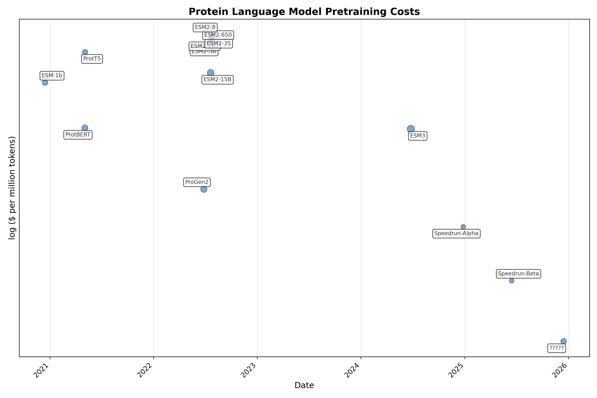
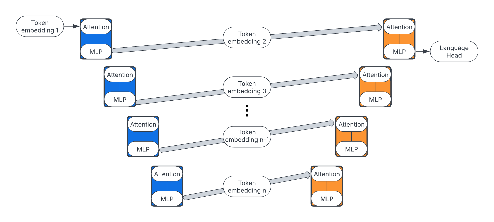

# Speedrunning PLM Training

## TL;DR

This project aims to democratize protein language model (pLM) training by reducing costs from $10,000-1,000,000 to $10-100 using modern NLP techniques. We have successfully reproduced ESMC-300M and ESMC-650M performance with fewer parameters and dramatically lower costs. The project features non-trivial changes to the vanilla transformer is planning virtual competitions to curate innovation.



## Table of Contents

- [Introduction](#introduction)
  - [Interested in contributing?](#interested-in-contributing)
- [Getting started](#getting-started)
- [Running experiments](#running-experiments)
- [Some general info](#some-general-info)

## Introduction

Protein Language Models (pLMs) are representation learning algorithms which, primarily, map discrete amino acids to a continuous latent space. By training pLMs through semi-supervised denoising, like Masked Language Modeling (MLM), pLMs become adept at filling in hidden amino acids to make plasuible sequence. After many types of training, the internal representations of pLMs correlate highly with valuable protein properties - the type of catalytic characteristics or biological associations that wet-lab experiments can take years and millions of dollars to verify. With the immense value of accelerated protein annotation and design backing pLM projects, they have become cornerstones of various life science communities.

However, training pLMs, specifically the large-scale semi-supervised pretraining, has been historically quite expensive - the type of cost only large tech companies, or sponsorships through large tech companies, can afford. Luckily, the Natural Language Processing (NLP) community has seen astronomical talent and money investments since the rise in popularity of AI chat bots. Additionally, the data repositories of protein sequences continue to dramatically grow due to the dissapearing costs associated with genome sequencing combined with improvements to genome annotation. The pLM community gets to plug into both of these rapidly advancing spaces to continually enhance the types of analysis and affordability behind our models.

The large cost associated with pLM pretraining was notably questioned in the [AMPLIFY](https://www.biorxiv.org/content/10.1101/2024.09.23.614603v1.full) paper, where popular pLMs were reproduced at a fraction of the cost due to modern NLP techniques. In tandem, they argued that pLMs should be retrained often due to the frequent quality and size upgrades to sequence repositories. Then, we noticed the [NanoGPT speedrun](https://github.com/KellerJordan/modded-nanogpt). The contributors to NanGPT where speeding up (the already ridiculously fast) llm.c GPT2 speedrun, now down to less than 3 minutes from a 45 minute starting point. The cost of reproducing a leading 2019 language model? ~**$1.13**. Now that is the type of cost that is truly democratizing!

And so, this repository is our attempt to take PLM training to the next level. We have gathered the non-trivial improvements to the vanilla transformer architecture, typical optimizers, dataloading and distributed training, as well as high quality modern meta-genomic datasets to speedrun pLM pretraining between ~$10-100. The preliminary results are promising, with several runs in the $10-100 range matching the validation loss of ESM2-650 and ESMC-300 models, often using a fraction of the parameters as well. So the project is done, right? Not quite.

One training trick that increase the quality of the pLM representations, basically the correlation between the last hidden state and valuable properties, is tieing the weights from the token embeddings to the language modeling head. It has been shown in numerous papers ([1](https://arxiv.org/abs/2111.09543), [2](https://arxiv.org/abs/2412.13663), [3](https://arxiv.org/pdf/2506.08293)) that a tied language modeling head improves the representation quality. Unfortunately, this severely dampens the convergence of the language modeling loss - leading to much slower and expensive training runs.

Interestingly, this may no longer be a significant problem. Several works have shown that the last hidden state of transformer models rarely produces the highest quality embeddings ([1](https://arxiv.org/pdf/2502.02013), [2](https://www.biorxiv.org/content/10.1101/2024.02.05.578959v2)). Intuitively, this makes a lot of sense - there is some severe expansion and compression of the hidden state at the beginning and end of the models, respectively. So, if we do not care about the quality of the last hidden state anymore (as it is rarely the best anyways) maybe we can curate an internal representation while avoiding weight tieing - maintaining speed and quality. This is even more promising when analyzing the unique UNET transformer inspired from NanoGPT.



More direct encoder-decoder schemas to stratify representaiton learning and generative capabilities? Autoencoders or clever regularization at the nth transformer layer? The sky is the limit here.

Another disadvantage of traditional pLM training lies in the MLM itself, as it leads to poor generation capabilies, hampering protein design prospects. Recent work of our group introduced DSM, a simple way to reformat pLM MLM into masked diffusion, increasing the generative qualities. Of course, naively switching to masked diffusion instead of MLM in the speedrun does not work pefectly either. So some warmup from fixed rate MLM to varied rate masked diffusion may give us the best of both worlds.

### Interested in contributing?
This is an open-source initiative to help the entire community. We are planning a month-long virtual hackathon/competition to see which team can produce the best solutions, with two main tracks:

1. **Speed Track**: Fastest time to reach less than 2.1 validation loss with fewer than 150 million parameters
2. **Quality Track**: Best scoring representations in 8 hours

Representations will be evaluated using a version of the [Protify](https://github.com/Synthyra/Protify) project for standardized and fair comparisons.

We plan to use an 8xH100 rig for consistent training comparisons on the competition leaderboard. However, supporting multiple teams with 8xH100 access is expensive! We are seeking sponsors who can pledge:

1. Direct H100 access
2. Compute credits  
3. Prizes for winners

Please reach out to `info@synthyra.com` if you are interested in sponsoring.

## Getting started

```
git clone https://github.com/Synthyra/SpeedrunningPLMs.git
cd SpeedrunningPLMs
pip install huggingface_hub
python data/download_omgprot50.py # --num_chunks 100 download less data to save time for smaller runs
```

For ARM64 systems (GH200)
```
pip install -r requirements.txt -U
pip install torch torchvision --index-url https://download.pytorch.org/whl/cu128 -U
torchrun --standalone --nproc_per_node=NUM_GPUS_ON_YOUR_SYSTEM train.py
```

For non ARM64 systems you can use Docker
```
git clone https://github.com/Synthyra/SpeedrunningPLMs.git
cd SpeedrunningPLMs
sudo docker build -t speedrun_plm .
sudo docker run --gpus all --shm-size=128g -v ${PWD}:/workspace speedrun_plm \
    torchrun --standalone --nproc_per_node=NUM_GPUS_ON_YOUR_SYSTEM train.py \
    --token YOUR_HUGGINGFACE_TOKEN
    --wandb_token YOUR_WANDB_TOKEN
```

<details>
<summary><strong>Note about Docker on ARM64 (GH200)</strong></summary>

Currently, the docker image results in various issues on ARM64 systems.

<pre>
  File "/usr/local/lib/python3.12/site-packages/torch/_inductor/scheduler.py", line 3432, in create_backend
    raise RuntimeError(
torch._dynamo.exc.BackendCompilerFailed: backend='inductor' raised:
RuntimeError: Cannot find a working triton installation. Either the package is not installed or it is too old. More information on installing Triton can be found at https://github.com/openai/triton

Set TORCH_LOGS="+dynamo" and TORCHDYNAMO_VERBOSE=1 for more information


You can suppress this exception and fall back to eager by setting:
    import torch._dynamo
    torch._dynamo.config.suppress_errors = True
</pre>

Suppressing dynamo leads to its own error. There is something delicate going on here.

If you know how to get our docker image working (or a solution with different container software) on GH200 please open an issue or pull request! There is some triton version mismatch that breaks the <code>torch.compile</code>. So in principle the docker image works for GH200 without <code>torch.compile</code>, but obviously that is not ideal.
</details>

## Running experiments

Check out our documented experiments thus far [here](https://synthyra.github.io/SpeedrunningPLMs/).

You can set up experiments by editing the example yaml files with desired settings (`example_yamls/default.yaml`). Simply build a yaml file for each experiment you would like to run and drag them into the `experiments` folder on your training rig. Then, run:

```
chmod +x run_experiments.sh
./run_experiments.sh
```

which will automatically determine how many GPUs your machine has, prompt you for Huggingface and Wandb tokens, and then run all the yaml files in `experiments` sequentially. Each yaml file corresponds to a set of settings that will start a training run.

For more information about CLI or yaml arguments you can reference the table in the drop down below:

<details>
<summary><strong>Command-line Arguments Reference</strong></summary>

| Argument | Type | Default | Description |
|----------|------|---------|-------------|
| <code>--yaml_path</code> | str | None | Path to YAML file with experiment configuration. CLI arguments override YAML. |
| <code>--token</code> | str | None | HuggingFace token (required for model saving/uploading). Prompted if not provided. |
| <code>--wandb_token</code> | str | None | Weights & Biases API token (for experiment tracking). Prompted if not provided. |
| <code>--log_name</code> | str | None | Name for the log file and wandb run. If not set, a random UUID is used. |
| <code>--bugfix</code> | flag | False | Use small batch size and max length for debugging. |
| <code>--save_path</code> | str | "Synthyra/speedrun_test" | Path to save the model and report to wandb. |
| <code>--seed</code> | int | 42 | Random seed for reproducibility. |
| <code>--clear_cache_every</code> | int | 1000 | Clear CUDA cache every N steps. |
| <code>--grad_clip</code> | float | 0.0 | Gradient clipping value (0 to disable). |
| <code>--hidden_size</code> | int | 768 | Hidden size of the model. |
| <code>--num_attention_heads</code> | int | 6 | Number of attention heads. |
| <code>--num_hidden_layers</code> | int | 24 | Number of hidden layers. |
| <code>--num_att_tokens</code> | int | 512 | Number of attention tokens. |
| <code>--vocab_size</code> | int | 33 | Vocabulary size. |
| <code>--expansion_ratio</code> | float | 2.6667 | Expansion ratio for MLP (e.g., 8/3). |
| <code>--soft_logit_cap</code> | float | 32.0 | Soft logit cap for output logits. |
| <code>--attention_soft_cap</code> | float | 64.0 | Attention softmax cap. |
| <code>--add_att_soft_cap</code> | bool | True | Whether to add attention softmax cap. |
| <code>--p_attention</code> | flag | False | Use P attention variant. |
| <code>--tie_embeddings</code> | flag | False | Tie input and output embeddings. |
| <code>--unet</code> | bool | True | Use UNet architecture. |
| <code>--input_bin</code> | str | "data/omgprot50/omgprot50_train_*.bin" | Input training bin files pattern. |
| <code>--input_valid_bin</code> | str | "data/omgprot50/omgprot50_valid_*.bin" | Input validation bin files pattern. |
| <code>--input_test_bin</code> | str | "data/omgprot50/omgprot50_test_*.bin" | Input test bin files pattern. |
| <code>--mlm</code> | bool | False | Use masked language modeling objective. |
| <code>--mask_rate</code> | float | 0.2 | Mask rate for masked language modeling. |
| <code>--batch_size</code> | int | 524288 | Total batch size in tokens (default: 8*64*1024). |
| <code>--grad_accum</code> | int | 1 | Gradient accumulation steps. |
| <code>--num_steps</code> | int | 50000 | Number of training steps. |
| <code>--cooldown_steps</code> | int | 5000 | Number of cooldown steps after main training. |
| <code>--max_length</code> | int | 1024 | Maximum sequence length. |
| <code>--scheduler_type</code> | str | "cosine" | Scheduler type for learning rate. |
| <code>--lr_warmup_steps</code> | int | 1000 | Number of warmup steps for learning rate. |
| <code>--lr</code> | float | 0.001 | Learning rate for Adam optimizer (when not using Muon). |
| <code>--lr_embed</code> | float | 0.06 | Learning rate for embeddings. |
| <code>--lr_head</code> | float | 0.008 | Learning rate for head. |
| <code>--lr_scalar</code> | float | 0.04 | Learning rate for scalar parameters. |
| <code>--use_muon</code> | bool | True | Use Muon optimizer for hidden layers. |
| <code>--lr_hidden</code> | float | 0.05 | Learning rate for hidden layers (Muon). |
| <code>--muon_momentum_warmup_steps</code> | int | 300 | Steps for Muon momentum warmup (0.85 → 0.95). |
| <code>--eval_every</code> | int | 1000 | Evaluate on validation set every N steps. |
| <code>--hf_model_name</code> | str | "Synthyra/speedrun" | HuggingFace model name for saving. |
| <code>--save_every</code> | int | None | Save checkpoint every N steps (if set). |
| <code>--num_workers</code> | int | 4 | Number of workers for optimized dataloader. |
| <code>--prefetch_factor</code> | int | 2 | Prefetch factor for optimized dataloader. |

</details>


## Some general info
A batch size of 8x64x1024 (524288) or 4x64x1024 (262144) tokens has worked very well. We recommend a local batch size of 64*1024 (65536) tokens for 80gb VRAM machines, and less if working with a smaller rig. For example, if 524288 is desired and you have 4 A100 80gb gpus, use gradient accumulation (`--grad_accum`) of 2 (524288 / 4 / 2 = 65536).

Our newer trainer and dataloader incorporates prefetching and multiple workers per GPU to accelerate data handling - the masking is also accomplished at this stage. In general, this has led to a small increase in throughput, which should have a larger effect for systems with slower disk read rates (University HPC systems, Jarvis Labs, Many azure blob types, etc.).

Here is a table of some current throughput during training for the default model size (133 million params, 24 blocks, UNET + Value embedddings, hidden size 768):

|Hardware |Tokens per sec|
|---------|--------------|
| 1xH100  | 275,900 |
| 1xGH200 | 1,011,800 |
|4xA100 80gb PCIe gen4| 340,700 |
|8xH100 SXM5 | 2,149,500 |

This implies that you could train ESM2-150 (batch size 2 million tokens for 500,000 steps) in 129 hours for $3091 (lambda 8xH100 6/30/2025) - assuming no improvements to model architecture, any training associated algorithms, or datasets. Compared to the ~$46k that ESM2-150 would have cost through vendors like AWS in 2022 this is a big improvement on its own!

Clearly, memory and disk read/write speeds are still a major bottleneck on some rigs (looking at the GH200 domination). Perhaps enhancements to the dataloading and prefetching can reduce this further. 

<details>
<summary>Preliminary SpeedrunnningESM2 repo readme with early results</summary>
# Replicating ESM2 at the speed of sound
This repo is an open-source collaboration to reproduce ESM2 models with the same or less parameters in as little time as possible, inspired by the fantastic [modded-nanogpt](https://github.com/KellerJordan/modded-nanogpt) repo. Mostly interested in 8xH100 or 1xH200 runs which are currently available through many vendors.

## Quick Start

Setup environment and train ESM2

```
git clone https://github.com/Synthyra/SpeedRunningESM2
cd SpeedRunningESM2
pip install -r requirements.txt
pip install --pre torch==2.6.0.dev20241203+cu124 torchvision==0.20.0.dev20241204 --index-url https://download.pytorch.org/whl/nightly/cu124 --upgrade
python data/download_omgprot50.py # --num_chunks 10 you can download less chunks to save time
./run.sh
```
torchvision is needed to fix an import error with transformers. You might need a different version of torch for consumer cards, all the code is tested on Hopper GPUs.

## Benchmarks to match
[OMGprot50](https://huggingface.co/datasets/Synthyra/omg_prot50) validation and test sets, 15% BERT-like MLM objective.
Loss is standard cross-entropy loss, perplexity $e^{loss}$. [Sequence reconstruction metrics](https://github.com/Synthyra/SpeedRunningESM2/blob/master/benchmark_esm.py) are calculated via exact match betweeen predictions and labels and weighted averages.

Validation set, random 10,000 sequences from OMGprot50.
| model | loss &darr;   | perplexity &darr; | precision &uarr; | recall &uarr; | f1 &uarr; | accuracy &uarr; | mcc &uarr;|
|-----------|--------|------------|-----------|--------|--------|----------|--------|
| ESM2-8M   | 2.4662 | 11.7775    | 0.3074    | 0.2780 | 0.2726 | 0.2780   | 0.2262 |
| ESM2-35M  | 2.3572 | 10.5613    | 0.3464    | 0.3205 | 0.3161 | 0.3205   | 0.2726 |
| ESM2-150M | 2.2550 | 9.5349     | 0.3806    | 0.3596 | 0.3560 | 0.3596   | 0.3152 |
| ESMC-300M | 2.1996 | 9.0214     | 0.3936    | 0.3648 | 0.3605 | 0.3648   | 0.3206 |
| ESMC-600M | 2.1549 | 8.6267     | 0.4068    | 0.3802 | 0.3762 | 0.3802   | 0.3373 |
| ESM2-650M | 2.1382 | 8.4841     | 0.4218    | 0.4024 | 0.4000 | 0.4024   | 0.3615 |

Test set, random 10,000 sequences from OMGprot50 and 3,000+ newly discovered sequences after OMGprot50 creation (well after ESM2 training date).
| model | loss &darr; | perplexity &darr; | precision &uarr; | recall &uarr; | f1 &uarr; | accuracy &uarr; | mcc &uarr;|
|-----------|--------|------------|-----------|--------|--------|----------|--------|
| ESM2-8M   | 2.4520 | 11.6116    | 0.3079    | 0.2780 | 0.2735 | 0.2780   | 0.2274 |
| ESM2-35M  | 2.3063 | 10.0374    | 0.3616    | 0.3380 | 0.3346 | 0.3380   | 0.2928 |
| ESM2-150M | 2.1587 | 8.6602     | 0.4149    | 0.3973 | 0.3949 | 0.3973   | 0.3568 |
| ESMC-300M | 2.0523 | 7.7854     | 0.4549    | 0.4296 | 0.4278 | 0.4296   | 0.3916 |
| ESMC-600M | 1.9942 | 7.3466     | 0.4741    | 0.4516 | 0.4498 | 0.4516   | 0.4152 |
| ESM2-650M | 1.9980 | 7.3743     | 0.4723    | 0.4576 | 0.4561 | 0.4576   | 0.4217 |

These match the [results](https://github.com/Synthyra/SpeedRunningESM2/pull/2#issue-2756280840) from the original paper well.


## Successful runs showcase

|~Matches |Parameters|Time      |Hardware |Log | Val loss |
|---------|----------|----------|---------|----|----------|
|ESM2-150|140M      |9.44 hours |1 x GH200|[Link](https://github.com/Synthyra/SpeedRunningESM2/blob/master/logs_to_keep/f48932cb-f41f-4c0c-8f24-90c839e9dc9e.txt)| 2.2272 |
|ESMC-300|44M       |7.01 hours |4 x 4090 |[Link](https://gist.github.com/lapp0/8553e911c649eea11cc2d7426f26eab6)                                        | 2.1906 |

|~Matches |Parameters|Time      |Hardware |Log | Val loss | Test loss |
|---------|----------|----------|---------|----|----------|-----------|
|ESM2-150|132M      |9.00 hours |1 x GH200|[Link](https://github.com/Synthyra/SpeedRunningESM2/blob/master/logs_to_keep/e631bf18-f202-492b-a3b8-fbae2cb7484a.txt)| 2.2137 | 2.2093 |
|ESM2-650|132M      |45.16 hours|1 x GH200|[Link](https://github.com/Synthyra/SpeedRunningESM2/blob/master/logs_to_keep/a0a3dc4e-6f27-43e0-96fb-b1c2372a164b.txt)| 2.1044 | 2.1058 |

</details>


<details>
<summary>Pretraining cost calculation details</summary>

ESM-1b
- 4.25 hours per epoch, 56 epochs, 128 V100 GPUs
- [Source](https://epoch.ai/data/notable-ai-models)
- 238 hours x 128 gpus is 30,464 V100 hours
- 8xV100 on AWS is ~$24.48 [on demand](https://instances.vantage.sh/aws/ec2/p3.16xlarge)
- Assume 1/2 of that per hours because of scale and year is 2020, but the GPUs were newer so this is generous
- $1.53 gpu/hour * 30,464 hours is $46,610

ProtBERT, ProtT5, Progen2
- Estimated from [here](https://epoch.ai/data/notable-ai-models)

ESM2-15B
- Approximated at $1.5 million USD
- [Source](https://www.biorxiv.org/content/10.1101/2024.09.23.614603v1.full)
ESM2-3B
- Roughly 1/2 of 15B FLOPs
- [Source](https://github.com/facebookresearch/esm/discussions/414)
ESM2-650M
- Roughly 1/4 of 3B FLOPs
- [Source](https://github.com/facebookresearch/esm/discussions/414)
ESM2-150M
- Approximated at 1/4 of 650M FlOPs
ESM2-35M
- Approximated at 1/4 of 150M FlOPs
ESM2-8M
- Approximated at 1/4 of 35M FlOPs

ESM3-98B
- We don not have much details about training cost beyond FLOPs at 1.07E24 from the [paper](https://www.science.org/doi/10.1126/science.ads0018)
- If we assume same FLOP per dollar efficiency of [Llama 3.1-405B](https://epoch.ai/data/notable-ai-models) we get 1.34E-18 $/FLOP
- So that is ~$1.4 million for ESM3 training
</details>