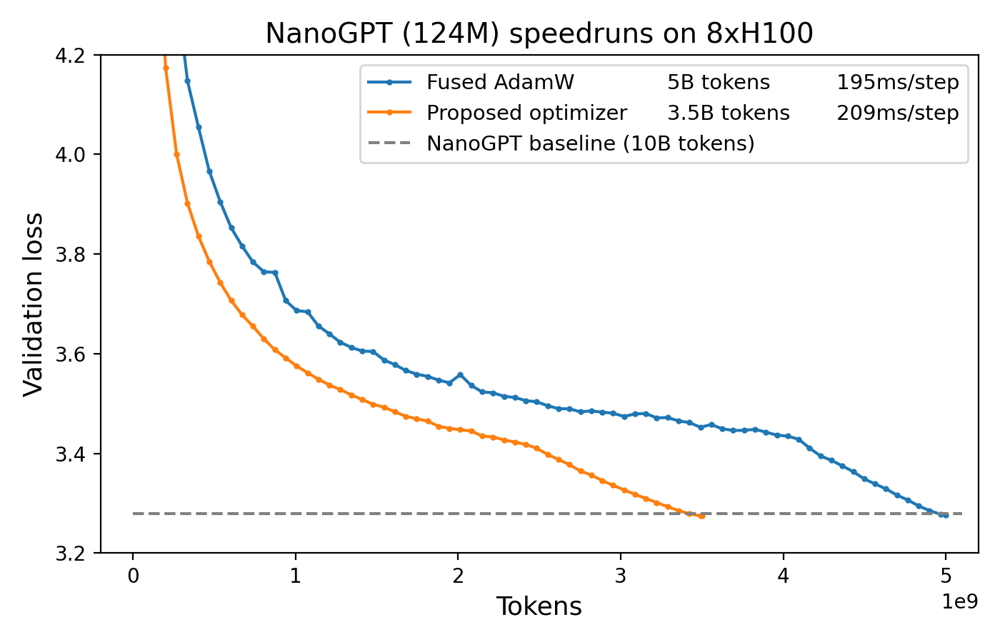

# Modded-NanoGPT

This is a "speedrun" variant of the [PyTorch GPT-2 trainer](https://github.com/karpathy/llm.c/blob/7b929300217ff1a974b63791a228928b39b26409/train_gpt2.py) from
Andrej Karpathy's [llm.c](https://github.com/karpathy/llm.c) repo, which attains the same final validation loss in:
* **2.67B tokens instead of 10B**
* **12 minutes on 8xH100 instead of 45**

We use the following techniques:
* Modernizing the architecture: Rotary embeddings, QK-Norm, RMSNorm, and ReLU^2.
* Initializing the projection layers to zero (muP-like).
* Using a new optimizer (Muon - Momentum Orthogonalized by Newton-schulz).

To execute the training, simply run the following three commands, which first install the necessary packages and download the data.
They should all complete within <20min on an 8xH100 with decent internet connection.
```bash
pip install -r requirements.txt
python data/cached_fineweb10B.py 27 # downloads only the first 2.7B training tokens to save time
./run.sh
```

The result will be a 124M-parameter transformer trained for 5100 steps on 2.67B tokens of Fineweb [1], achieving ~3.277 validation loss.
For comparison, the default llm.c PyTorch trainer yields [>3.28 validation loss after training for 19560 steps on 10B tokens](https://github.com/karpathy/llm.c/discussions/481#:~:text=By%20the%20end%20of%20the%20optimization%20we%27ll%20get%20to%20about%203.29).

## World record history

The following is the progression of world records for the task of *training a model that attains 3.28 validation loss on FineWeb in the minimal time on an 8xH100 machine.*

1. [45 minutes: llm.c baseline (05/28/24)](https://github.com/karpathy/llm.c/discussions/481) (note: the 90 minute time is on 8xA100; it's 45 minutes on 8xH100)
2. [31.4 minutes: Architectural modernizations and learning rate tuning (06/06/24)](https://x.com/kellerjordan0/status/1798863559243513937) (note: this uses half the tokens as the baseline but isn't yet twice as fast since it's slower PyTorch code rather than raw CUDA. also note: by far the biggest improvement here came from simply tripling the learning rate.)
3. [24.9 minutes: Introduced the Muon optimizer (10/04/24)](https://x.com/kellerjordan0/status/1842300916864844014)
4. [22.3 minutes: Muon improvements (10/11/24)](https://x.com/kellerjordan0/status/1844820919061287009)
5. [15.2 minutes: Pad embeddings & architectural modernizations (10/14/24)](https://x.com/kellerjordan0/status/1845865698532450646)
6. [13.1 minutes: Distributed the overhead of Muon (10/18/24)](https://x.com/kellerjordan0/status/1847291684016783746)
7. [12.0 minutes: Upgraded PyTorch from 2.4.1 to 2.5.0 (10/18/24)](https://x.com/kellerjordan0/status/1847358578686152764) (note: this now runs at the same speed per step as the CUDA llm.c trainer)

Direct contributors to these records: @Grad62304977, @bozavlado, myself

Note: Of course, the original llm.c baseline is intended to be closer to a replication of GPT-2 than to an optimized LLM training.
So it's no surprise that there is room to improve, since as Dr. Karpathy said, "llm.c still has a lot of pending optimizations".
In addition, many of the techniques used in these records are completely standard, such as rotary embeddings.
The goal of this benchmark is simply to find out all the techniques which actually work, because I'm going crazy reading all these LLM training papers
which claim a huge speedup but then use their own weird idiosyncratic benchmarks and therefore no one in the community has any idea if it's legit for months.
I mean hello??? We're in a completely empirical field; it is insane to not use benchmarks.
The only possible benefit I can think of for any empirical field to abandon benchmarks is that it would make it easier to publish false results. Oh, I guess that's why it happened.
No wonder the peer review system has collapsed.

## Figures

Figure 1. Proposed optimizer vs. a well-tuned AdamW.


---


## Muon optimizer

Muon is defined as follows:


Where NewtonSchulz5 is the following Newton-Schulz iteration [2, 3]:
```python
@torch.compile
def zeroth_power_via_newtonschulz5(G, steps=5, eps=1e-7):
    assert len(G.shape) == 2
    a, b, c = (3.4445, -4.7750,  2.0315)
    X = G.bfloat16() / (G.norm() + eps)
    if G.size(0) > G.size(1):
        X = X.T 
    for _ in range(steps):
        A = X @ X.T 
        B = A @ X 
        X = a * X + b * B + c * A @ B 
    if G.size(0) > G.size(1):
        X = X.T 
    return X.to(G.dtype)
```

Note that this iteration approximately replaces `G` with `U @ V.T` where `U, S, V = G.svd()`.

For this training scenario, Muon has the following favorable properties:
* Less memory usage than Adam
* ~1.5x faster training
* <2% wallclock overhead


### Provenance

Many of the choices made to generate this optimizer were obtained experimentally by our pursuit of [CIFAR-10 speedrunning](https://github.com/KellerJordan/cifar10-airbench).
In particular, we experimentally obtained the following practices:
* Using Nesterov momentum inside the update, with orthogonalization applied after momentum.
* Using a specifically quintic Newton-Schulz iteration as the method of orthogonalization.
* Using non-convergent coefficients for the quintic polynomial in order to maximize slope at zero, and thereby minimize the number of necessary Newton-Schulz iterations.
* Running the Newton-Schulz iteration in bfloat16 (whereas Shampoo implementations often compute the preconditioners via inverse-pth-roots in fp32 or fp64).

Our use of a Newton-Schulz iteration for orthogonalization traces to [Bernstein & Newhouse (2024)](https://arxiv.org/abs/2409.20325),
who suggested it as a way to compute Shampoo [5, 6] preconditioners, and theoretically explored Shampoo without preconditioner accumulation.
In particular, Jeremy Bernstein @jxbz sent us the draft, which caused us to experiment with various Newton-Schulz iterations as the
orthogonalization method for this optimizer.
If we had used SVD instead of a Newton-Schulz iteration, this optimizer would have been too slow to be useful.
Bernstein & Newhouse also pointed out that Shampoo without preconditioner accumulation is equivalent to steepest descent in the spectral norm,
and therefore Shampoo can be thought of as a way to smooth out spectral steepest descent.
The proposed optimizer can be thought of as a second way of smoothing spectral steepest descent, with a different set of memory and runtime tradeoffs
compared to Shampoo.

---

## Startup script

Here's a good startup script for a fresh instance. If you get `torchrun not found` after this upon running then just close and reopen your tmux tab.

```
sudo apt-get update
sudo apt-get install vim tmux python3-pip python-is-python3 -y
git clone https://github.com/KellerJordan/modded-nanogpt.git
cd modded-nanogpt
tmux

pip install numpy==1.23.5 huggingface-hub tqdm
pip install --upgrade torch &
python data/cached_fineweb10B.py 30
```

---

## References

1. [Penedo, Guilherme, et al. "The fineweb datasets: Decanting the web for the finest text data at scale." arXiv preprint arXiv:2406.17557 (2024).](https://arxiv.org/abs/2406.17557)
2. Nicholas J. Higham. Functions of Matrices. Society for Industrial and Applied Mathematics, 2008. Equation 5.22.
3. Günther Schulz. Iterative Berechnung der reziproken Matrix. Z. Angew. Math. Mech., 13:57–59, 1933.
4. [Jeremy Bernstein and Laker Newhouse. "Old Optimizer, New Norm: An Anthology." arxiv preprint arXiv:2409.20325 (2024).](https://arxiv.org/abs/2409.20325)
5. [Vineet Gupta, Tomer Koren, and Yoram Singer. "Shampoo: Preconditioned stochastic tensor optimization." International Conference on Machine Learning. PMLR, 2018.](https://arxiv.org/abs/1802.09568)
6. [Anil, Rohan, et al. "Scalable second order optimization for deep learning." arXiv preprint arXiv:2002.09018 (2020).](https://arxiv.org/abs/2002.09018)
7. [Hägele, Alexander, et al. "Scaling Laws and Compute-Optimal Training Beyond Fixed Training Durations." arXiv preprint arXiv:2405.18392 (2024).](https://arxiv.org/abs/2405.18392)


