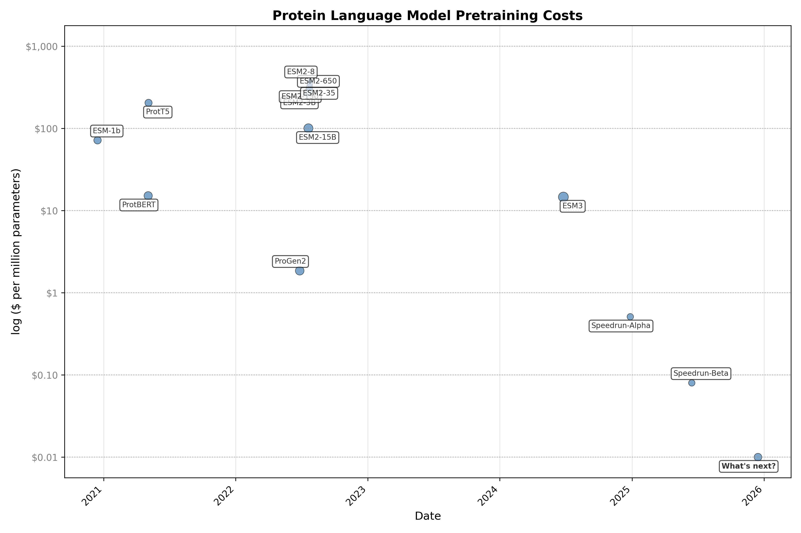

# Speedrunning Protein Language Model Training

## Overview

This project aims to democratize protein language model (pLM) training by reducing costs from $10,000-1,000,000 to $10-100 through modern NLP techniques. We have successfully reproduced ESMC-300M and ESMC-650M performance with fewer parameters and dramatically reduced costs. The project features significant improvements to the vanilla transformer architecture and is planning virtual competitions to drive innovation.

## Table of Contents

- [Introduction](#introduction)
- [Contributing](#contributing)
- [Getting Started](#getting-started)
- [Running Experiments](#running-experiments)
- [Performance Benchmarks](#performance-benchmarks)
- [ESM Model Evaluation](#esm-model-evaluation)
- [Technical Details](#technical-details)



## Introduction

Protein Language Models (pLMs) are representation learning algorithms which, primarily, map discrete amino acids to a continuous latent space. By training pLMs through semi-supervised denoising, like Masked Language Modeling (MLM), pLMs become adept at filling in hidden amino acids to make plasuible sequence. After many types of training, the internal representations of pLMs correlate highly with valuable protein properties - the type of catalytic characteristics or biological associations that wet-lab experiments can take years and millions of dollars to verify. With the immense value of accelerated protein annotation and design backing pLM projects, they have become cornerstones of various life science communities.

However, training pLMs, specifically the large-scale semi-supervised pretraining, has been historically quite expensive - the type of cost only large tech companies, or sponsorships through large tech companies, can afford. Luckily, the Natural Language Processing (NLP) community has seen astronomical talent and money investments since the rise in popularity of AI chat bots. Additionally, the data repositories of protein sequences continue to dramatically grow due to the dissapearing costs associated with genome sequencing combined with improvements to genome annotation. The pLM community gets to plug into both of these rapidly advancing spaces to continually enhance the types of analysis and affordability behind our models.

The large cost associated with pLM pretraining was notably questioned in the [AMPLIFY](https://www.biorxiv.org/content/10.1101/2024.09.23.614603v1.full) paper, where popular pLMs were reproduced at a fraction of the cost due to modern NLP techniques. In tandem, they argued that pLMs should be retrained often due to the frequent quality and size upgrades to sequence repositories. Then, we noticed the [NanoGPT speedrun](https://github.com/KellerJordan/modded-nanogpt). The contributors to NanGPT where speeding up (the already ridiculously fast) llm.c GPT2 speedrun, now down to less than 3 minutes from a 45 minute starting point. The cost of reproducing a leading 2019 language model? ~**$1.13**. Now that is the type of cost that is truly democratizing!

And so, this repository is our attempt to take PLM training to the next level. We have gathered the non-trivial improvements to the vanilla transformer architecture, typical optimizers, dataloading and distributed training, as well as high quality modern meta-genomic datasets to speedrun pLM pretraining between ~$10-100. The preliminary results are promising, with several runs in the $10-100 range matching the validation loss of ESM2-650 and ESMC-300 models, often using a fraction of the parameters as well. So the project is done, right? Not quite.

### Research Opportunities

One training technique that enhances pLM representation quality—improving correlation between hidden states and valuable properties is weight tying between token embeddings and the language modeling head. Multiple studies ([1](https://arxiv.org/abs/2111.09543), [2](https://arxiv.org/abs/2412.13663), [3](https://arxiv.org/pdf/2506.08293)) have demonstrated that tied language modeling heads improve representation quality. However, this approach significantly slows convergence of the language modeling loss, resulting in slower and more expensive training.

Recent work suggests this may no longer be a significant limitation. Several studies have shown that the final hidden state of transformer models rarely produces the highest quality embeddings ([1](https://arxiv.org/pdf/2502.02013), [2](https://www.biorxiv.org/content/10.1101/2024.02.05.578959v2)). This makes intuitive sense—significant expansion and compression of hidden states occur at the model's beginning and end, respectively. If we no longer prioritize final hidden state quality (since it's rarely optimal), we may be able to optimize internal representations while avoiding weight tying, maintaining both speed and quality. This approach shows particular promise with the innovative UNet transformer architecture inspired by NanoGPT.


Additional research directions include direct encoder-decoder architectures to stratify representation learning and generative capabilities, autoencoders, and clever regularization at intermediate transformer layers.

Another limitation of traditional pLM training lies in MLM itself, which results in poor generation capabilities and hampers protein design prospects. Recent work from our group introduced Discrete State Masking (DSM), which reformats pLM MLM into masked diffusion, enhancing generative qualities. However, naive replacement of MLM with masked diffusion in speedrun contexts doesn't work perfectly. A warmup strategy from fixed-rate MLM to variable-rate masked diffusion may provide optimal results for both objectives.

## Contributing

This open-source initiative aims to benefit the entire community. We are planning a month-long virtual hackathon/competition with two main tracks:

1. **Speed Track**: Fastest time to achieve validation loss below 2.1 with fewer than 150 million parameters
2. **Quality Track**: Best-scoring representations within 8 hours of training

Representations will be evaluated using a standardized version of the [Protify](https://github.com/Synthyra/Protify) project for fair comparisons.

### Competition Infrastructure

We plan to use an 8×H100 system for consistent training comparisons on the competition leaderboard. Supporting multiple teams with 8×H100 access is expensive, so we are seeking sponsors who can provide:

1. Direct H100 access
2. Compute credits
3. Prizes for winners

Please contact `info@synthyra.com` if you're interested in sponsoring this initiative.

## Getting Started

### Quick Start

```bash
git clone https://github.com/Synthyra/SpeedrunningPLMs.git
cd SpeedrunningPLMs
pip install huggingface_hub
python data/download_omgprot50.py # Add --num_chunks 100 to download less data for smaller runs
```

### ARM64 Systems (GH200)

```bash
pip install -r requirements.txt -U
pip install torch torchvision --index-url https://download.pytorch.org/whl/cu128 -U
torchrun --standalone --nproc_per_node=NUM_GPUS_ON_YOUR_SYSTEM train.py
```

### Docker Installation (Non-ARM64 Systems)

```bash
git clone https://github.com/Synthyra/SpeedrunningPLMs.git
cd SpeedrunningPLMs
sudo docker build -t speedrun_plm .
sudo docker run --gpus all --shm-size=128g -v ${PWD}:/workspace speedrun_plm \
    torchrun --standalone --nproc_per_node=NUM_GPUS_ON_YOUR_SYSTEM train.py \
    --token YOUR_HUGGINGFACE_TOKEN \
    --wandb_token YOUR_WANDB_TOKEN
```

> **Note for ARM64 (GH200) Systems**: The Docker image currently experiences compatibility issues on ARM64 systems due to Triton version conflicts that break `torch.compile`. If you have a solution for this issue, please open an issue or pull request.

## Running Experiments

### Experiment Documentation

View our documented experiments at [https://synthyra.github.io/SpeedrunningPLMs/](https://synthyra.github.io/SpeedrunningPLMs/).

### Configuration

Configure experiments by editing the example YAML files with your desired settings (`example_yamls/default.yaml`). Create a YAML file for each experiment and place them in the `experiments` folder on your training system.

### Execution

```bash
chmod +x run_experiments.sh
./run_experiments.sh
```

This script will automatically:
- Determine the number of GPUs on your system
- Prompt for HuggingFace and Weights & Biases tokens
- Execute all YAML files in the `experiments` directory sequentially

<details>
<summary><strong>Command-line Arguments Reference</strong></summary>

| Argument | Type | Default | Description |
|----------|------|---------|-------------|
| `--yaml_path` | str | None | Path to YAML file with experiment configuration. CLI arguments override YAML. |
| `--token` | str | None | HuggingFace token (required for model saving/uploading). Prompted if not provided. |
| `--wandb_token` | str | None | Weights & Biases API token (for experiment tracking). Prompted if not provided. |
| `--log_name` | str | None | Name for the log file and wandb run. If not set, a random UUID is used. |
| `--bugfix` | flag | False | Use small batch size and max length for debugging. |
| `--save_path` | str | "Synthyra/speedrun_test" | Path to save the model and report to wandb. |
| `--seed` | int | 42 | Random seed for reproducibility. |
| `--clear_cache_every` | int | 1000 | Clear CUDA cache every N steps. |
| `--grad_clip` | float | 0.0 | Gradient clipping value (0 to disable). |
| `--hidden_size` | int | 768 | Hidden size of the model. |
| `--num_attention_heads` | int | 6 | Number of attention heads. |
| `--num_hidden_layers` | int | 24 | Number of hidden layers. |
| `--num_att_tokens` | int | 512 | Number of attention tokens. |
| `--vocab_size` | int | 33 | Vocabulary size. |
| `--expansion_ratio` | float | 2.6667 | Expansion ratio for MLP (e.g., 8/3). |
| `--soft_logit_cap` | float | 32.0 | Soft logit cap for output logits. |
| `--attention_soft_cap` | float | 64.0 | Attention softmax cap. |
| `--add_att_soft_cap` | bool | True | Whether to add attention softmax cap. |
| `--p_attention` | flag | False | Use P attention variant. |
| `--tie_embeddings` | flag | False | Tie input and output embeddings. |
| `--unet` | bool | True | Use UNet architecture. |
| `--input_bin` | str | "data/omgprot50/omgprot50_train_*.bin" | Input training bin files pattern. |
| `--input_valid_bin` | str | "data/omgprot50/omgprot50_valid_*.bin" | Input validation bin files pattern. |
| `--input_test_bin` | str | "data/omgprot50/omgprot50_test_*.bin" | Input test bin files pattern. |
| `--mlm` | bool | False | Use masked language modeling objective. |
| `--mask_rate` | float | 0.2 | Mask rate for masked language modeling. |
| `--batch_size` | int | 524288 | Total batch size in tokens (default: 8×64×1024). |
| `--grad_accum` | int | 1 | Gradient accumulation steps. |
| `--num_steps` | int | 50000 | Number of training steps. |
| `--cooldown_steps` | int | 5000 | Number of cooldown steps after main training. |
| `--max_length` | int | 1024 | Maximum sequence length. |
| `--scheduler_type` | str | "cosine" | Scheduler type for learning rate. |
| `--lr_warmup_steps` | int | 1000 | Number of warmup steps for learning rate. |
| `--lr` | float | 0.001 | Learning rate for Adam optimizer (when not using Muon). |
| `--lr_embed` | float | 0.06 | Learning rate for embeddings. |
| `--lr_head` | float | 0.008 | Learning rate for head. |
| `--lr_scalar` | float | 0.04 | Learning rate for scalar parameters. |
| `--use_muon` | bool | True | Use Muon optimizer for hidden layers. |
| `--lr_hidden` | float | 0.05 | Learning rate for hidden layers (Muon). |
| `--muon_momentum_warmup_steps` | int | 300 | Steps for Muon momentum warmup (0.85 → 0.95). |
| `--eval_every` | int | 1000 | Evaluate on validation set every N steps. |
| `--hf_model_name` | str | "Synthyra/speedrun" | HuggingFace model name for saving. |
| `--save_every` | int | None | Save checkpoint every N steps (if set). |
| `--num_workers` | int | 4 | Number of workers for optimized dataloader. |
| `--prefetch_factor` | int | 2 | Prefetch factor for optimized dataloader. |

</details>

## Performance Benchmarks

### Recommended Configuration

Batch sizes of 8×64×1024 (524,288) or 4×64×1024 (262,144) tokens have demonstrated excellent performance. We recommend a local batch size of 64×1024 (65,536) tokens for 80GB VRAM systems, with adjustments for smaller configurations.

**Example**: For a desired batch size of 524,288 tokens on 4×A100 80GB GPUs, use gradient accumulation (`--grad_accum`) of 2:
```
524,288 ÷ 4 ÷ 2 = 65,536 tokens per GPU
```

### System Performance

Our optimized trainer and dataloader incorporate prefetching and multiple workers per GPU to accelerate data handling, with masking performed at the data loading stage. This results in improved throughput, particularly beneficial for systems with slower disk I/O.

**Training Throughput** (Default model: 133M parameters, 24 blocks, UNet + Value embeddings, 768 hidden size):

| Hardware | Tokens/Second |
|----------|---------------|
| 1×H100 | 275,900 |
| 1×GH200 | 1,011,800 |
| 4×A100 80GB PCIe Gen4 | 340,700 |
| 8×H100 SXM5 | 2,149,500 |

### Cost Analysis

Based on current performance metrics, training ESM2-150M equivalent (2M token batch size, 500K steps) would require approximately 129 hours at $3,091 using 8×H100 systems (Lambda pricing as of June 2025). This represents a significant improvement over the estimated $46,000 cost for ESM2-150M training via AWS in 2022.

Memory and disk I/O remain primary bottlenecks on some systems, as evidenced by the GH200's superior performance. Further optimizations to data loading and prefetching may yield additional improvements.

## ESM Model Evaluation

Models achieving validation losses below 2.0 on certain splits may indicate training on similar sequences (or direct training, especially in the case of ESMC on the metagenomic data). A validation loss target of approximately 2.1 without data leakage appears highly competitive.

### OMG Prot50 Dataset

- **Source**: [tattabio/OMG_prot50](https://huggingface.co/datasets/tattabio/OMG_prot50)
- **Split Version**: [Synthyra/omg_prot50](https://huggingface.co/datasets/Synthyra/omg_prot50)
- **Evaluation**: 10,000 sequences, 2,500 batches

#### Validation Split Results (303,545 tokens)

| Model | Loss | Perplexity | Accuracy | Precision | Recall | F1 | MCC |
|-------|------|-----------|----------|-----------|--------|----|----|
| ESM2-8M | 2.618 | 13.706 | 0.212 | 0.248 | 0.212 | 0.198 | 0.152 |
| ESM2-35M | 2.500 | 12.186 | 0.261 | 0.296 | 0.261 | 0.251 | 0.207 |
| ESM2-150M | 2.390 | 10.915 | 0.305 | 0.336 | 0.305 | 0.298 | 0.255 |
| ESMC-300M | 2.192 | 8.954 | 0.368 | 0.397 | 0.368 | 0.364 | 0.324 |
| ESMC-600M | 2.154 | 8.623 | 0.381 | 0.408 | 0.381 | 0.378 | 0.338 |
| ESM2-650M | 2.267 | 9.652 | 0.352 | 0.382 | 0.352 | 0.348 | 0.307 |
| ESM2-3B | 2.200 | 9.024 | 0.378 | 0.403 | 0.378 | 0.375 | 0.335 |

#### Test Split Results (307,141 tokens)

| Model | Loss | Perplexity | Accuracy | Precision | Recall | F1 | MCC |
|-------|------|-----------|----------|-----------|--------|----|----|
| ESM2-8M | 2.620 | 13.737 | 0.210 | 0.247 | 0.210 | 0.196 | 0.150 |
| ESM2-35M | 2.505 | 12.242 | 0.259 | 0.296 | 0.259 | 0.250 | 0.206 |
| ESM2-150M | 2.391 | 10.930 | 0.305 | 0.337 | 0.305 | 0.299 | 0.256 |
| ESMC-300M | 2.191 | 8.942 | 0.369 | 0.398 | 0.369 | 0.365 | 0.325 |
| ESMC-600M | 2.154 | 8.619 | 0.384 | 0.409 | 0.384 | 0.380 | 0.341 |
| ESM2-650M | 2.268 | 9.655 | 0.353 | 0.382 | 0.353 | 0.349 | 0.308 |
| ESM2-3B | 2.203 | 9.051 | 0.377 | 0.402 | 0.377 | 0.374 | 0.334 |

### OG Prot90 Dataset

- **Source**: [tattabio/OG_prot90](https://huggingface.co/datasets/tattabio/OG_prot90)
- **Split Version**: [Synthyra/og_prot90](https://huggingface.co/datasets/Synthyra/og_prot90)
- **Evaluation**: 10,000 sequences, 2,500 batches

#### Validation Split Results (442,548 tokens)

| Model | Loss | Perplexity | Accuracy | Precision | Recall | F1 | MCC |
|-------|------|-----------|----------|-----------|--------|----|----|
| ESM2-8M | 2.476 | 11.890 | 0.236 | 0.266 | 0.236 | 0.220 | 0.176 |
| ESM2-35M | 2.248 | 9.465 | 0.314 | 0.339 | 0.314 | 0.303 | 0.262 |
| ESM2-150M | 2.037 | 7.664 | 0.383 | 0.400 | 0.383 | 0.376 | 0.338 |
| ESMC-300M | 1.697 | 5.460 | 0.485 | 0.497 | 0.485 | 0.481 | 0.449 |
| ESMC-600M | 1.628 | 5.094 | 0.507 | 0.517 | 0.507 | 0.503 | 0.472 |
| ESM2-650M | 1.800 | 6.051 | 0.460 | 0.472 | 0.460 | 0.455 | 0.422 |
| ESM2-3B | 1.662 | 5.271 | 0.505 | 0.513 | 0.505 | 0.501 | 0.470 |

#### Test Split Results (449,207 tokens)

| Model | Loss | Perplexity | Accuracy | Precision | Recall | F1 | MCC |
|-------|------|-----------|----------|-----------|--------|----|----|
| ESM2-8M | 2.470 | 11.817 | 0.238 | 0.268 | 0.238 | 0.223 | 0.178 |
| ESM2-35M | 2.240 | 9.396 | 0.316 | 0.342 | 0.316 | 0.306 | 0.265 |
| ESM2-150M | 2.023 | 7.564 | 0.387 | 0.404 | 0.387 | 0.380 | 0.342 |
| ESMC-300M | 1.687 | 5.402 | 0.487 | 0.500 | 0.487 | 0.483 | 0.451 |
| ESMC-600M | 1.616 | 5.031 | 0.508 | 0.519 | 0.508 | 0.505 | 0.474 |
| ESM2-650M | 1.787 | 5.969 | 0.465 | 0.477 | 0.465 | 0.460 | 0.427 |
| ESM2-3B | 1.651 | 5.212 | 0.508 | 0.515 | 0.508 | 0.504 | 0.473 |

### UniRef50 Dataset

- **Source**: [agemagician/uniref50_09012025](https://huggingface.co/datasets/agemagician/uniref50_09012025)
- **Split Version**: [Synthyra/uniref50](https://huggingface.co/datasets/Synthyra/uniref50)
- **Evaluation**: 10,000 sequences, 2,500 batches

#### Validation Split Results (405,314 tokens)

| Model | Loss | Perplexity | Accuracy | Precision | Recall | F1 | MCC |
|-------|------|-----------|----------|-----------|--------|----|----|
| ESM2-8M | 2.575 | 13.134 | 0.213 | 0.255 | 0.213 | 0.201 | 0.155 |
| ESM2-35M | 2.453 | 11.623 | 0.258 | 0.297 | 0.258 | 0.250 | 0.204 |
| ESM2-150M | 2.324 | 10.212 | 0.303 | 0.337 | 0.303 | 0.298 | 0.254 |
| ESMC-300M | 2.161 | 8.679 | 0.347 | 0.379 | 0.347 | 0.344 | 0.302 |
| ESMC-600M | 2.109 | 8.244 | 0.364 | 0.393 | 0.364 | 0.362 | 0.320 |
| ESM2-650M | 2.165 | 8.717 | 0.357 | 0.387 | 0.357 | 0.355 | 0.313 |
| ESM2-3B | 2.053 | 7.788 | 0.395 | 0.419 | 0.395 | 0.393 | 0.354 |

#### Test Split Results (400,117 tokens)

| Model | Loss | Perplexity | Accuracy | Precision | Recall | F1 | MCC |
|-------|------|-----------|----------|-----------|--------|----|----|
| ESM2-8M | 2.577 | 13.156 | 0.213 | 0.254 | 0.213 | 0.202 | 0.155 |
| ESM2-35M | 2.455 | 11.648 | 0.257 | 0.296 | 0.257 | 0.250 | 0.204 |
| ESM2-150M | 2.328 | 10.261 | 0.302 | 0.335 | 0.302 | 0.297 | 0.253 |
| ESMC-300M | 2.159 | 8.659 | 0.348 | 0.379 | 0.348 | 0.345 | 0.303 |
| ESMC-600M | 2.111 | 8.256 | 0.364 | 0.393 | 0.364 | 0.362 | 0.320 |
| ESM2-650M | 2.165 | 8.717 | 0.357 | 0.385 | 0.357 | 0.354 | 0.313 |
| ESM2-3B | 2.059 | 7.835 | 0.393 | 0.416 | 0.393 | 0.391 | 0.352 |

## Technical Details

<details>
<summary><strong>Pretraining Cost Calculation Methodology</strong></summary>

### ESM-1B
- **Training**: 4.25 hours per epoch × 56 epochs on 128 V100 GPUs
- **Source**: [Notable AI Models Database](https://epoch.ai/data/notable-ai-models)
- **Calculation**: 238 hours × 128 GPUs = 30,464 V100 hours
- **Cost Estimate**: Based on AWS 8×V100 (~$24.48 on-demand), adjusted for 2020 pricing and scale, estimated at $1.53/GPU-hour
- **Total**: $1.53 × 30,464 = $46,610

### Other Models
- **ProtBERT, ProtT5, Progen2**: Estimates from [Notable AI Models Database](https://epoch.ai/data/notable-ai-models)
- **ESM2-15B**: Approximately $1.5M USD ([AMPLIFY paper](https://www.biorxiv.org/content/10.1101/2024.09.23.614603v1.full))
- **ESM2-3B**: ~50% of ESM2-15B FLOPs ([ESM Discussion](https://github.com/facebookresearch/esm/discussions/414))
- **ESM2-650M**: ~25% of ESM2-3B FLOPs
- **ESM2-150M**: ~25% of ESM2-650M FLOPs
- **ESM2-35M**: ~25% of ESM2-150M FLOPs
- **ESM2-8M**: ~25% of ESM2-35M FLOPs

### ESM3-98B
- **FLOPs**: 1.07×10²⁴ ([ESM3 paper](https://www.science.org/doi/10.1126/science.ads0018))
- **Efficiency**: Assumed similar to Llama 3.1-405B (1.34×10⁻¹⁸ $/FLOP)
- **Estimated Cost**: ~$1.4M

</details>
