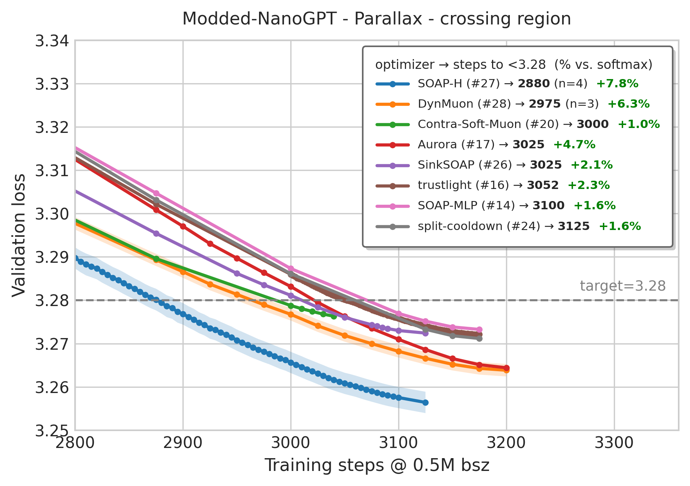
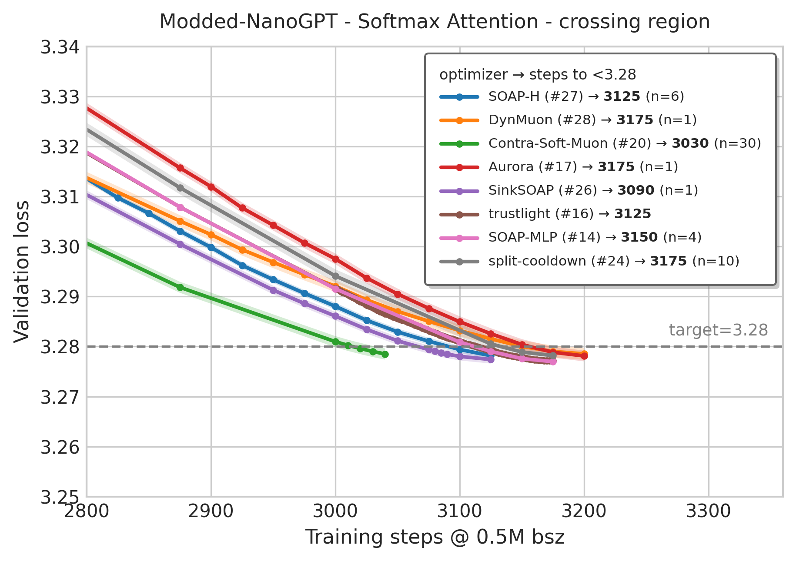

# Parallax mechanism on the Track-3 optimization benchmark

Drop-in **Parallax** mechanism applied on top of the
`track_3_optimization` records, **without changing the optimizer configuration**.

Paper: [https://arxiv.org/abs/2605.29157](https://arxiv.org/abs/2605.29157)</br>
kernels library: [https://github.com/yifei-zuo/Parallax](https://github.com/yifei-zuo/Parallax))

## Results (steps to val < 3.28; lower is better)

Standard Attention steps are the documented record numbers (see
`records/track_3_optimization/README.md`). Parallax's records follow the benchmark's convention: the
first eval-grid step at which the **seed-mean** val_loss first drops below 3.28 (i.e. average seeds, then threshold).

<p align="left">
  
  
</p>

| Algo (Track-3 record) | Script | Attn steps | PLX steps | % boost |
| - | - | - | - | - |
| **SOAP-H** ([#27](https://github.com/KellerJordan/modded-nanogpt/pull/302)) | `rec27_soaph.py` | 3125 | **2880** (n=4) | **7.84%** |
| **DynMuon** ([#28](https://github.com/KellerJordan/modded-nanogpt/pull/304)) | `rec28_dynmuon.py` | 3175 | **2975** (n=3) | **6.30%** |
| Aurora ([#17](https://github.com/KellerJordan/modded-nanogpt/pull/284)) | `rec17_aurora.py` | 3175 | 3025 (n=1) | 4.72% |
| trustlight ([#16](https://github.com/KellerJordan/modded-nanogpt/pull/283)) | `rec16_trustlight.py` | 3125 | 3052 (n=1) | 2.34% |
| SinkSOAP ([#26](https://github.com/KellerJordan/modded-nanogpt/pull/298)) | `rec26_sinksoap.py` | 3090 | 3025 (n=1) | 2.10% |
| SOAP-MLP ([#14](https://github.com/KellerJordan/modded-nanogpt/pull/278)) | `rec14_soap_mlp.py` | 3150 | 3100 (n=1) | 1.59% |
| split-cooldown ([#24](https://github.com/KellerJordan/modded-nanogpt/pull/292)) | `rec24_split_cd.py` | 3175 | 3125 (n=1) | 1.57% |
| Contra-Soft-Muon ([#20](https://github.com/KellerJordan/modded-nanogpt/pull/291)) | `rec20_contra_soft.py` | 3030 | 3000 (n=1) | 0.99% |
| Vanilla Muon (baseline) | `muon_baseline.py` | ~3400 | 3325 (n=1) | ~2% |

SOAP-H + Parallax's **2880** (n=4) is below the best current Track-3 record ([#30](https://github.com/KellerJordan/modded-nanogpt/pull/300), 2930).

## Logs (`results/`)

| variant | logs | per-seed crossing | seed-mean crossing |
|---|---|---|---|
| `rec27_soaph/`    | `seed{0..3}.txt` | 2910 / 2865 / 2870 / 2860 | **2880** |
| `rec28_dynmuon/`  | `seed{0..2}.txt` | 2950 / 2975 / 2975 | — (n=3, pending 4th) |
| `rec17_aurora/`   | `seed0.txt` | 3025 |
| `rec16_trustlight/` | `seed0.txt` | 3052 |
| `rec26_sinksoap/` | `seed0.txt` | 3025 |
| `rec14_soap_mlp/` | `seed0.txt` | 3100 |
| `rec24_split_cd/` | `seed0.txt` | 3125 |
| `rec20_contra_soft/` | `seed0.txt` | 3000 |
| `muon_baseline/`  | `seed0.txt` | 3325 |

For the **vanilla-attention baseline** trajectory of each, use the corresponding official record log
already in this repo under `records/track_3_optimization/` (the benchmark ID in the table above).

## How to run

Each `rec*.py` / `muon_baseline.py` is a self-contained training script (a copy of the corresponding record with the Parallax patch applied).

```bash
# 1) data (same as the benchmark baseline)
python data/cached_fineweb10B.py 20

# 2) Parallax kernels: clone + point PARALLAX_PATH at it (or pip install it)
git clone https://github.com/yifei-zuo/Parallax /path/to/Parallax
export PARALLAX_PATH=/path/to/Parallax     # parallax_op.py inserts this onto sys.path

# 3) run a variant
SEED=0 torchrun --standalone --nproc_per_node=8 parallax/rec27_soaph.py
```

The first step pays a Triton autotune sweep on the Parallax fwd + bwd kernels plus a Dynamo trace of
the model. Subsequent steps hit the autotune cache and run at full compiled speed. The logs in
`results/` were produced from an earlier eager-only revision of the scripts; loss trajectory is
unchanged under compile, only wall-clock per step.

## The Parallax patch

**Each `rec*.py` / `muon_baseline.py`** adds:
  1. `self.r = Linear(dim, hdim)` in the attention module.
  2. `r = self.r(x).view(...)` in `forward`, then the same RMSNorm + RoPE applied to `q`/`k`.
  3. Replaces the `F.scaled_dot_product_attention(...)` call with `parallax_func(q, r, k, v, scale)`
     (imported from the local `parallax_op.py`).

The optimizer, data, batch size, and architecture are otherwise **unchanged** from the record.
