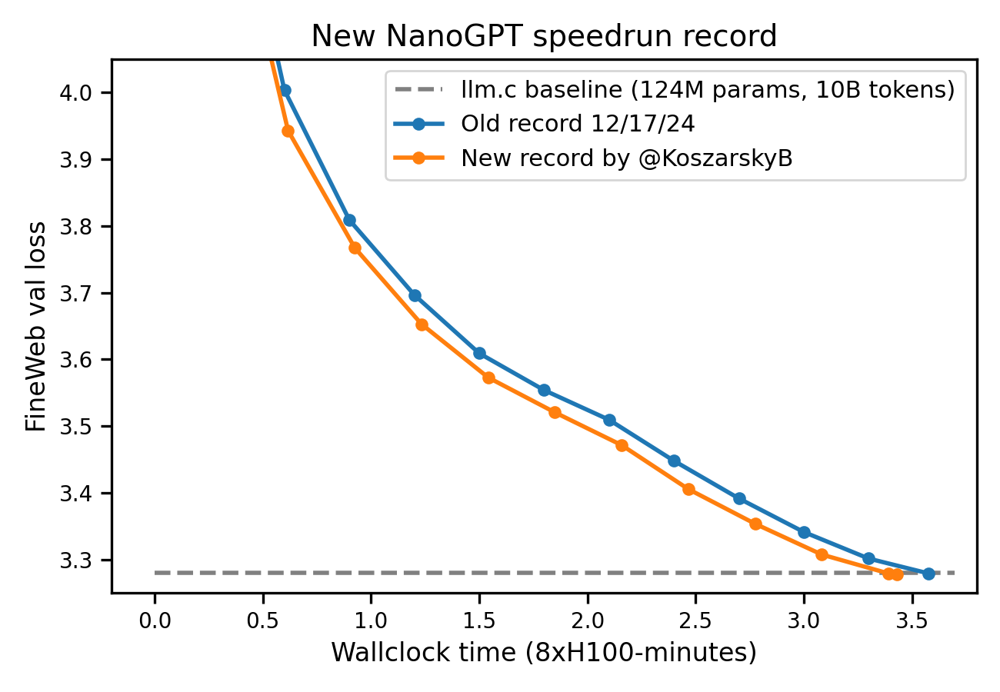

# Softer softcap

This record, by Braden Koszarsky, increases the degree of logit softcapping, yielding a 7% speedup.
[reproducible log](31d6c427-f1f7-4d8a-91be-a67b5dcd13fd.txt)

Previously, logits were softcapped (via tanh) to be at most 30. The new record lowers that to 15,
which boosts performance such that the step count can be reduced from 1490 to 1390.

Lowering the tanh softcap can be understood as a form of extra structure which we are imposing on the network, which improves
performance in the small-scale regime.

Running this new record 80 times yielded the following series of val losses:
```
accs = [3.2798, 3.2804, 3.2837, 3.2808, 3.2782, 3.2801, 3.283, 3.2825, 3.2777, 3.2769, 3.2834, 3.2832, 3.2753,
        3.2809, 3.2778, 3.2801, 3.2799, 3.2804, 3.2765, 3.2792, 3.2786, 3.2792, 3.2801, 3.2762, 3.2803, 3.2784,
        3.2792, 3.2791, 3.2769, 3.279, 3.2784, 3.2775, 3.283, 3.2785, 3.2753, 3.2805, 3.2766, 3.2766, 3.2781,
        3.2819, 3.2754, 3.2827, 3.2803, 3.2784, 3.2802, 3.2794, 3.2765, 3.278, 3.2782, 3.278, 3.2816, 3.279,
        3.2771, 3.2791, 3.2768, 3.2781, 3.2794, 3.2798, 3.2785, 3.2804, 3.2777, 3.2765, 3.2796, 3.278, 3.2803,
        3.2793, 3.2793, 3.2788, 3.2797, 3.278, 3.2799, 3.2813, 3.2803, 3.2768, 3.2803, 3.2796, 3.28, 3.2796,
        3.2783, 3.278]

import scipy.stats
print('p=%.4f' % scipy.stats.ttest_1samp(accs, 3.28, alternative='less').pvalue)
# p=0.0001

import torch
print(torch.std_mean(torch.tensor(accs)))
# (tensor(0.0019), tensor(3.2791))
```



