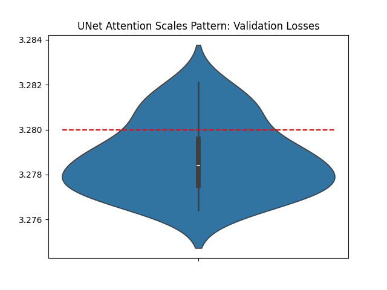

# UNet-pattern Attention Scales



This record, by [Franz Cesista](@leloykun), makes the attention scale follow the UNet pattern instead of just being fixed at $1/\sqrt{d}$.

At first, we made the attention scale learnable. It worked well, reducing training steps by 20. However, the extra overhead made it not so worth it. We then observed that the learned attention scales generally follow a UNet pattern somewhat consistently. So, we decided to hardcode that pattern instead. Overall, this change reduced the training steps by 15 and wallclock time by ~2.4 secs (on my machine).

Diff:

```diff
# For the layer_id-th layer
# In CausalSelfAttention.__init__
+ self.attn_scale = 0.13 + 0.01 * min(layer_id, 11 - layer_id)
...
# In CausalSelfAttention.forward
- y = flex_attention(q.transpose(1, 2), k.transpose(1, 2), v.transpose(1, 2), block_mask=block_mask)
+ y = flex_attention(q.transpose(1, 2), k.transpose(1, 2), v.transpose(1, 2), block_mask=block_mask, scale=self.attn_scale)
```

---

```python
val_losses = [3.2768, 3.2821, 3.2786, 3.2782, 3.2764, 3.2778, 3.2792, 3.2808, 3.2789, 3.2775, 3.2816, 3.2768, 3.2805, 3.2781, 3.2797, 3.2777, 3.2792, 3.2791, 3.2812, 3.2775, 3.2806, 3.2776, 3.2771, 3.279, 3.277, 3.2781]

import scipy.stats
print('p=%.4f' % scipy.stats.ttest_1samp(val_losses, 3.28, alternative='less').pvalue)
# p=0.0002
```

---

Wallclock time improvement: 2.4 secs on Franz' machine

- Jan 4, 2025 record runtime on Franz' machine: 205.5 secs
- This record on Franz' machine: 203.1 secs

---

Having learnable attention scales was originally recommended by the [OG paper on QK-Normalization](https://arxiv.org/abs/2010.04245) and more recently by the [Cosmos team at NVidia](https://arxiv.org/abs/2501.03575v1).

Also thanks to @YouJiacheng and @Grad62304977 for the discussions on this topic.
