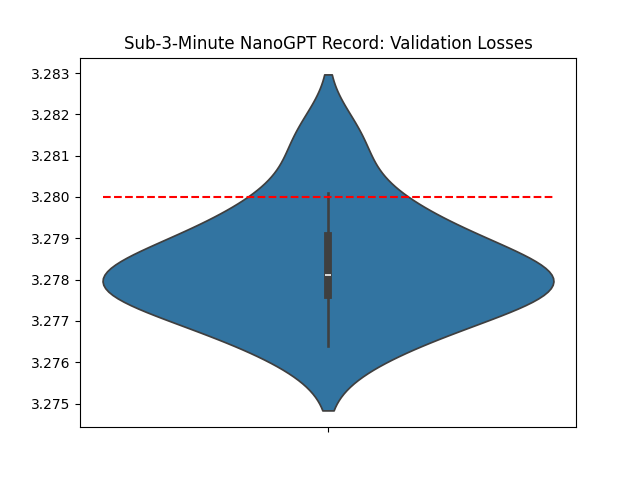
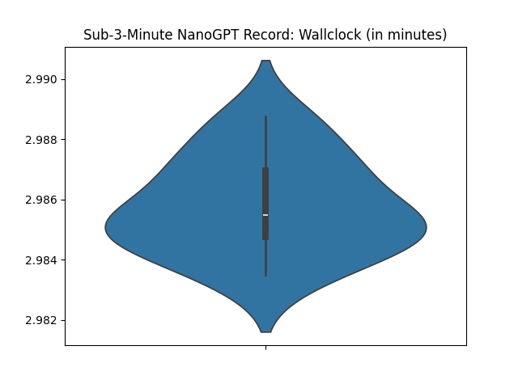

# Misc Tweaks: Sub 3 Mins Record

Changelogs:

- @leloykun's & @YouJiacheng's Long-Short Sliding Window Attention
- @leloykun's & @YouJiacheng's & @brendanh0gan's attention scale modifications
- @tysam-code's & @brendanh0gan's merged QKV weights
  - @scottjmaddox's Batched Muon implementation (to avoid concat on the QKV weights)
  - (c) @YouJiacheng for pointing out this optimization
- @tysam-code's & @YouJiacheng's Adam eps fix

Additional credits:
- @Grad62304977 for suggesting Local-Global Attention which eventually morphed into this implementation
- @koszarskyb for implementing Sliding Window Attention using FlexAttention

---

```python
val_losses = [3.2793, 3.2778, 3.2814, 3.2786, 3.2792, 3.278, 3.2764, 3.2777, 3.2783, 3.2782, 3.2801, 3.2774, 3.2767, 3.2776]

import scipy.stats
print('p=%.4f' % scipy.stats.ttest_1samp(val_losses, 3.28, alternative='less').pvalue)
# p=0.0002
```




---

## Long-Short [Warmup] Sliding Window Attention

This attention mechanism is inspired by the Local-Global Attention introduced by the [Gemma 2](https://arxiv.org/abs/2408.00118) paper (and more recent "hybrid" architecutres). But there are two key differences:

1. We use [Sliding Window Attention](https://arxiv.org/abs/2004.05150) for both the "global attention" (i.e. "long SWA") and the "local attention" (i.e. "short SWA") parts. The difference between the two is that the "long SWA" has double the context length of the "short SWA".
2. We also **warmup the context length** of both the sliding window attention mechanisms, but **at different rates**. The "long SWA" context length is warmed up at a double the rate compared to the "short SWA".

We also made a speedrun-specific decision to only use "long SWA" in the first, fifth, and last layers. The first, because we do not want to compress information too early in the network. The last, because the model architecture we use for the speedrun follows a UNet-like structure, and we want the first and the last layers to be symmetric. And finally, the fifth layer, mainly because it is empirically the best choice for the speedrun.

This would have been very difficult to implement without PyTorch's [FlexAttention](https://pytorch.org/blog/flexattention/).

---

## Attention Scale Modification

