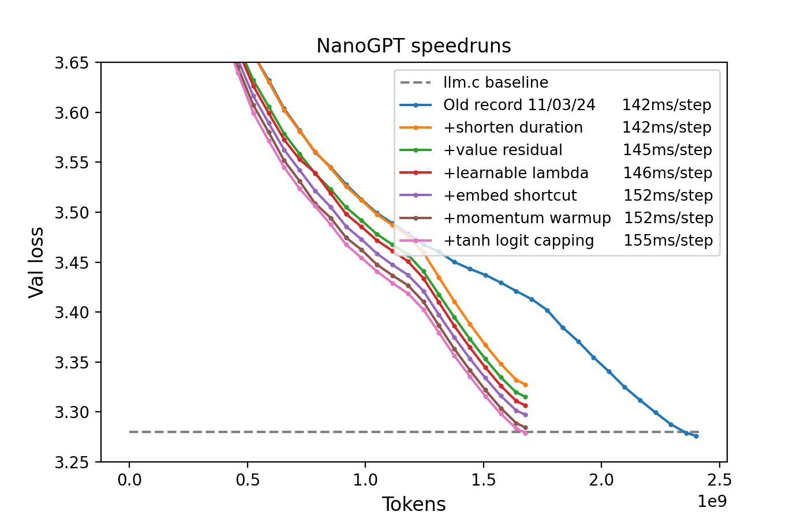

# New record 11/06/24

8.2 minutes on 8xH100 (previous record: 10.8 minutes)

* [Old record 11/03/24](d6b50d71-f419-4d26-bb39-a60d55ae7a04.txt)
* [+shorten duration](4a71cc92-0f43-4058-a033-23e85c1e98f1.txt)
* [+value residual](042f9e87-07e6-4504-bb04-4ec59a380211.txt) by @Grad62304977 following [1]
* [+learnable lambda](43f60c4f-0448-4de7-83d9-643ca26f61e7.txt) @Grad62304977's innovation on top of [1]
* [+embed shortcut](05b29e54-0be0-4a0f-a1e2-7d5317daedd3.txt)
* [+momentum warmup](10119f53-7001-4248-bfd9-33d32427a912.txt)
* [+tanh logit capping](dd7304a6-cc43-4d5e-adb8-c070111464a1.txt) by @Grad62304977 following [2]

## References

1. [Zhou, Zhanchao, et al. "Value Residual Learning For Alleviating Attention Concentration In Transformers." arXiv preprint arXiv:2410.17897 (2024).](https://arxiv.org/abs/2410.17897)
2. [Team, Gemma, et al. "Gemma 2: Improving open language models at a practical size." arXiv preprint arXiv:2408.00118 (2024).](https://arxiv.org/abs/2408.00118)

