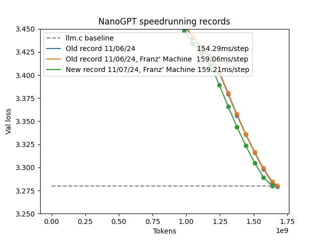
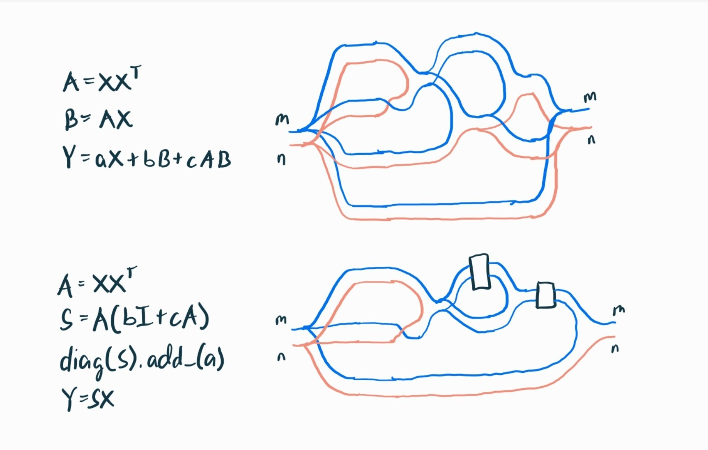

# New record 11/07/24



* [Old record](dd7304a6-cc43-4d5e-adb8-c070111464a1.txt)
* [New record](6c9d875b-ad91-46c9-9ede-2c7f998b9b16.txt)

## Code snippets

### Embedding optimizer's betas cooldown

@jxbz's idea: The embeddings for rare tokens would be updated less frequently, thus their momentum & velocity terms would be more funky--especially near the end of training as it takes a long time for them to decay to zero. Thus, we should reduce the impact of these terms as we wind down the training.

TODO: test cooldown to 0

```python
frac2 = 1 - max(step - args.num_iterations + 500, 0) / 500
optimizer1.param_groups[0]['betas'] = (
    (1 - frac2) * 0.80 + frac2 * 0.90,
    (1 - frac2) * 0.85 + frac2 * 0.95,
)
```

### Optimized implementation for Muon's iterator



```python
I = torch.eye(min(G.size(0), G.size(1)), dtype=X.dtype, device=X.device)
...
for _ in range(steps):
    A = X @ X.T
    S = A @ (b * I + c * A)
    torch.diagonal(S).add_(a)
    X = S @ X
```

### More flexible lambdas for the value residual

In the attention layer:

```python
def forward(self, x, v1=None):
    ...
    v = self.c_v(x).view(B, T, self.n_head, self.head_dim)
    if v1 is None:
        v1 = v
    v = self.lambdas[0] * v + self.lambdas[1] * v1.view_as(v)
```

I simply untied the lambdas for the new V and the first V.

