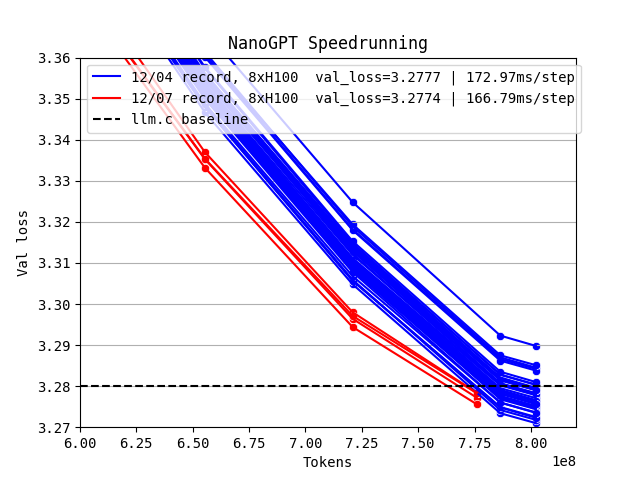
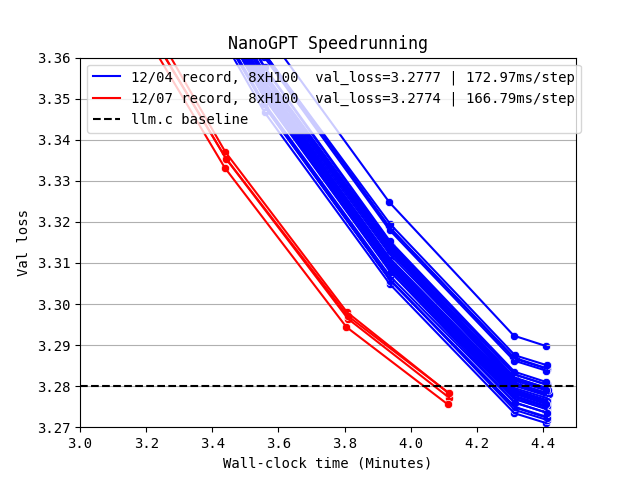

# 12/07/24 ValueEmbedUNet

by [@leloykun](https://github.com/leloykun)




## ChangeLog

* **Added UNet connectivity structure on the value embeddings**. This allowed us to reduce the number of value embeddings from 12 to 6 and the total number of parameters by ~231M. This also reduced the wallclock time per step from ~173ms down to ~167ms.
* **Decoupled the attention value lambda parameter into two separate parameters**. Previously, we were _interpolating_ between the value embeddings and the value activations with a single lambda parameter. Now, we are _linearly combining_ the two.

Together, these changes allows us to reach 3.28 val_loss in just 1480 steps (prev. 1530) with an average wallclock per step of ~167ms (prev. ~173ms).

## Statistical tests

```python
val_losses = [3.2772, 3.2756, 3.2784, 3.2783]

import scipy.stats
p_value = scipy.stats.ttest_1samp(val_losses, 3.28, alternative='less').pvalue
print('p=%.4f; %s' % (p_value, 'significant' if p_value < 0.05 else 'not significant'))

import torch
print(torch.std_mean(torch.tensor(val_losses)))
# (tensor(0.0013), tensor(3.2774))
```

## Notes

- I used the nightly version of PyTorch published on 12/03/24. Later versions causes FlexAttention-related crashes.
