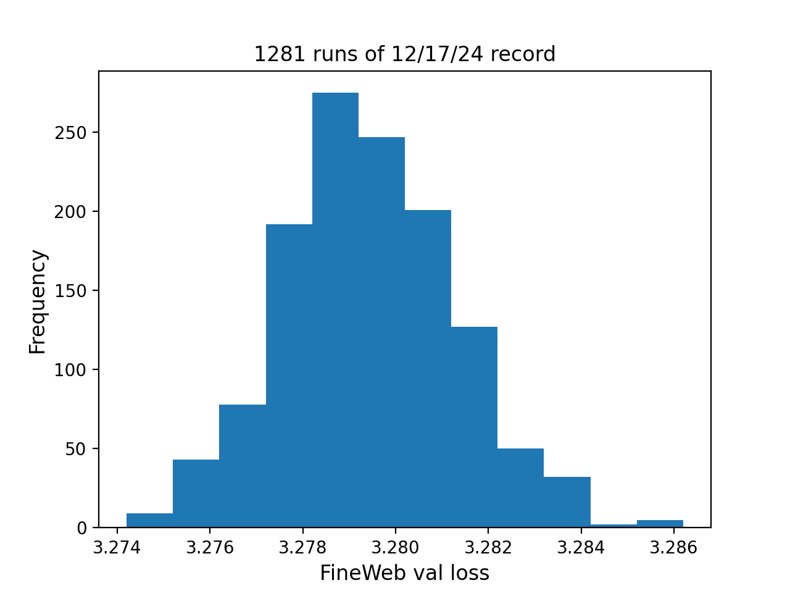

# Sparsify embeds

Running this new record by Jiacheng You 1261 times yielded the following series of val losses:
```
accs = [3.2772, 3.2794, 3.2786, 3.2807, 3.2816, 3.2827, 3.2805, 3.2787, 3.2757, 3.2798, 3.2795, 3.2785, 3.2785, 3.2803, 3.2804, 3.2816, 3.2814, 3.2808, 3.2776, 3.2809, 3.2792, 3.2776, 3.2784, 3.2809, 3.2804, 3.2779, 3.2799, 3.2761, 3.2763, 3.2794, 3.2754, 3.2816, 3.2818, 3.2785, 3.2837, 3.2765, 3.2805, 3.2784, 3.2783, 3.28, 3.2791, 3.2777, 3.2815, 3.2789, 3.2796, 3.2804, 3.2793, 3.2817, 3.2799, 3.2803, 3.2773, 3.283, 3.2781, 3.2785, 3.2771, 3.2824, 3.2819, 3.2791, 3.2799, 3.2792, 3.2771, 3.2799, 3.2782, 3.2811, 3.2786, 3.2774, 3.2786, 3.2807, 3.2775, 3.2778, 3.2778, 3.2801, 3.2764, 3.2774, 3.2801, 3.28, 3.2785, 3.2813, 3.2799, 3.2787, 3.2802, 3.2776, 3.2818, 3.2783, 3.2774, 3.2779, 3.279, 3.2777, 3.2814, 3.2783, 3.2796, 3.2822, 3.2785, 3.2784, 3.283, 3.2799, 3.2786, 3.2799, 3.2797, 3.2791, 3.2761, 3.278, 3.2775, 3.28, 3.2804, 3.2781, 3.2778, 3.2806, 3.2767, 3.2787, 3.2769, 3.2794, 3.2856, 3.2764, 3.278, 3.2814, 3.2803, 3.2781, 3.28, 3.2787, 3.2787, 3.2797, 3.2799, 3.2815, 3.2777, 3.2792, 3.2799, 3.2789, 3.2772, 3.2762, 3.2792, 3.2769, 3.28, 3.2786, 3.2751, 3.2818, 3.2791, 3.2776, 3.2778, 3.2796, 3.2793, 3.2785, 3.2826, 3.281, 3.2781, 3.2796, 3.2783, 3.2788, 3.2811, 3.2818, 3.2803, 3.2794, 3.2757, 3.2793, 3.277, 3.2765, 3.2785, 3.2788, 3.2796, 3.2773, 3.2778, 3.2802, 3.2837, 3.2753, 3.2831, 3.276, 3.2773, 3.2762, 3.2789, 3.2769, 3.2805, 3.2816, 3.2761, 3.2788, 3.2787, 3.2785, 3.2818, 3.2787, 3.2838, 3.279, 3.2805, 3.2807, 3.2804, 3.2797, 3.2752, 3.2838, 3.2834, 3.2792, 3.2804, 3.2793, 3.282, 3.2829, 3.2796, 3.2789, 3.279, 3.2778, 3.2787, 3.279, 3.279, 3.2789, 3.2756, 3.281, 3.28, 3.2804, 3.2796, 3.2803, 3.2795, 3.2781, 3.2783, 3.2772, 3.2807, 3.279, 3.2787, 3.2777, 3.2781, 3.2818, 3.2748, 3.2786, 3.2758, 3.2762, 3.2801, 3.2817, 3.2807, 3.2804, 3.2772, 3.281, 3.2766, 3.278, 3.2753, 3.2803, 3.2787, 3.2799, 3.2797, 3.2794, 3.2823, 3.2769, 3.2789, 3.2769, 3.277, 3.2806, 3.2799, 3.2787, 3.2786, 3.28, 3.28, 3.2813, 3.279, 3.2795, 3.2792, 3.2807, 3.2806, 3.2779, 3.2783, 3.2796, 3.2778, 3.2808, 3.2778, 3.2785, 3.2781, 3.2808, 3.2802, 3.2819, 3.2794, 3.2784, 3.2819, 3.2824, 3.2814, 3.2791, 3.2779, 3.2788, 3.2788, 3.2796, 3.2798, 3.2782, 3.2782, 3.2768, 3.2785, 3.2788, 3.2812, 3.2811, 3.2793, 3.2812, 3.2824, 3.2786, 3.2787, 3.2806, 3.2807, 3.2771, 3.2825, 3.2791, 3.2761, 3.2831, 3.2803, 3.2807, 3.2793, 3.2795, 3.2825, 3.276, 3.279, 3.2817, 3.2808, 3.279, 3.2793, 3.282, 3.2835, 3.2789, 3.2791, 3.2792, 3.2797, 3.281, 3.2795, 3.2775, 3.2772, 3.2818, 3.2787, 3.2775, 3.2814, 3.2787, 3.2818, 3.2772, 3.2796, 3.2787, 3.2815, 3.2795, 3.2799, 3.2785, 3.2772, 3.2788, 3.279, 3.2776, 3.2819, 3.2783, 3.2751, 3.2763, 3.2771, 3.2797, 3.2783, 3.2823, 3.2798, 3.277, 3.2813, 3.2774, 3.2801, 3.2821, 3.2806, 3.2833, 3.281, 3.2819, 3.2794, 3.2815, 3.279, 3.2837, 3.2779, 3.28, 3.2803, 3.2784, 3.2786, 3.2782, 3.2782, 3.2791, 3.279, 3.2806, 3.2801, 3.2807, 3.2797, 3.2767, 3.2796, 3.2798, 3.2816, 3.2766, 3.2823, 3.2772, 3.2765, 3.2784, 3.2775, 3.2779, 3.284, 3.2778, 3.2806, 3.2806, 3.281, 3.2787, 3.2823, 3.2771, 3.2768, 3.2782, 3.2822, 3.2785, 3.279, 3.2811, 3.2785, 3.2781, 3.2802, 3.2793, 3.2794, 3.2811, 3.2837, 3.2785, 3.2809, 3.283, 3.2813, 3.2805, 3.2769, 3.2806, 3.276, 3.2814, 3.28, 3.277, 3.2791, 3.2775, 3.279, 3.2802, 3.2809, 3.2815, 3.2763, 3.2862, 3.2791, 3.2791, 3.2763, 3.2789, 3.2792, 3.2816, 3.2792, 3.2775, 3.2803, 3.2809, 3.2828, 3.2805, 3.2794, 3.2801, 3.281, 3.2772, 3.2806, 3.2789, 3.2827, 3.2796, 3.2846, 3.2812, 3.2791, 3.2765, 3.2784, 3.2777, 3.2773, 3.2778, 3.2768, 3.2783, 3.2793, 3.2778, 3.2776, 3.2742, 3.2769, 3.2774, 3.2813, 3.2801, 3.2807, 3.2777, 3.2821, 3.2794, 3.2791, 3.279, 3.2763, 3.2804, 3.2803, 3.2795, 3.2805, 3.2815, 3.2801, 3.2823, 3.2798, 3.2802, 3.2784, 3.2801, 3.2792, 3.2856, 3.2805, 3.2782, 3.2808, 3.2793, 3.2804, 3.2775, 3.2798, 3.28, 3.2795, 3.2789, 3.2795, 3.2771, 3.2792, 3.2802, 3.2815, 3.2806, 3.2813, 3.2809, 3.2829, 3.2778, 3.282, 3.2825, 3.2789, 3.282, 3.2785, 3.2782, 3.2791, 3.2803, 3.276, 3.2777, 3.279, 3.278, 3.2781, 3.2815, 3.2776, 3.2823, 3.275, 3.2794, 3.2787, 3.2775, 3.2792, 3.2794, 3.2774, 3.2806, 3.2785, 3.28, 3.2758, 3.2795, 3.2778, 3.2796, 3.2817, 3.2785, 3.2815, 3.2797, 3.2749, 3.2785, 3.2804, 3.277, 3.2791, 3.2818, 3.2826, 3.2784, 3.2768, 3.2801, 3.2833, 3.2817, 3.2796, 3.2783, 3.2781, 3.2757, 3.2787, 3.2803, 3.2786, 3.2757, 3.2774, 3.2813, 3.2777, 3.2821, 3.2791, 3.2774, 3.2786, 3.2808, 3.2791, 3.279, 3.2813, 3.2818, 3.2771, 3.2861, 3.2805, 3.2789, 3.2769, 3.2809, 3.2823, 3.2854, 3.2819, 3.2789, 3.2796, 3.2815, 3.2781, 3.2819, 3.2802, 3.2788, 3.2767, 3.277, 3.2798, 3.2806, 3.2787, 3.2778, 3.2786, 3.2805, 3.2799, 3.2776, 3.2775, 3.2815, 3.2791, 3.28, 3.2789, 3.28, 3.2807, 3.2793, 3.2783, 3.2771, 3.2801, 3.2796, 3.2789, 3.2772, 3.2783, 3.2812, 3.2803, 3.2756, 3.2775, 3.2807, 3.2801, 3.2787, 3.28, 3.2827, 3.2801, 3.2798, 3.2785, 3.2798, 3.2787, 3.2785, 3.2796, 3.2762, 3.2808, 3.2788, 3.2775, 3.2765, 3.2792, 3.2784, 3.2787, 3.2793, 3.2793, 3.2784, 3.2773, 3.2812, 3.2785, 3.2759, 3.2781, 3.2786, 3.2783, 3.2804, 3.2791, 3.2791, 3.2772, 3.2803, 3.2773, 3.2778, 3.2809, 3.2815, 3.2784, 3.278, 3.2783, 3.2818, 3.2805, 3.2802, 3.2828, 3.2767, 3.2811, 3.2786, 3.2798, 3.2796, 3.2777, 3.2793, 3.277, 3.2762, 3.2773, 3.2796, 3.2786, 3.2809, 3.2797, 3.2796, 3.2815, 3.2803, 3.2833, 3.2793, 3.2773, 3.2761, 3.2832, 3.2798, 3.2801, 3.2806, 3.2803, 3.2797, 3.276, 3.2798, 3.2797, 3.2788, 3.2824, 3.2785, 3.2802, 3.2817, 3.2766, 3.2815, 3.2797, 3.279, 3.2808, 3.2776, 3.2789, 3.2783, 3.2772, 3.2803, 3.282, 3.2773, 3.2803, 3.28, 3.2772, 3.2827, 3.2804, 3.2776, 3.2794, 3.2815, 3.2836, 3.2813, 3.2794, 3.2795, 3.279, 3.2772, 3.2787, 3.2813, 3.2778, 3.2798, 3.2819, 3.2788, 3.2838, 3.2792, 3.2772, 3.2799, 3.2837, 3.2801, 3.2806, 3.2799, 3.2793, 3.2788, 3.2786, 3.2766, 3.2782, 3.281, 3.2783, 3.2789, 3.2801, 3.2759, 3.281, 3.2762, 3.2795, 3.2799, 3.2835, 3.2772, 3.2794, 3.2803, 3.2782, 3.2804, 3.2782, 3.28, 3.2766, 3.2823, 3.2771, 3.2775, 3.2811, 3.2789, 3.2808, 3.2787, 3.2805, 3.2812, 3.281, 3.2809, 3.2795, 3.2801, 3.2817, 3.2789, 3.2808, 3.2779, 3.2758, 3.2779, 3.276, 3.2779, 3.2823, 3.2818, 3.2816, 3.2806, 3.2807, 3.2788, 3.2778, 3.2821, 3.2777, 3.2779, 3.2775, 3.2785, 3.2794, 3.2813, 3.2825, 3.2812, 3.2801, 3.2782, 3.2807, 3.2797, 3.2781, 3.2778, 3.2778, 3.2803, 3.2832, 3.2819, 3.2783, 3.279, 3.2785, 3.279, 3.2786, 3.2793, 3.2798, 3.282, 3.2794, 3.2818, 3.2796, 3.2795, 3.2796, 3.2779, 3.2788, 3.2776, 3.2787, 3.2766, 3.279, 3.2764, 3.2831, 3.2819, 3.2791, 3.2784, 3.2793, 3.2824, 3.28, 3.2812, 3.2773, 3.2777, 3.283, 3.2774, 3.278, 3.2801, 3.2817, 3.2791, 3.2811, 3.281, 3.2817, 3.2803, 3.2791, 3.2816, 3.2785, 3.2797, 3.2805, 3.2809, 3.2825, 3.2799, 3.2777, 3.2803, 3.2787, 3.2783, 3.2784, 3.2781, 3.2754, 3.2801, 3.2782, 3.2792, 3.2776, 3.2786, 3.283, 3.28, 3.2771, 3.2808, 3.2774, 3.2787, 3.2788, 3.2787, 3.278, 3.2805, 3.2783, 3.2814, 3.2785, 3.2794, 3.2825, 3.2767, 3.2781, 3.2812, 3.2792, 3.2807, 3.2785, 3.2833, 3.2763, 3.2834, 3.2798, 3.278, 3.2783, 3.2781, 3.28, 3.2793, 3.2768, 3.2786, 3.2797, 3.2775, 3.2786, 3.2776, 3.2792, 3.277, 3.2784, 3.2804, 3.2795, 3.2802, 3.2761, 3.2778, 3.2796, 3.278, 3.2776, 3.2781, 3.2791, 3.2768, 3.2797, 3.2835, 3.2774, 3.2783, 3.2814, 3.2799, 3.2799, 3.2812, 3.2787, 3.2815, 3.2786, 3.2771, 3.2796, 3.2812, 3.276, 3.2814, 3.2775, 3.28, 3.2824, 3.2806, 3.2806, 3.2786, 3.2839, 3.2794, 3.2787, 3.2809, 3.2838, 3.2794, 3.2812, 3.282, 3.2783, 3.2813, 3.2803, 3.2784, 3.2826, 3.279, 3.2784, 3.2835, 3.2811, 3.2843, 3.2805, 3.282, 3.2805, 3.2798, 3.2786, 3.2785, 3.2804, 3.276, 3.2764, 3.2774, 3.2783, 3.279, 3.2815, 3.2803, 3.2768, 3.2796, 3.2801, 3.2808, 3.2778, 3.2798, 3.2804, 3.2814, 3.2782, 3.2801, 3.2787, 3.2795, 3.2792, 3.2791, 3.2776, 3.2774, 3.2776, 3.2796, 3.2795, 3.2766, 3.2774, 3.2773, 3.2804, 3.2785, 3.2802, 3.2805, 3.2802, 3.2793, 3.281, 3.2763, 3.2834, 3.2803, 3.2781, 3.2768, 3.2771, 3.278, 3.2779, 3.2815, 3.2812, 3.2807, 3.2819, 3.2824, 3.2812, 3.2806, 3.2782, 3.2797, 3.2782, 3.2793, 3.2755, 3.2808, 3.2816, 3.2796, 3.2817, 3.2779, 3.2774, 3.2774, 3.2774, 3.2794, 3.278, 3.2836, 3.2828, 3.279, 3.2805, 3.2824, 3.2776, 3.2795, 3.2807, 3.2783, 3.2809, 3.2789, 3.2771, 3.2792, 3.2775, 3.2809, 3.2813, 3.2797, 3.2788, 3.2792, 3.2763, 3.282, 3.2762, 3.2787, 3.282, 3.2791, 3.2781, 3.2778, 3.279, 3.2788, 3.2791, 3.2829, 3.2769, 3.28, 3.2768, 3.277, 3.2774, 3.2841, 3.2777, 3.2749, 3.2785, 3.2805, 3.2814, 3.2768, 3.2767, 3.2803, 3.2785, 3.2808, 3.2811, 3.2805, 3.2794, 3.2772, 3.2791, 3.2809, 3.2807, 3.2815, 3.2793, 3.2784, 3.2794, 3.2819, 3.2812, 3.2799, 3.2805, 3.2782, 3.2805, 3.2793, 3.2788, 3.2783, 3.2804, 3.2795, 3.2785, 3.2808, 3.2823, 3.2787, 3.2787, 3.278, 3.2791, 3.2805, 3.2808, 3.2787, 3.2779, 3.2781, 3.2787, 3.2779, 3.2775, 3.2789, 3.2784, 3.2803, 3.2774, 3.2798, 3.2772, 3.28, 3.2816, 3.2792, 3.278, 3.2792, 3.2787, 3.2813, 3.2799, 3.2802, 3.281, 3.2768, 3.2811, 3.2772, 3.2802, 3.2822, 3.2789, 3.2762, 3.2775, 3.2799, 3.2792, 3.2795, 3.2792, 3.2793, 3.2817, 3.2784, 3.28, 3.2792, 3.2788, 3.2815, 3.2782, 3.2826, 3.28, 3.2782, 3.2792, 3.2757, 3.2766, 3.2788, 3.2778, 3.2788, 3.2797, 3.2797, 3.2777, 3.2783, 3.2778, 3.2799, 3.2812, 3.2813, 3.2802, 3.2818, 3.2801, 3.277, 3.2839, 3.2806, 3.2777, 3.2805, 3.278, 3.279, 3.2775, 3.28, 3.2774, 3.2789, 3.277, 3.2807, 3.2805, 3.2795, 3.2777, 3.2813, 3.2805, 3.2809, 3.2814, 3.2794, 3.2797, 3.2803, 3.2802, 3.2808, 3.278, 3.275, 3.283, 3.2791, 3.2761, 3.2787, 3.2797, 3.2781, 3.2754, 3.2775, 3.2797, 3.281, 3.2792, 3.2797, 3.2812, 3.2781, 3.2782, 3.2803, 3.2778, 3.2812, 3.2809, 3.2781, 3.2769, 3.2797, 3.2774, 3.2787, 3.2805, 3.2796, 3.2771, 3.2776, 3.2784, 3.2757, 3.2784, 3.2795, 3.2802, 3.2788, 3.2787, 3.2778, 3.2832, 3.2784, 3.2802, 3.2805, 3.2787, 3.2786, 3.2801, 3.2811, 3.2809, 3.2793, 3.2809, 3.2786, 3.2777, 3.2801, 3.2787, 3.2838, 3.2751, 3.2777, 3.2806, 3.2786, 3.2772, 3.2797, 3.278, 3.281, 3.2808, 3.2769, 3.2774, 3.2779, 3.2836, 3.2792, 3.2786, 3.2834, 3.2786, 3.2781, 3.2809, 3.2788, 3.2799, 3.28, 3.2807]

import scipy.stats
print('p=%.4f' % scipy.stats.ttest_1samp(accs, 3.28, alternative='less').pvalue)
# p=0.0000

import torch
print(torch.std_mean(torch.tensor(accs)))
# (tensor(0.0018), tensor(3.2794))
```



