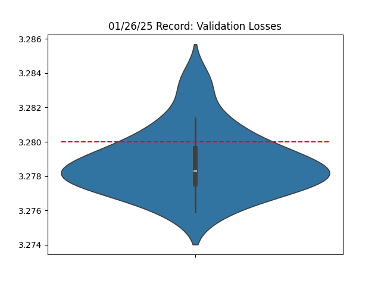
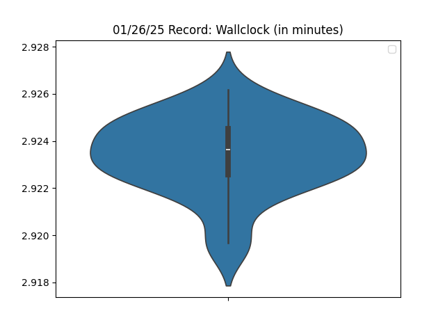
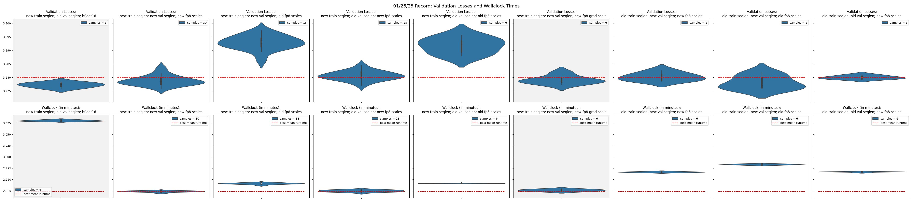

# 11/26/25 - Misc Tweaks

Changelogs:

1. Reduced per-device training sequence length from `64*1024` to `48*1024`. See [Critical Batch Size](https://arxiv.org/abs/2410.21676) literature.
2. Increased per-device eval sequence length from `64*1024` to `4*64*1024`. This improves `val_loss` by `~0.0015` or an equivalent of a reduction of 10 training steps. Overall it saves `~1 sec` of training time.
3. Modified scales for `fp8` training of LM Head. Saves `1 sec` and improves `val_loss` by as much as `~0.01` after reducing training sequence length down to `48*1024`. I don't know wtf is causing this and I'm NOT going crazy about this. I have evidence. See `records/012625_MiscTweaks/no-autocast-same-fp8-scales`.
    - `w_s = 2.0**9` (from `2.0**5`)
    - `grad_s = 2.0**19` (from `2.0**29`)
4. Upgraded PyTorch to 2.7.0 nightly version (20250125) for CUDA 12.6
     - `pip install --pre torch==2.7.0.dev20250125+cu126 --index-url https://download.pytorch.org/whl/nightly/cu126`




```python
accs = [3.2806, 3.2771, 3.2829, 3.2813, 3.2789, 3.2774, 3.2798, 3.2759, 3.2794,
        3.2775, 3.2768, 3.2793, 3.2838, 3.2779, 3.2782, 3.2770, 3.2775, 3.2784,
        3.2782, 3.2776, 3.2814, 3.2785, 3.2793, 3.2797, 3.2782, 3.2789, 3.2759,
        3.2803, 3.2780, 3.2782, 3.2744, 3.2819, 3.2801, 3.2782, 3.2771, 3.2782,
        3.2792, 3.2778, 3.2774, 3.2798, 3.2799, 3.2768, 3.2814, 3.2816, 3.2785,
        3.2817, 3.2801, 3.2755, 3.2780, 3.2774, 3.2797, 3.2789, 3.2843, 3.2777,
        3.2777, 3.2768, 3.2763, 3.2773, 3.2792, 3.2819, 3.2778, 3.2792, 3.2782,
        3.2776, 3.2752, 3.2792, 3.2786, 3.2793, 3.2773, 3.2804, 3.2802, 3.2779,
        3.2780, 3.2779, 3.2801, 3.2773, 3.2802, 3.2770, 3.2785, 3.2772, 3.2818]

import scipy.stats
print(f'p={scipy.stats.ttest_1samp(accs, 3.28, alternative='less').pvalue:.8f}')
# p=0.00000002 (statistically significant)

import torch
print(torch.std_mean(torch.tensor(accs)))
# (tensor(0.0019), tensor(3.2787))
```

---


