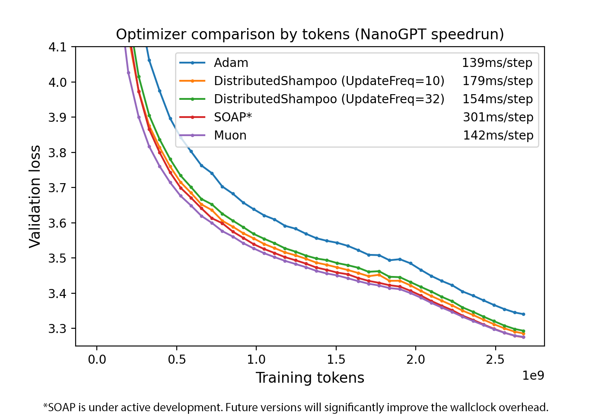
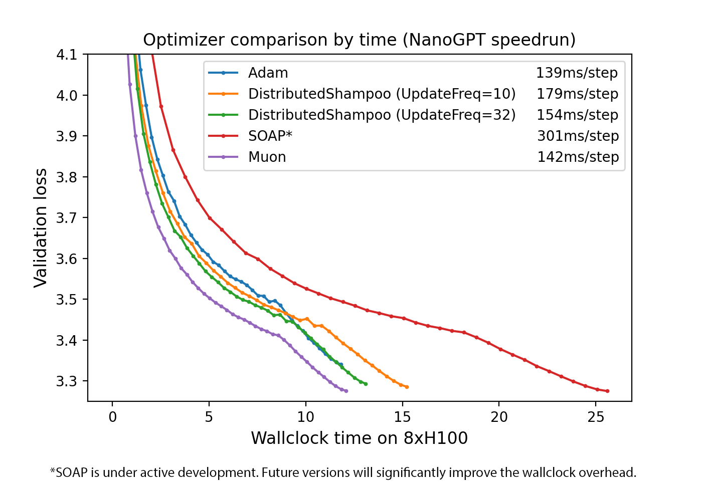

# Optimizer comparison for NanoGPT speedrunning

This is a comparison between the four best optimizers I am aware of for NanoGPT speedrunning. They are compared using the 10/18/24 NanoGPT speedrunning record.

Reproducible logs:
* [Adam](95a9fd44-7c13-49c7-b324-3e7d9e23a499.txt)
* [DistributedShampoo](8bfe4e35-c3fc-4b70-a984-3be937b71ff3)
* [SOAP](e21a2838-a0f2-46f2-a247-db0021165682.txt)
* [Muon](8d6193f4-27fc-4e68-899f-af70019a4d54.txt)

Results:



### General notes for all optimizers

All optimizers are run using zero weight decay (which is found to be empirically optimal).

And they are all run with a warmup-stable-decay / trapezoidal schedule, which also seems to be optimal. That's what causes the kink in the loss curve ~75% of the way to the end.

In addition, in all cases, we optimize the shared embedding/head layer just using Adam (which is also found to be empirically optimal).
Note that in the following code snippets, `raw_model.transformer.h.parameters()` gives all parameters besides those two.

In each case, the hyperparameters are the best ones I could find in around 20 attempts.

## [Adam](95a9fd44-7c13-49c7-b324-3e7d9e23a499.txt)
The optimizer here is equivalent to:
```
torch.optim.Adam(raw_model.transformer.h.parameters(), lr=0.0018, betas=(0.9, 0.95))
```


## [DistributedShampoo](8bfe4e35-c3fc-4b70-a984-3be937b71ff3.txt)
Run as follows:
```
DistributedShampoo(
    raw_model.transformer.h.parameters(),
    lr=0.0018,
    betas=(0.95, 0.95),
    epsilon=1e-12,
    weight_decay=0,
    max_preconditioner_dim=8192,
    precondition_frequency=10,
    use_decoupled_weight_decay=True,
    grafting_config=AdamGraftingConfig(
        beta2=0.95,
        epsilon=1e-8,
    ),   
    distributed_config=DDPShampooConfig(
        communication_dtype=CommunicationDType.FP32,
        num_trainers_per_group=8,
        communicate_params=False,
    ),   
)
```

This is using the official `DistributedShampoo` implementation from [here](https://github.com/facebookresearch/optimizers/tree/ad2809a291c01859f68fcabbcb49a2aa75fd7827/distributed_shampoo).

Things that turned out to be important:
* Don't use epsilon above 1e-8; this loses performance. Epsilon 1e-12 performs as well as 1e-15
* Betas=(0.95, 0.95) seemed optimal, which turns out to be the same thing that SOAP uses
* Higher preconditioner update frequency is better but slower

I'm open to hyperparameter suggestions; the experiment takes ~20-30 minutes to run on a fresh 8xH100 instance, so it's not hard for me to run more attempts.


## [SOAP](e21a2838-a0f2-46f2-a247-db0021165682.txt)
```
SOAP(model.transformer.h.parameters(), lr=0.0018, betas=(.95, .95), precondition_frequency=10)
```

This is using the official SOAP implementation [here](https://github.com/nikhilvyas/SOAP/blob/bbce86e890d3b697380f4376acb600c2d6c3d203/soap.py).

Based on conversations with the authors, it is likely that a future SOAP implementation will significantly reduce the wallclock overhead.


## [Muon](8d6193f4-27fc-4e68-899f-af70019a4d54.txt)
```
Muon(raw_model.transformer.h.parameters(), lr=0.02, momentum=0.95)
```


## Openness

These training logs are reproducible (just cut out the part besides the code, and run it using the `run.sh` in the top-level folder). They take 12-25 minutes to run.

I tried to do a good job sweeping the hyperparameters for each optimizer, but I can easily have missed something, or just not have performed enough runs.

Therefore, I am interested in any better hyperparameter settings which other researchers can find, for any of the optimizers.
If you post or send me your own reproducible log with one of these optimizers, I will be very happy to boost it in any way I can.

## Appendix: Negative results

I believe it was Shazeer who said something like "negative results in machine learning are not worth much, because your inability to make something work doesn't prove that it can't work"

Given that disclaimer, here are some optimizers that I tried to make work, but was unable to get a significant boost over Adam with:
* Sophia
* Lion
* AdamWScheduleFree
* AdEmaMix (actually this was slightly better than Adam, just not enough to get near competing with the three Shampoo-like optimizers)

Of course, this is just for NanoGPT speedrunning (short train duration); it's quite possible they work better at longer training duration or for larger models.

