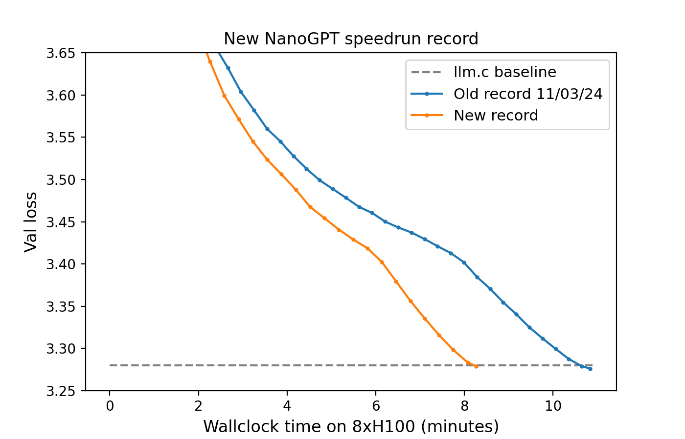
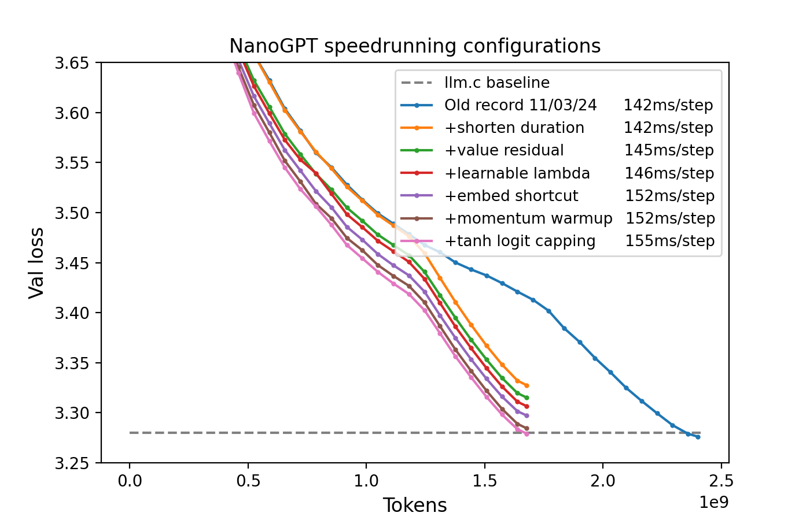

# New record 11/06/24

8.2 minutes on 8xH100 (previous record: 10.8 minutes)




* [Old record 11/03/24](d6b50d71-f419-4d26-bb39-a60d55ae7a04.txt)
* [+shorten duration](4a71cc92-0f43-4058-a033-23e85c1e98f1.txt)
* [+value residual](042f9e87-07e6-4504-bb04-4ec59a380211.txt) by @Grad62304977 following [1]
* [+learnable lambda](43f60c4f-0448-4de7-83d9-643ca26f61e7.txt) @Grad62304977's innovation on top of [1]
* [+embed shortcut](05b29e54-0be0-4a0f-a1e2-7d5317daedd3.txt)
* [+momentum warmup](10119f53-7001-4248-bfd9-33d32427a912.txt)
* [+tanh logit capping](dd7304a6-cc43-4d5e-adb8-c070111464a1.txt) by @Grad62304977 following [2]

## Code snippets

### Value residual

In the attention layer:
```
def forward(self, x, v1=None):
    ...
    v = self.c_v(x).view(B, T, self.n_head, self.head_dim)
    if v1 is None:
        v1 = v
    v = 0.5 * v + 0.5 * v1.view_as(v)
```
Where the first block receives v1=None, and subsequent blocks receive v1 as the value produced by the first block.

### Learnable lambda

In the attention block:
```
def __init__(self, config):
    ...
    self.lamb = nn.Parameter(torch.tensor(0.5))

def forward(self, x, v1=None):
    ...
    v = (1 - self.lamb) * v + self.lamb * v1.view_as(v)
```
That is, we just replace the fixed 0.5 constant used in standard value residual [1] with a learnable scalar (optimized by Adam(lr=0.02)).

### Embed shortcut

Replaces the standard transformer block with this:

```
class Block(nn.Module):

    def __init__(self, config):
        super().__init__()
        self.attn = CausalSelfAttention(config)
        self.mlp = MLP(config)
        self.lambdas = nn.Parameter(torch.tensor([1., 0.]))

    def forward(self, x, x0): 
        x = self.lambdas[0] * x + self.lambdas[1] * x0 
        x = x + self.attn(F.rms_norm(x, (x.size(-1),)), v1)
        x = x + self.mlp(F.rms_norm(x, (x.size(-1),)))
        return x
```

where the two scalars are optimized using Adam(lr=0.02), and `x0` is fed in from the initial embedding via:
```
...
x = self.transformer.wte(idx) # token embeddings of shape (b, t, n_embd)
x = F.rms_norm(x, (x.size(-1),))
x0 = x
for block in self.transformer.h:
    x = block(x, x0)
...
```

### Momentum warmup

Just adds the following two lines.
```
frac = min(step/500, 1)
optimizer3.param_groups[0]['momentum'] = (1 - frac) * 0.85 + frac * 0.95
```
where `optimizer3` is the Muon for the body of the transformer.

### Tanh soft capping

Just adds the following line.

```
logits = 30 * torch.tanh(logits / 30)
```


## References

1. [Zhou, Zhanchao, et al. "Value Residual Learning For Alleviating Attention Concentration In Transformers." arXiv preprint arXiv:2410.17897 (2024).](https://arxiv.org/abs/2410.17897)
2. [Team, Gemma, et al. "Gemma 2: Improving open language models at a practical size." arXiv preprint arXiv:2408.00118 (2024).](https://arxiv.org/abs/2408.00118)

