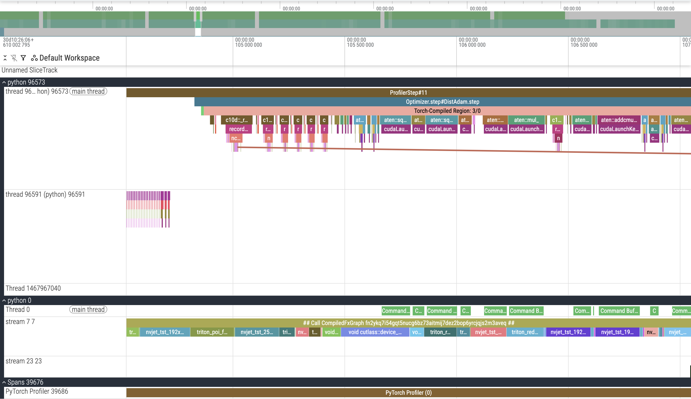
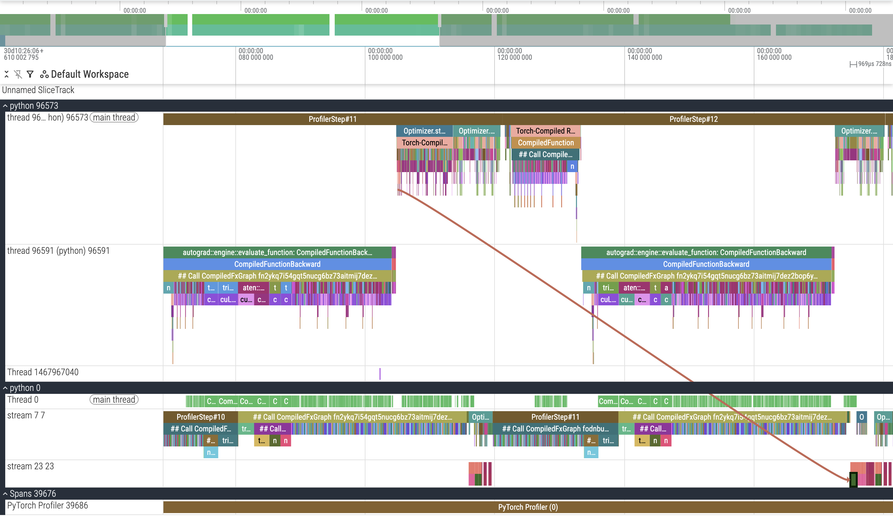
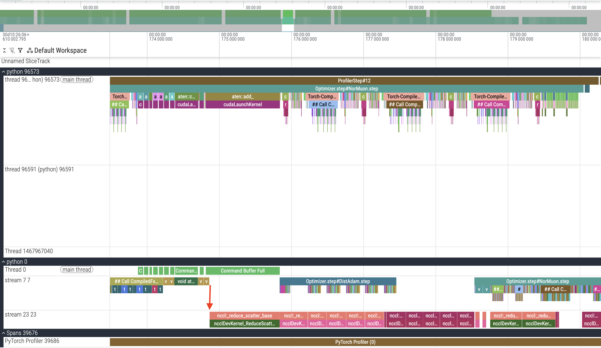
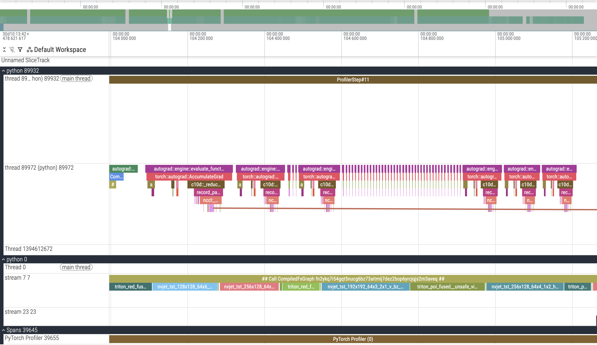
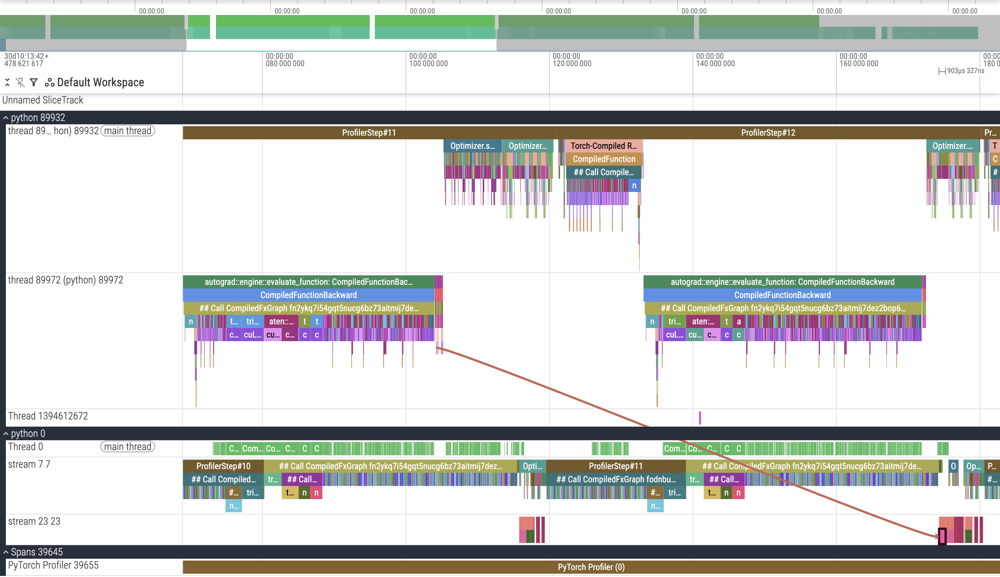
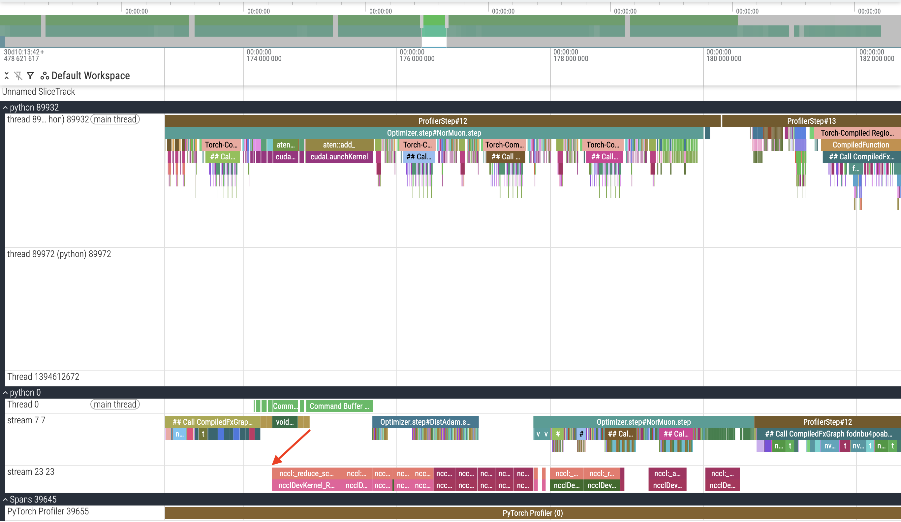

# Adam Gradient Sync in Backward Hooks

This PR improves the overall training time and avg training step time by moving the `DistAdam` gradient sync reduce-scatter collectives for each model parameter out of the `step` method and into a backward hook. The `step` method is then modified to iterate through the param groups and parameters in reverse order to benefit from this change by stepping parameters in later layers first. The parameters of later layers will have their backward hooks called sooner, which should result in their gradient syncs being triggered earlier and completed sooner.


## Timing and Validation

This PR improves the final training time by ~0.7 seconds

This PR:

```
import scipy.stats
import torch

losses = [3.2775, 3.2776, 3.2777, 3.2780, 3.2781, 3.2775, 3.2786, 3.2774, 3.2751, 3.2739]
times = [140.909, 140.872, 140.743, 140.743, 140.747, 140.809, 140.728, 140.784, 140.862, 140.934]

print("p=%.4f" % scipy.stats.ttest_1samp(losses, 3.28, alternative="less").pvalue)
# p=0.0001

print("losses:", torch.std_mean(torch.tensor(losses)))
# losses: (std=0.0015, mean=3.2771)

print("time:", torch.std_mean(torch.tensor(times)))
# time: (std=0.0760, mean=140.8131)
```

Previous PR timed on same machine:

```
import scipy.stats
import torch

times = [141.654, 141.413, 141.467, 141.516]

print("time:", torch.std_mean(torch.tensor(times)))
# time: (std=0.1033, mean=141.5125)
```

## Changes


### Reduce Scatter in `DistAdam` Backward Hook

Even though the collective operations are async, they all occur at the end of each training step. The previous implementation looped through each parameter in order, launched the reduce-scatter operation, and then immediately waited for it to complete.

In this PR I moved the reduce-scatter operation launch out of the `step` method and into a backward hook, registered using `register_post_accumulate_grad_hook` to ensure the gradients are ready. Since the backwards hooks will first be executed for later model layers, their reduce-scatters will start and complete first.


### Step params and param groups in reverse order

To take advantage of this, I modified the `step` method of `DistAdam` to iterate through the param_groups and parameters in reverse order. In our init function we define param groups to group by the parameter tensor's shape. The parameters of later layers are at the end of the parameters lists and since their reduce-scatters are launched earlier, we iterate and wait on the reduce-scatter futures earlier in our `step` method's loop.

Similarly we iterate through param_groups in reverse because the first group will correspond to the first shape we encounter, therefore parameters for later layers should be contained in later param_groups.


## Profiler Trace Analysis

The tracefiles are checked in and can be explored using the [perfetto trace viewer](https://ui.perfetto.dev)

### Current Implementation

To start, here is the profiler trace for the current implementation. We can see that the first reduce-scatter operation begins at the start of the `DistAdam` step.

#### First Reduce-Scatter

#### Overview


#### Overlap
Looking at the GPU streams, we can see that the initial reduce-scatter does not overlap with the main GPU stream.


### Hook Implementation

Similarly in the new implementation we can see that the first reduce-scatter is launched by the first hook.

#### First Reduce-Scatter

#### Overview


#### Overlap
This time we can see that the reduce-scatter overlaps with the computation on the main GPU stream.

