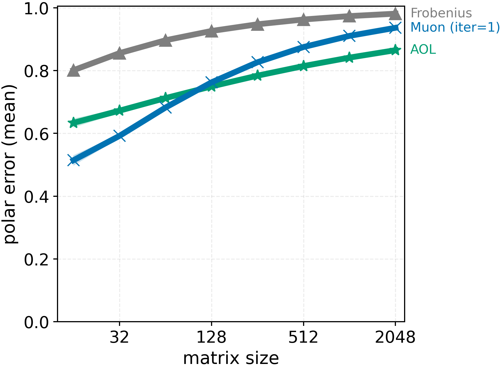
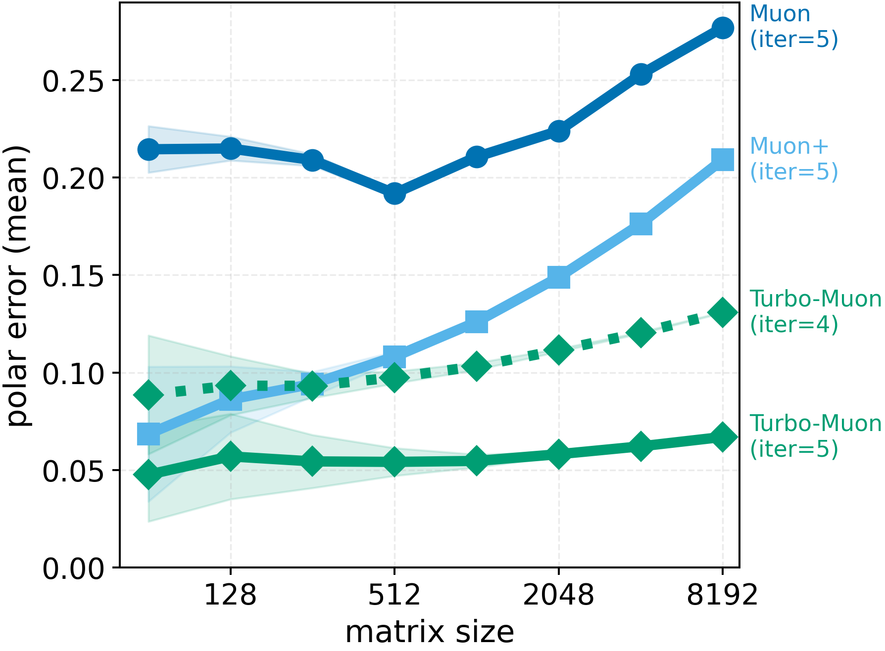

# Description:
Building atop #154 this PR introduces Turbo-Muon, a preconditioned version of the Newton–Schulz orthogonalization used in Muon. The method applies an Almost-Orthogonal Layer (AOL) preconditioning step that improves the initial approximation of the polar factor, enabling faster convergence and the removal of one NS iteration without loss of numerical precision. ( as described [here](https://x.com/ThibautBoissin/status/1961427640340156437) and [here](https://github.com/thib-s/flash-newton-schulz) )

# Timing and Validation

Unfortunately, I do not have access to nodes with 8x H100 GPUs, so my verification was done on nodes with 4x H100 GPUs. 
I then adjusted the runtimes to have a coarse estimation of the runtime on 8xH100 (likely too optimistic). I've added my measurements for PR154 on similar hardware (4xH100) for reference.

```python
import scipy.stats
import torch

losses = [3.2779,3.2782,3.2782,3.2788,3.2814,3.2807,3.2780,3.2780,3.2795,3.2802]
# I adjusted times since I have only 4xH100 instead of 8
# times should not be compared directly, more modest improvements should be expected
times = [266.623/2,266.600/2,266.504/2,266.707/2,266.779/2,266.627/2,266.532/2,266.682/2,266.816/2,266.726/2]

print("p=%.4f" % scipy.stats.ttest_1samp(losses, 3.28, alternative="less").pvalue)
# p=0.0018

print("losses:", torch.std_mean(torch.tensor(losses)))
# losses: (std=0.0013, mean=3.2791)
# results of PR154: losses: (std=0.0014, mean=3.2774)


print("time:", torch.std_mean(torch.tensor(times)))
# time: (std=0.0506, mean=133.3298)
# results of PR154: time: (std=0.0734, mean=136.8784)
```

Two important notes:
1. The p-value seems correct, but I've noted a very slight increase in mean loss (+0.002)
2. My experiments run on a Slurm cluster, and I've observed variations in runtime depending on the allocated node (around 1.5s). I'm confident this PR improves runtime, but I do think that the gain is overestimated (I expect something closer to 1.5s)

## Changes

For this implementation we started from the [dion implementation of newton schulz](https://github.com/microsoft/dion)
which has a great triton implementation of the newton schulz algorithm.

### triton kernel for ns_line_3:

We noticed that the ns_line_3 function was taking a lot of time, so we wrote a triton kernel to avoid multiple
loadings of the same data. This give a marginal speedup on small matrices, where loading data is the bottleneck.

### Fewer iterations:

We remove the previous normalization to switch to AOL rescaling
Which is further explained in the paper: https://arxiv.org/pdf/2208.03160

This consists in computing W@W^t using ns_line_1 and then computing the
scaling factors: fast_inv_sqrt(reduce_sum(abs(WW^t), axis=-1)) which is a vector



Since the main operation to compute those correspond to ns_line_1,
we can fuse it with the first newton schulz iterate. Furthermore this gives a better
starting point for the newton schulz iterations as the matrix is closer to orthogonal

Thanks to this, we can save one iteration of newton schulz (here compared with the implementation from [here](https://github.com/microsoft/dion)):



However, usual polynomial coefficients are not optimal anymore since the preconditioning changes the spectrum of the matrix. This 
allows for more aggressive coefficients, which would be suboptimal without preconditioning.
The simplest way to obtain such coefficients is to simply drop the first iteration of the usual
newton schulz coefficients.