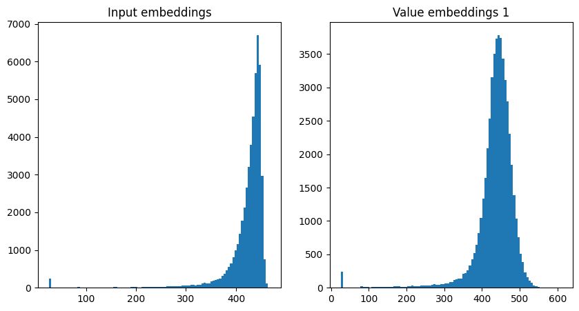

This record implements [Cautious Weight Decay](https://arxiv.org/abs/2510.12402) on Adam (skipping the scalars).

## Timing and Validation

Removed 20 steps, no run-time overhead as the extra computations are overlapped with cross-GPU communication

```
import scipy.stats
import torch

losses = [3.2746, 3.2769, 3.2760, 3.2776, 3.2771, 3.2722, 3.2740, 3.2779, 3.2765, 3.2870, 3.2773, 3.2754]
times = [127.065, 126.984, 126.965, 127.067, 126.988, 126.999, 127.094, 127.092, 126.957, 127.059, 126.971, 126.997]

print("p=%.4f" % scipy.stats.ttest_1samp(losses, 3.28, alternative="less").pvalue)
# p=0.0060

print("losses:", torch.std_mean(torch.tensor(losses)))
# losses: (tensor(0.0036), tensor(3.2769))

print("time:", torch.std_mean(torch.tensor(times)))
# time: (tensor(0.0514), tensor(127.0198))
```

Previous record (timed on the same machine):

```
import scipy.stats
import torch

baseline_times = [128.158, 128.171, 128.183, 128.216]
print("time:", torch.std_mean(torch.tensor(baseline_times)))
# time: (tensor(0.0249), tensor(128.1820))
```

This shows an improvement of $ \approx 1.1 $ seconds.

## Notes

The last sentence of [record 43](../2025-11-10_CautiousWD/README.md) implied it may be a good idea to add cautious weight decay
to the ADAM-optimized parameters. As I was working towards a [previous record](../2025-12-10_SALambdaOnWeights/README.md), I had
noted that the embeddings were huge, as evidenced by this histogram of embedding magnitudes:



**Extras**: I was wondering about the weight-decay schedule, I'm not convinced it's necessary as weight decay is no longer decoupled
from the learning rate. I got ok results by removing the coupling in Muon and tweaking the constant a bit. I did not investigate this
further as it seemed more obviously beneficial to add weight decay to Adam.