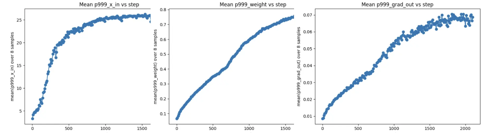

This record reties the LM Head with the first embed and tunes some of the FP8 Scales. I have incorporated the results of [PR#172](https://github.com/KellerJordan/modded-nanogpt/pull/172).

## Timing and Validation

This record has 55 fewer steps than the previous record at approximately the same step time.

```
import scipy.stats
import torch

losses = [3.2777, 3.2790, 3.2776, 3.2792, 3.2760, 3.2792, 3.2767, 3.2763, 3.2770]
times = [123.853, 123.969, 123.929, 123.933, 123.914, 123.906, 123.970, 123.914, 123.964]

print("p=%.4f" % scipy.stats.ttest_1samp(losses, 3.28, alternative="less").pvalue)
# p=0.0002

print("losses:", torch.std_mean(torch.tensor(losses)))
# losses: (std=0.0013, mean=3.2776)

print("time:", torch.std_mean(torch.tensor(times)))
# time: (std=0.0375, mean=123.9280)
```

Previous record (timed on same machine):

```
import scipy.stats
import torch

times = [127.051, 127.139, 127.049, 127.147, 127.163, 127.161]

print("time:", torch.std_mean(torch.tensor(times)))
# time: (std=0.0537, mean=127.1183)
```

These timings show an improvement of $\approx 3.2$ seconds.

Thank you to Prime Intellect for sponsoring my research with GPU credits.

## Tied Embed and LM Head

[Record 8](https://x.com/kellerjordan0/status/1853188916704387239) untied the LM Head with the Embed layer. This record came with two other changes: namely, adding an RMS Norm after embedding, and initializing the LM Head with zeros.

In this record, I reverse both the first and third change from Record 8. My motivation was to reduce the Adam step time by reducing the amount of parameters that needed to be communicated. I thought that this tradeoff might be reasonable even if it came with an increase in the number of steps. In fact, I found that re-tying the Embed and LM Head could significantly decrease step count. On the other hand, there is basically no impact to the per-step time. I do not know exactly why, though I am guessing the fact that the LM Head weight is both the first and last element in backprop destroys some of the current asynchronous logic in DistAdam.

## Decreasing the FP8 Scales

I discovered the above prior to PR#172 but it turns out both benefit from retuning the FP8 Scales. I ran the following experiment on the shared LM Head/Embed weight:



which guided my choice of relative scales for the FP8 weights. These plots also indicate that a simple linear schedule could be optimal for the FP8 scales, though I failed to make this work with simple attempts.

Applying the scales in this Record to PR#172 without tying the LM Head gave me the following results:

```
import scipy.stats
import torch

losses = [3.2754, 3.2756, 3.2779, 3.2746, 3.2740]

print("losses:", torch.std_mean(torch.tensor(losses)))
# losses: (std=0.0015, mean=3.2755)
```

It seems that the FP8 weight rescale improves the mean and the high variance seemingly caused by cautious weight decay on the adam parameters.
