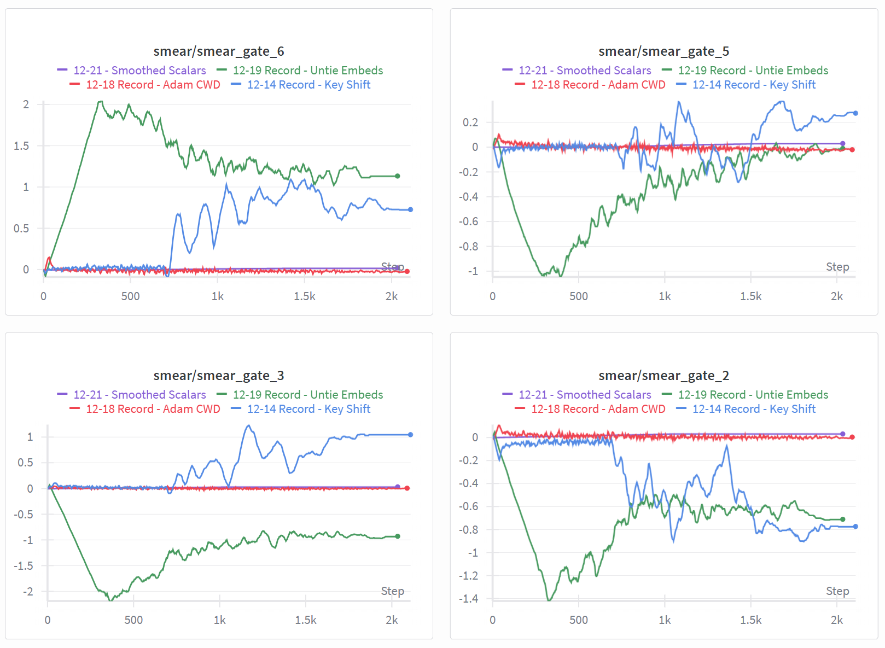
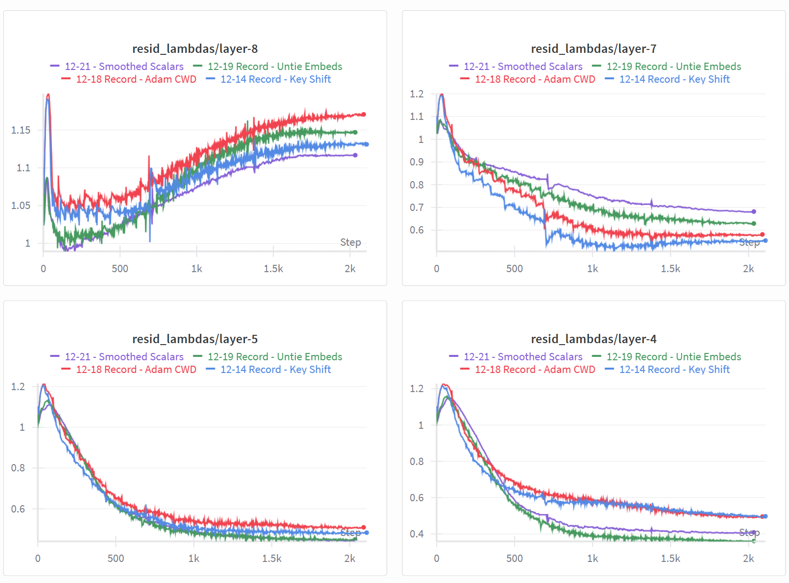
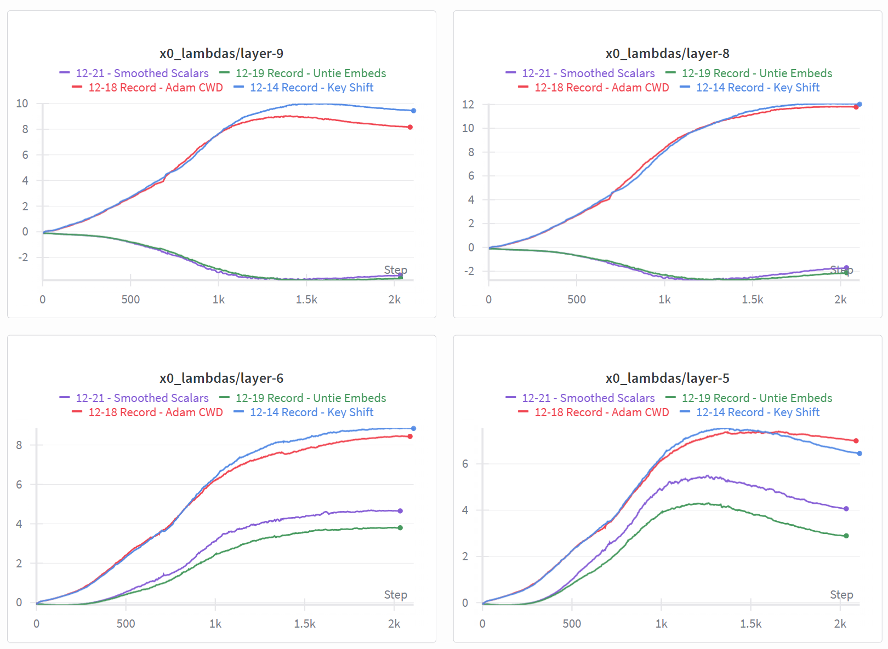
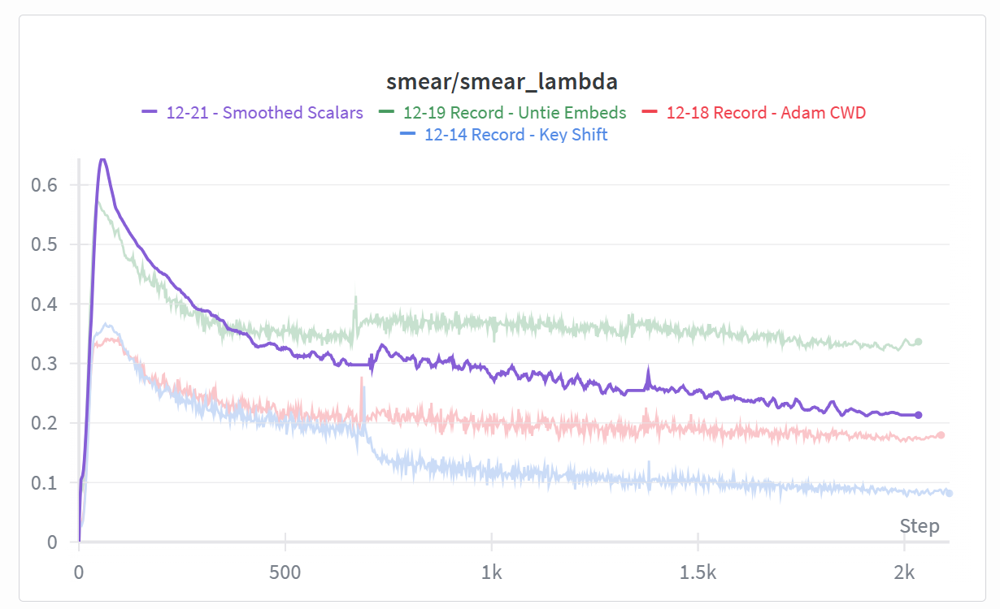

## Smoothed Scalars and Smear Gate

This update includes:
1. Moving the smear gate to Adam and giving it a very low learning rate.
2. Separating the scalars out into their own instance of Adam so we can apply stronger beta values to them for smoothing.
3. Pausing the scalars' updates during schedule transitions (batch size and window size).
4. Using 'all_reduce' in Adam for parameters with fewer than 1024 values.

```
                                   Runs   Time μ  Time σ  Time +/-  Loss μ  Loss σ  Loss +/-        p
12-19-Baseline                        5 124.3646  0.1454    0.0000  3.2785  0.0021    0.0000   0.0922
12-21-Smooth-Scalars-stps.2000        7 122.0859  0.0484   -2.2787  3.2789  0.0008    0.0004   0.0045

12-19-Baseline:
  losses = [3.2762, 3.2788, 3.2773, 3.2817, 3.2786]
  times  = [124.2520, 124.3050, 124.3510, 124.6170, 124.2980]
  (n = 5)

12-21-Smooth-Scalars-stps.2000:
  losses = [3.2790, 3.2782, 3.2784, 3.2793, 3.2786, 3.2804, 3.2783]
  times  = [122.1310, 122.1400, 122.0070, 122.0660, 122.1040, 122.0450, 122.1080]
  (n = 7)

```

### **Smear Gate Updates**

I've been experimenting with logging the values of the scalar parameters in the model over the course of training, and am seeing some interesting behavior relating to the schedule transitions, and to the smear gate weights in particular.

For reference: each input token to our model is actually a sum of itself and the prior token. The multiplier on the prior token is determined by the smear gate. Token `t` determines how much of token `t-1` to add to itself using the first 12 dimensions of its embedding, which are the input to the smear gate.

Here are a few of the smear gate weight values from recent records.



For the key shift record (in blue), the smear gate values were small and noisy, but stable, until we hit the first shcedule transition around ~700 steps, where the batch size, window size, and learning rate increase.

Then, with cautious weight decay added to Adam (in red) the weight values were again small and noisy, but stayed relatively stable throughout training.

With the most recent record, re-tying the embeddings (in green), the noise appears reduced, and the batch size jump doesn't destabilize it.

(Note: The long ramp corresponds to Muon's momentum warmup period of 300 steps.)

Moving the smear gate weights to Adam and reducing the learning rate to 0.01 brought it in line with the value range it has had before the destabilization point, and also smoothed it strongly.

I haven't worked through the math, but I could imagine that there's a strong relationship between the embedding table and the smear gate. Even though its only 12 dimensions, its output is applied to every position of every embedding in the sequence.

### **Increased Smoothing on Scalars**

The scalars in the model seem to more-or-less follow predictable / consistent trajectories across runs, but are noisy.



My thought was that, given how clear the intended trajectory of the scalars is, it might be beneficial to find a way to make them follow that path with less noise.

In order to increase the beta values on just the scalars, I landed on creating a second instance of DistAdam specifically for them.

Also, I found that the `x0_lambdas` (below) are unique in that they are already very smooth in comparison to the other scalars.

Additional momentum altered their course, so to avoid that, I separated them out from the `scalars` block and kept them with the main instance of Adam.



### **DistAdam All Reduce**

The changes to the parameters (separating x0_lambdas, and moving the smear gate) complicates the sharding logic in Adam.

To avoid that, and because it "seems sensible", I adjusted DistAdam to use `all_reduce` for parameters with fewer than 1,024 values. This means that each GPU receives the full set of gradients for these weights and does redundant work to update them. The benefit is that we don't need to pad to the world size, and we don't need to issue a gather operation for them at the end.

I figured I might have added overhead overall, though, by splitting off x0_lambdas. It doesn't appear to have made things worse, though:
(This compares to the prior record at the same number of steps)
```
                                   Runs   Time μ  Time σ  Time +/-  Loss μ  Loss σ  Loss +/-        p
12-19-Baseline                        5 124.3646  0.1454    0.0000  3.2785  0.0021    0.0000   0.0922
12-21-Smooth-Scalars-stps.2035        5 124.2794  0.0447   -0.0852  3.2765  0.0015   -0.0020   0.0031
```

### **Pausing Scalar Updates**

I tried several approaches, such as gradient clipping, to prevent the big swings that occur in the values when the schedule changes.

I haven't been able to smooth them out fully, but what's seemed to work best was to zero the gradients for the scalars for 40 steps, while preserving their momentum buffers. Preserving the buffers means they still have that healthy momentum when jumping back into the turbulence.



### **Further Work**

* The model still seems destabilized:
    * Some scalars appear to be oscillating.
    * Even with the changes here, values are noisier after the batch size change.
* Most of the scalars have an initial large swing during the first 100 steps. I don't know whether that's a problem or not.
    * They also seem to have clear "starting points", i.e., initial values that they settle into after the swing.
    * I tried to address the swings and start at the weight's "intended" intial value by customizing the inits and clamping down learning rates, but it didn't seem to help loss.
    * I think the right way to address the swings (if they are a problem) is to add a warmup period to the scalars' momentum (higher momentum amplifies the swing) and maybe their learning rate as well.
* I tried a few yolo runs where I added custom lrs and betas to all scalars, and tried to smooth everything out. It wasn't obviously fruitful.

### **Other Changes**

* A recent (closed) pull request referenced updating to a more recent pytorch nightly, so I used that on my instance:
`pip install --pre torch==2.10.0.dev20251210+cu126 --index-url https://download.pytorch.org/whl/nightly/cu126`
* I simplified (I think) the logic for assigning parameters to optimizers by specifying them directly using lists of label names.
    * These lists also replace the ones that were inside the optimizers previously. 
    * I added asserts to ensure that all parameters have labels. 
