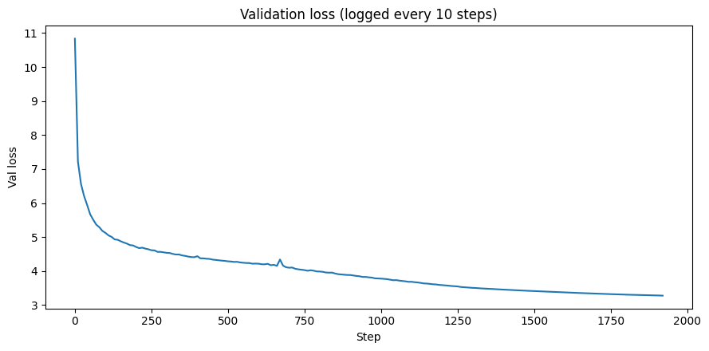

This record implements:
- a form of multitoken prediction
- Untying the LM Head and Embed weight at 2/3rds through training (contribution from @ClassicLarry)

There are additionally the following minor changes
- Changing CWD on Adam from `>=` to `>` (contribution from @ClassicLarry)
- Halving the weight initialization for the attention heads
- Slightly decreasing the magnitude of the second learning rate bump

## Timing and Validation

This PR has 80 fewer steps than PR#177 at a slightly higher step time.

```
import scipy.stats
import torch

losses = [3.2783, 3.2809, 3.2784, 3.2783, 3.2787, 3.2776, 3.2781, 3.2780, 3.2768, 3.2798, 3.2789, 3.2797, 3.2795, 3.2794]
times = [119.694, 119.820, 119.762, 119.794, 119.811, 119.760, 119.801, 119.923, 119.677, 119.754, 119.726, 119.865, 119.685, 119.578]

print("p=%.4f" % scipy.stats.ttest_1samp(losses, 3.28, alternative="less").pvalue)
# p=0.0003

print("losses:", torch.std_mean(torch.tensor(losses)))
# losses: (std=0.0010, mean=3.2787)

print("time:", torch.std_mean(torch.tensor(times)))
# time: (std=0.0867, mean=119.7607)
```

Previous record (timed on same machine):

```
import scipy.stats
import torch

times = [122.445, 122.882, 122.913, 122.940, 122.939]

print("time:", torch.std_mean(torch.tensor(times)))
# time: (std=0.2131, mean=122.8238)
```

These timings show $\approx 3.06$ seconds of improvement.

Thank you to Prime Intellect for sponsoring my research with GPU credits.

## Multi-token prediction

This record implements Multi-token Prediction without adding any additional parameters. It uses a weighted average of the cross entropy loss over the next $k$ tokens as the total step loss. I will describe the schedule in terms of the three phase schedule for training.

1) First phase: weighted average over 3 token MTP. The weights start at `[1, 0.5, 0.25]` and decay to `[1, 0.5, 0.0]`.
2) Second phase: weighted average over 2 token MTP. The weights start at `[1, 0.5]` and decay to `[1, 0.0]`.
3) Third/extension phase: Regular next-token prediction.

In shorthand, this schedule can be described as `[1, 0.5, 0.25->0] -> [1, 0.5->0] -> [1]`.




## Untying the LM Head and Embed weight

This idea goes back to a comment by @ClassicLarry in PR#175:

> My shaky hypothesis here is that since the embed gradient is very sparse, it benefits from tagging along with the lm_head gradient early, since there are some core similarities between token relationships in lm_head space and embed space. This sparsity was previously handled by scaling up the lr 75x, which is less stable than the approach here. But later on in training the embed and lm_head are fundamentally different, and benefit from having their own representations.

I found that the 75x learning rate is probably due more to the high initial weight initialization on the original version of the embedding weights rather than the sparsity of the updates. I found that the untied embedding weights did not benefit from learning rate a multipler, though it may be possible to include, perhaps by using a schedule, or lowering the magnitude of the weights.

## Additional Details

* The change for CWD from `>=` to `>` shows minor improvement in Adam.
* Halving the weight initialization for the attention heads shows empirical improvement, and now corresponds to Kaiming/Xavier initialization for $q$, $k$, $v$ weights assuming they are treated as square $(768, 768)$ parameters.
* Slightly decreasing the magnitude of the second learning rate increase seems to slightly decrease variance.
* Matching PR#177, I'm using nightly 12/10 and Python version 3.12.
* My timing for this record seems a bit slower than both PR#175 and PR#177.

TODO: Include ablations for the above
