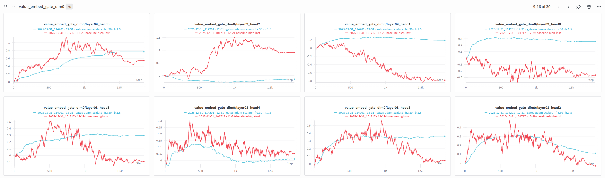
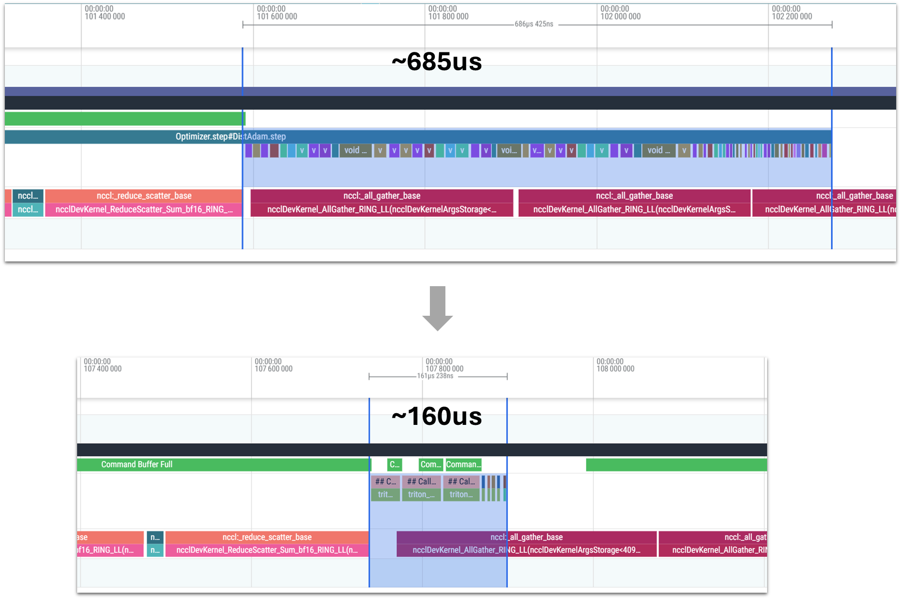

One last one to wrap up 2025.

This record includes multiple changes to Adam:

1. Attention and VE gates moved to Adam, and defined as parameter banks for comms efficiency.
2. float32 state (`exp_avg` and `exp_avg_sq` buffers) for all Adam parameters.
3. Compiled helper function for Adam update math.

```
                            Runs   Time μ  Time σ  Time +/-  Loss μ  Loss σ  Loss +/-      p
12-29-baseline                 7 114.4301  0.0283    0.0000  3.2787  0.0009    0.0000 0.0036
12-31-gates-to-adam            7 114.1380  0.1078   -0.2921  3.2774  0.0010   -0.0013 0.0003
12-31-gates-to-adam-20stps    10 112.9730  0.0692   -1.4571  3.2789  0.0010    0.0002 0.0031
```

My initial commit was showing a more significant time improvement (without removing steps), but had a very high variance on the runtime. I re-ran to get the above results, and the variance was still fairly high--108ms. 
Oddly, after removing 20 steps to take advantage of the decrease in loss, the times were much more stable again. 
All 24 runs were on the same machine, run consecutively.

Here are the individual runs:

```
12-29-baseline:
  losses = [3.2778, 3.2774, 3.2788, 3.2794, 3.2791, 3.2787, 3.2798]
  times  = [114.4190, 114.4200, 114.4760, 114.4620, 114.4140, 114.3960, 114.4240]
  (n = 7)

12-31-gates-to-adam:
  losses = [3.2772, 3.2771, 3.2783, 3.2756, 3.2784, 3.2772, 3.2783]
  times  = [114.2900, 114.0690, 114.2260, 114.0950, 114.2260, 114.0050, 114.0550]
  (n = 7)

12-31-gates-to-adam-20stps:
  losses = [3.2794, 3.2780, 3.2791, 3.2788, 3.2786, 3.2780, 3.2804, 3.2802, 3.2774, 3.2793]
  times  = [112.8490, 112.9770, 113.1200, 113.0130, 112.9440, 112.9710, 112.9860, 112.9150, 112.9730, 112.9820]
  (n = 10)
```

### Gates Moved to Adam

I logged some weight values from the attention and value embedding gates and they were exhibiting noise that looked similar to how the smear gate was previously.

Moving them to Adam smoothed them out significantly. The loss didn't clearly improve from that change alone, but did have lower variance.




(Note: The blue line is illustrative of the effect, but includes some changes which I ultimately backed out, explained at the end)

Moving these gates does result in Adam managing a large number of additional parameters--10 attention gate parameters and 5 ve gate parameters. Each of these is handled separately, meaning separate kernel calls and communication.

To address this, I "pre-stacked" the weights across the layers into two parameters.

### Gate Parameter Banks

This pre-stacking is what I've been referring to as a "parameter bank" approach. The attention gates for all 10 attention modules are defined as a single nn.Parameter with shape (10, 6, 12)--10 layers, 6 heads, 12-dims. Similarly the ve gates are a single (5, 6, 12) nn.Parameter.

Adding the batch dimension means that they can be used by the individual layers with just a `view`--no slicing required (which could impact compute).

Because these gate banks are a small number of parameters, they follow the `all_reduce` path in Adam, where every GPU works on the full set of the gradients instead of dividing up the work.

### Parameter Bank Workarounds

Parameter banks require defining the parameter at the top level (in the GPT class), and then passing the appropriate portion down to the individual modules.

There are a few challenges with this approach that require some unfortunate workarounds.

First, it would be nice / feel more natural to pass a view to each module during init. However, views do not follow device movement, so when we call `model.to` the views would need to be re-created. To resolve this, I pass the view of the gate weights as an argument to attn.forward call, which just looks a little odd.

The second issue is that I noticed from profiling the code that it was using some less efficient kernels in the backwards path. I don't have a deep understanding of the fundamental issue, or how the workaround addresses it, but here it is. 

* The issue: Passing a view of the weights into each forward call forces torch.compile to use a less efficient `select_backward` kernel.
* The workaround: You can resolve this by calling `unbind(0)` on the bank in `GPT.forward` to turn the 3D bank into a python tuple of 2D weight matrices.

### Float32 Adam State

I discovered by accident that, while the embedding tables and gate weights are bfloat16, it appears to be slightly faster and lowers the loss if the Adam optimizer state (the `exp_avg` and `exp_avg_sq` buffers) are stored as float32. 

```
                              Runs     Time μ  Time σ  Loss μ  Loss σ       p
weights bf16 - state bf16        4   113.8900  0.2746  3.2786  0.0009  0.0243
weights bf16 - state fp32        5   113.8622  0.4169  3.2777  0.0010  0.0036
```

### Fused Update Function

We can fully fuse the Adam operations using the same techniques I applied to Muon for cautious weight decay and the variance normalization:

* 0-D cpu tensors for passing in values which change frequently, and 
* using low-level pytorch operators which:
    * perform operations in-place to avoid additional memory traffic
    * eliminate edge cases which prevent `torch.compile` from fusing the operations

I added a helper function to perform the math, with `@torch.compile(dynamic=False, fullgraph=True)` to achieve the fusion.

The amount this reduces the Adam compute is remarkable:


Also note that the gates (the first of the three muon blocks in the baseline) are moved.

Here's a closer look at the Adam block:



The change does come at the cost of readability, though--it replaces the nice, legibile "code that looks like math" pytorch operators with explicit function calls.

To balance this somewhat, I added comments to each line which show what they're doing in the simpler pytorch syntax. Here's the helper function.

```python
    @staticmethod
    @torch.compile(dynamic=False, fullgraph=True)
    def _update_step(p_slice, g_slice, exp_avg, exp_avg_sq, beta1, beta2, eps, step_size_t, eff_wd_t):
        """Compiled Adam update step. step_size_t and eff_wd_t are 0-D CPU tensors to avoid recompilation."""
        exp_avg.mul_(beta1).add_(g_slice, alpha=1 - beta1)  # exp_avg = beta1 * exp_avg + (1 - beta1) * g_slice
        exp_avg_sq.mul_(beta2).addcmul_(g_slice, g_slice, value=1 - beta2)  # exp_avg_sq = beta2 * exp_avg_sq + (1 - beta2) * g_slice^2
        # compute step
        update = exp_avg.div(exp_avg_sq.sqrt().add_(eps)).mul_(step_size_t)  # update = (exp_avg / (sqrt(exp_avg_sq) + eps)) * step_size
        # cautious weight decay
        mask = (update * p_slice) > 0
        update.addcmul_(p_slice, mask, value=eff_wd_t)  # update += eff_wd_t * p_slice * mask
        p_slice.add_(other=update, alpha=-1.0)  # p_slice -= update
```

### Frozen Scalars

I fixed the code for freezing the scalars; freezing for 40 steps reduced total training time by ~150ms, but increased loss.

I tried moving the gates to the same Adam instance as the scalars to leverage the higher beta values, and froze them for 30 steps. The plots looked good and I got a run with a particularly low loss, but it was a red herring.

I tried doing my final runs with that arrangement and reduced steps, but the variance was too high, so I'm falling back on earlier results with no reduction in steps. I'll have to play with the configuration more another time.

Update: Added screenshots of traces
Update: Added results of new runs
