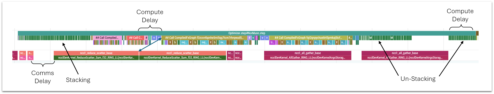
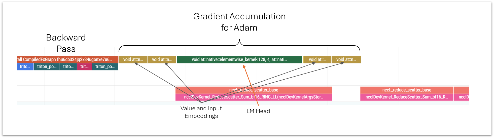
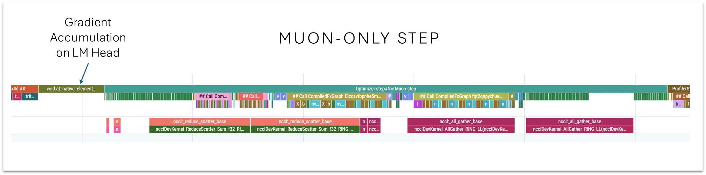

# Unified, Zero-Copy Optimizer and Transposed LM Head

The main contributions of this record are:

1. A combined and simplified optimizer, `NorMuonAndAdam`, oriented towards per-parameter rather than per-optimizer configuration.
2. MLP and Attention parameter banks, allowing for a uniform workload across the gpus and eliminating all memcpys.
3. A transposed memory layout for the LM head, which resolves the slow element-wise gradient accumulation kernel.

I did my development against record 59. After integrating record 60 (logit softacp kernel) and re-timing I was able to remove another 5 steps (-10 steps total):
```
                   Runs   Time μ  Time σ  Time +/-  Time p  Loss μ  Loss σ  Loss +/-      p
baseline              8 105.5361  0.0923    0.0000     NaN  3.2783  0.0008    0.0000 0.0003 # At 1775 steps
unified-optimizer     8 104.4579  0.1430   -1.0782  0.0000  3.2782  0.0015   -0.0001 0.0060 # At 1765 steps

baseline:
  losses = [3.2777, 3.2785, 3.2790, 3.2785, 3.2788, 3.2791, 3.2766, 3.2784]
  times  = [105.3690, 105.5950, 105.4140, 105.5520, 105.5610, 105.5820, 105.6090, 105.6070]
  (n = 8)

unified-optimizer:
  losses = [3.2781, 3.2803, 3.2767, 3.2799, 3.2794, 3.2767, 3.2767, 3.2780]
  times  = [104.6490, 104.4420, 104.2430, 104.4540, 104.4860, 104.3220, 104.6550, 104.4120]
  (n = 8)
```

Using record 59 (the MLP kernel) as baseline and reducing 5 steps:
```
                 Runs   Time μ  Time σ  Time +/-  Loss μ  Loss σ  Loss +/-      p
Baseline            8 107.0998  0.0763    0.0000  3.2792  0.0017    0.0000 0.1039  # At 1775 steps
unified-optimizer  10 106.4940  0.0245   -0.6058  3.2790  0.0006   -0.0001 0.0002  # At 1770 steps

baseline:
  losses = [3.2814, 3.2777, 3.2788, 3.2767, 3.2803, 3.2779, 3.2793, 3.2812]
  times  = [107.1350, 107.1030, 107.0080, 107.2160, 107.0990, 107.0060, 107.0510, 107.1800]
  (n = 8)

unified-optimizer
  losses = [3.2788, 3.2795, 3.2782, 3.2792, 3.2795, 3.2789, 3.2800, 3.2791, 3.2789, 3.2783]
  times  = [106.4900, 106.4900, 106.5200, 106.4550, 106.5010, 106.4950, 106.5390, 106.4620, 106.5000, 106.4880]
  (n = 10)
```

Notes:
* I also included the `triton_kernels.py` change, and added a line at the top of train_gpt.py to pull the kernel code into the log file.
* None of the changes in this PR should change the math or precision; however, they give a consistent reduction in loss (across multiple machines) which allowed for removing 5 steps relative to record 59.
    * I believe I've narrowed the cause down to having replaced the gradient accumulation hooks with an explicit ordering of communication and optimizer work, but otherwise can't explain it.


## 1. Unified, Zero-Copy Optimizer

### 1.1. Stacking vs. Sharding 

One of the core changes in this PR is the consolidation of the attention and mlp weight matrices into two "parameter banks", which can be sharded across the GPUs, eliminating the need for stacking and unstacking during the optimizer window.

**Current Approach**

The approach to communicating the Muon parameters has been to:

1. Assign different attention and MLP matrices to different GPUs.
2. Assemble each GPUs set of gradients by stacking them together.
3. Scatter the stacks, do the Muon math, then gather the updates.
4. Unstack the received updates and apply them to the local parameters.

This approach has a few drawbacks:

1. The stacking and unstacking operations require time-consuming memcpys, which have made it more difficult to fully overlap comms and compute (though a recent PR achieved it!).
2. It relies on the attention weight matrices having the same size, shape, and orientation as the mlp weights.
3. It runs in two passes, where the first pass works on all of the attention weights plus some of the MLP weights, and the second pass only works on the MLPs. The attention matrices are faster to process, but both passes are constrained by the length of the MLP work.

This illustration is out-of-date, so ignore what it says about comms and compute delays, but it highlights the memcpys I'm referring to, and shows how time-consuming they are.



**Parameter Banks**

This PR utilitizes a "parameter bank" strategy that was introduced in a previous PR for the attention gates and ve gates, and I've extended it to the attention and mlp projection matrices.

The QKVO weight matrices from all 10 attention modules are stored as a single parameter of shape (10, 4*768, 768). This can be 'reshaped' without memory movement to (40, 768, 768), and then sharded evenly across the 8 GPUs (so that each gets five attention matrices). 

The MLP weight matrices (11 modules, 2 matrices per module) require padding to be sharded evenly. Their parameter bank is (12, 2, 4*768), and this is "reshaped" to (24, 4*768) so that each GPU receives 3 matrices to process.

Note that means we're paying the communication and optimizer overhead for an entire additional MLP, so we may be able to find a use for those weights. There are some notes on what I tried under the `Ideas` section. 

Now, both passes have balanced workloads, and:
* The first pass should be significantly faster than before, with each GPU working only on attention weights, and only (5, 768, 768) each. 
* The second pass will be slower than before, with each GPU now working on 3 MLP matrices instead of two.

### 1.2. Individual Parameters

An additional benefit of the parameter banks is that it helps eliminate the need for the concept of "parameter groups".

Optimizer groups exist to handle the fact that we typically have multiple instances of the same functional matrix--e.g., we have 10 layers worth of attention weights--which all share settings like learning rate.

Groups add an additional layer of abstraction and complexity to the optimizer code. With the parameter banks, our model no longer has per-layer parameters, and instead has "only" the 13 distinct parameters in the table below (defined in the `TrainingManager` init function).

```python
# - Ordering dictates when to launch reduce/reduce_scatter operations
# - "sharded" parameters use reduce_scatter/all_gather and "replicated" ones use all_reduce
self.param_table = {
    "attn":           {"optim": "normuon", "comms": "sharded",     "adam_betas": None},
    "mlp":            {"optim": "normuon", "comms": "sharded",     "adam_betas": None},         
    "scalars":        {"optim": "adam",    "comms": "replicated",  "adam_betas": [0.9,  0.99]},
    "ve0":            {"optim": "adam",    "comms": "sharded",     "adam_betas": [0.75, 0.95]},
    "ve1":            {"optim": "adam",    "comms": "sharded",     "adam_betas": [0.75, 0.95]},
    "ve2":            {"optim": "adam",    "comms": "sharded",     "adam_betas": [0.75, 0.95]},
    "smear_gate":     {"optim": "adam",    "comms": "replicated",  "adam_betas": [0.9,  0.99]},
    "skip_gate":      {"optim": "adam",    "comms": "replicated",  "adam_betas": [0.9,  0.99]},
    "attn_gate_bank": {"optim": "adam",    "comms": "replicated",  "adam_betas": [0.9,  0.99]},
    "ve_gate_bank":   {"optim": "adam",    "comms": "replicated",  "adam_betas": [0.9,  0.99]},
    "x0_lambdas":     {"optim": "adam",    "comms": "replicated",  "adam_betas": [0.65, 0.95]},
    "lm_head":        {"optim": "adam",    "comms": "sharded",     "adam_betas": [0.5,  0.95]}, # Before embed for grad aggregation
    "embed":          {"optim": "adam",    "comms": "sharded",     "adam_betas": [0.5,  0.95]}, # Last (skipped when tied)
}
```

The one remaining set of components that could arguably still be grouped are the value embedding tables. Instead, I've individually labeled them as 've0', 've1', and 've2' to treat them as distinct parameters.

## 1.3. Replacing Hooks with Explicit Ordering

The most substantial benefit we were getting from registering gradient accumulation hooks was to overlap communication with the lengthy lm_head gradient accumulation kernel. With that removed (as described further down), there's less benefit to overlapping the smaller kernels, and I chose to remove the feature for simplicity and added flexibility in ordering the communication and workload.

The order of the parameters in the above `param_table` dictates the order in which we issue the scatter or all_reduce operations, and then a separate list specifies the order that we work on them:

```python
# - Process smaller/faster params first while large reduces complete
# - lm_head must complete before embed sync (when tied)
self.work_order = [
    "scalars", "smear_gate", "skip_gate", "attn_gate_bank", "ve_gate_bank", "x0_lambdas",  # Small, fast
    "ve0", "ve1", "ve2",  # Medium
    "lm_head", "embed",   # lm_head must complete before embed sync (when tied)
    "attn", "mlp",        # Large, polar express - process last to maximize overlap
]
```

This ordering was chosen by Claude Opus, and the comments are its' rationale. This strategy outperforms the prior hook approach and appears to be responsible for the reduction in validation loss that allowed me to remove 5 steps.

I think the rationale for the work order makes sense, but note how its roughly the opposite of the communication order--that part seems counterintuitive to me.

### 1.3. Debugging Comms

I've been having issues lately with getting good trace data. The profiler is somehow slowing things down much more than usual, and the communication data in particular doesn't look right. This has made it hard to arrive on a deliberate strategy and validate it.

In other words, I can't rationalize / confirm that the current communication and work strategy is optimal. It would even make sense for there to exist a hook-based solution that outperforms this one. This PR is very much "for whatever reason, this works better than what we had".

Just for future reference, I've printed out the order that the hooks were firing in, which tells us what order gradient accumulation happens in, and which in turn may have some value in understanding communication behavior.

Note: To include the NorMuon parameters as well, I added hooks to them and manually set the gradient accumulation steps to 2 so that they would trigger.

Here's the order they're called in:

1. scalars
2. embed
3. smear_gate
4. lm_head
5. skip_gate
6. mlp
7. attn
8. ve_gate_bank
9. ve2
10. attn_gate_bank
11. ve1
12. x0_lambdas
13. ve0

Not very intuitive!

## 2. Transposed LM-Head

Another long-standing communications issue has been the slow gradient accumulation kernel for the LM head. 

The below illustrations are from an older baseline, but highlight the problem well.

In the Adam plus Muon steps:



In the Muon-only steps:



I've resolved this by transposing the memory layout of the LM head so that it now has shape (768, 50304), and updated the FP8 implementation to support this. From test runs and looking at single GPU trace files, it appears to have identical forward/backward performance to the current implementation.

Here's what was behind the slow kernel, and how transposing addresses it.

### 2.1. Mismatched Memory Layouts

Currently, the backward pass produces gradients for the LM head with layout (768, 50304), but the head is stored as (50304, 768).

I've learned that, while CUDA can often hide the cost of mismatched memory layouts when performing matrix multiplications, it's not possible to hide this problem for element-wise operations.

This is because values can be read once and used multiple times in matmul, but for element-wise operations each value is read and used exactly once. When the memory layouts don't match, it has to stride through one of the matrices, resulting in kernels that run substantially slower.

This is the reason for the slowness of the current gradient accumulation kernel, which takes maybe 4x longer than the other embedding tables despite being the same size and shape.

Transposing the head brings the weights and gradients into alignment. This has the biggest impact for the NorMuon-only steps, where we've never been able to overlap any communication with the slower kernel.

### 2.2. Tied Embeddings

This change was more clearly beneficial back before we re-tied the embeddings. The tied embeddings create a problem--the input embeddings _still need_ to have their current shape of `(50304, 768)` so that the embeddings are laid out consecutively in memory and can be selected efficiently.

To resolve this, I "untied the embeddings" in the sense that there are now always two separate matrices involved, but they're kept effectively tied by managing their gradients and updates manually. 

This means manually combining the LM head and input embedding gradients before scattering them, and then copying the received updates into both the `embed` and `lm_head` weights.

This actually brings us back where we started--expensive elementwise operations on two misaligned matrices--but now it's inside of the optimizer step code where there's plenty of compute available and we have the ability to overlap it with comms. 

### 2.3. Optimizer State After Untying

An additional challenge was setting up the optimizer state for the `embed` matrix at the untie point. Because of the difference in orientation, each GPU handles a `(96, 50304)` shard of `lm_head` and a `(6288, 768)` shard of `embed`. That means we can't simply copy the Adam momentum buffers from one to the other. 

Thank you to @ClassicLarry for suggesting a more straightforward solution to this than what I had been trying. We simply perform an explicit communication step to make sure every GPU has the correct momentum buffer state for `embed`. This preserves the behavior and accuracy of the existing implementation.

## Ideas

With the Muon memcpys gone, we have quite a lot of compute available during the optimizer window. Here are a few things I played with that might deserve exploring more, or might spark other ideas.

### Interpolated Embedding Updates

Because we're now manually combining the gradient updates of the input embeddings and LM heads to tie them, we have the opportunity to "mix" them differently; i.e., we could scale the input embedding gradients up or down relative to the lm_head before combining them. 

### Blending / Switching Muon and Adam

Adam is remarkably fast, and I think we can afford to run both NorMuon and Adam on the MLP and Attention weights at the same time. I tried some experiments blending their updates over the course of training, but nothing looked promising.

What I'd still be interested to try, though, is switching the projection matrices from Muon to Adam towards the very end. Compared to Muon's orthogonalization constraint, I'm wondering if the per-parameter freedom of Adam's updates might allow it to settle into a better local optimum (or find one faster) at the end of training.

(Larry has some interesting notes on this idea in the comments of the PR)

### Starting `forward` Within `step`

It's not a giant time savings, but inside of the optimizer window, while still waiting for the attention and MLP gathers to complete, we can start selecting the next input embeddings, normalizing them, applying the smear gate, and perhaps even running the first attention layer (since those weights arrive before the MLPs).

I started on this, but set it aside when I realized how complicated / impossible it would be when doing gradient accumulation steps. 

I think the solution there would probably be to define a separate training loop that's only for the 8x gpu setup (with no gradient accumulation support), where we could apply this.

### Leveraging the Spare MLP Weights

We are now paying the communication and optimizer overhead for another MLP's worth of weights. 

One idea I tried for taking advantage of this was to use one of those spare matrices to serve as the QKVO weights to restore attention layer 6.

Because this matrix is optimized with the MLP weights, Muon treats it as one big matrix instead of four separate ones. Not ideal, but it still works.

It seemed promising, with some very low loss values: `[3.2740, 3.2722, 3.2733, 3.2758]`

However, it takes about 50 steps to break even, and the loss was far too high (row 4 below).

I tried both with and without the skip connection (which seems like it may be serving some of the role of the missing attention layer?):

```
                            Runs   Time μ  Time σ  Time +/-  Loss μ  Loss σ  Loss +/-      p
This Record                   10 106.4940  0.0245    0.0000  3.2790  0.0006    0.0000 0.0002
Restore Attn 6, remove skip    4 109.3678  0.0814    2.8738  3.2754  0.0011   -0.0036 0.0017
Restore Attn 6, keep skip      4 109.5280  0.0281    3.0340  3.2738  0.0015   -0.0052 0.0019
Above, minus 50 steps          8 106.4315  0.0485   -0.0625  3.2816  0.0012    0.0026 0.9964
```

Maybe with the right adjustments to the skip connection, or other attention attributes, it could work?
