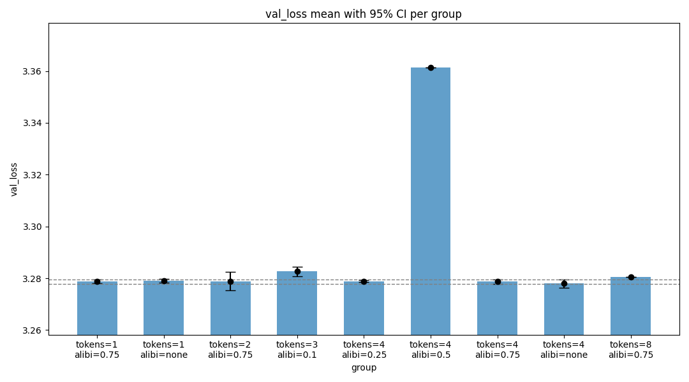

## New Record: Vertical Attention (-0.73s, -20 steps)

Updates in PR:

* Reduce step count from 1600 to 1580
* A "vertical attention" head attending to the means of the last 4 tokens of every layer

I tried to generalize skip connections after reading https://github.com/KellerJordan/modded-nanogpt/pull/138 and https://github.com/KellerJordan/modded-nanogpt/discussions/23?sort=new#discussioncomment-11358596 and decided to try a learned attention head over the recent token pools of every layer.

### Ablations

I tried fewer and more tokens per layer, uniform attention (no ALiBi), fixed sinusoids over layer index, ALiBi -0.25, -0.5, -0.75, -0.9.

I only made 1-3 runs per variation so ablations are not statistically significant.



### Ideas

The ablations are not statistically significant so it may be worth pursuing them further.

I only tried one attention head. I did not experiment with either learning rate multipliers or vertical attention gate values.

## Timing and Validation

```
import scipy.stats
import torch

losses = [3.2803, 3.2773, 3.2781, 3.2789, 3.2775, 3.2799, 3.2765, 3.278, 3.2788, 3.2766, 3.2771, 3.2776, 3.2834, 3.2788, 3.2829, 3.2785, 3.2793]
times = [97.603, 97.155, 97.092, 97.094, 97.117, 97.182, 97.153, 97.055, 97.121, 97.06, 97.576, 97.646, 97.156, 97.125, 97.64, 97.215, 97.112, 97.593]

print("p=%.4f" % scipy.stats.ttest_1samp(losses, 3.28, alternative="less").pvalue)
# p=0.0071

print("losses:", torch.std_mean(torch.tensor(losses)))
# losses: (tensor(0.0019), tensor(3.2788))

print("time:", torch.std_mean(torch.tensor(times)))
# time: (tensor(0.2276), tensor(97.2608))
```

Retiming prior record: 97.996 [98.035, 97.540, 98.176, 98.133, 98.098]

An 0.73s improvement over 97.99s.
