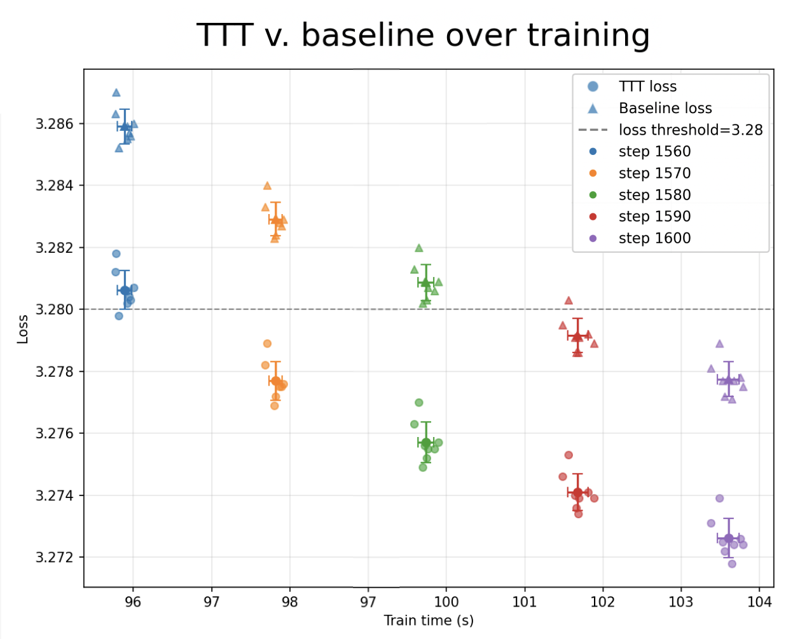
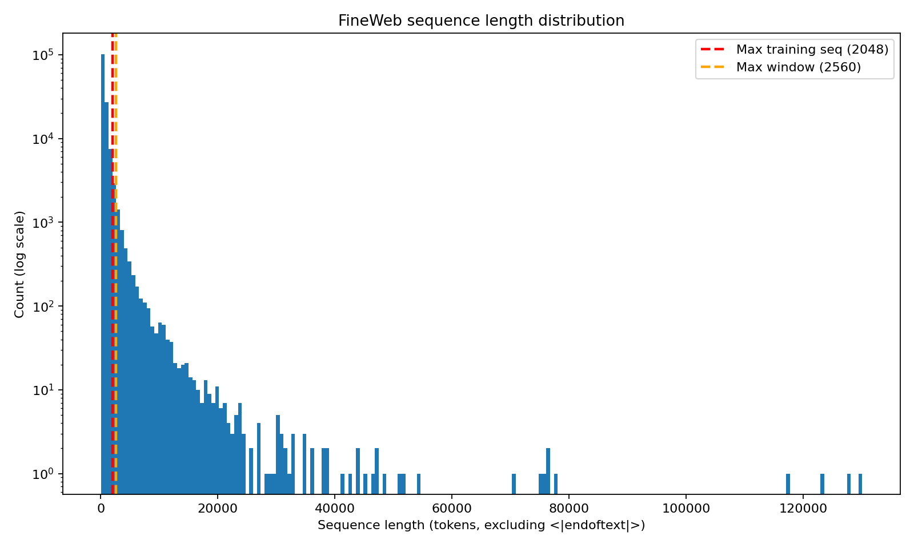

## New Record: Test-Time Training (-3.4s, -30 steps)

Updates in PR:
- Implemented test-time training (TTT) during final validation (-0.0s -- no impact on training time)
- Reduced step count from 1600 to 1570 (-3.4s)

*Important note*: This is a valid probability model -- loss is computed on each chunk before any gradient update uses those tokens. Model state resets between sequences. Training time is unchanged. However, if you include final validation time in the speedrun timing, this does
not improve speed. However, afaiu, this is fair game:
([discussion clarifying increasing validation time is OK](https://github.com/KellerJordan/modded-nanogpt/discussions/23?sort=new#discussioncomment-12109560)) and my implementation's speed has a lot of low-hanging fruit.

### Test-Time Training

Test-Time Training (TTT) was proposed as a general approach to improving OOD test
performance by turning each test example into an unsupervised learning problem
([TTT website](https://yueatsprograms.github.io/ttt/home.html)). This has been applied
to sequence-to-sequence learning in many forms:
([December paper applying inference-efficient TTT for LLMs](https://arxiv.org/abs/2512.13898),
[paper showing TTT helps ICL of non-linear functions](https://arxiv.org/abs/2509.25741),
[another good seq2seq TTT paper](https://arxiv.org/abs/2512.23675), + many others).

In this implementation, I implement the most straightforward (naive) method: don't change training,
and before predicting `P(token|context)`, train to improve `P(context)`. Importantly, this is a valid probability model: it just includes gradient updates in its processing of the context.

This does not change training, but increases the validation performance of a given checkpoint, allowing us to train for less time to reach our target loss. See the below plot, which
shows that for each checkpoint, TTT lowers the loss across training steps (loading from
the baseline checkpoint). Ignore the x-axis -- it was slower because I was saving many
checkpoints.



There are a few different motivations for applying this here, but I'll just outline one:
*the validation set has longer sequences than our model can handle*.

Over 1/3 of the validation sequences are longer than the longest sliding window
during training (1664, ~20% of tokens), and over 1/4 of the validation sequences are
longer than the longest sliding window during validation (2560, ~13% of tokens). So,
when predicting these ~13% of tokens, the model is not conditioning on part of the
sequence. Through TTT, we can encode the information of the entire context in the
weights of the model without any extra training cost.



### Implementation

To make this somewhat efficient, I don't train on each token before predicting the next,
but rather break the sequence into chunks. Without TTT, a given sequence is just `1`
forward pass through the model. With TTT, a given sequence is `n_chunks` forward passes
(to calculate validation loss) and `ttt_grad_steps*(n_chunks-1)` forward-backward passes
(we don't train on the last chunk as there is nothing to predict after it). The mean
sequence has < 700 tokens, and I report results with `ttt_chunk_size=512` and
`ttt_grad_steps=1`, so there are < 2 forward and backward passes per sequence.

Note that the models and optimizers are reset after each sequence, so there is no
dependence between validation sequences.

Pseudocode:

```python
# TTT hyperparameters
ttt_lr_mult: float = 1.0       # LR multiplier (use same LR as late training)
ttt_wd_mult: float = 0.1       # weight decay reduced 10x
ttt_grad_steps: int = 1        # gradient steps per chunk
ttt_chunk_size: int = 512      # tokens per chunk
ttt_bs: int = 2048             # TTT train bs (train_max_seq_len)
ttt_adam_only: bool = True     # only update Adam params, freeze NorMuon

# TTT main loop.
for seq in validation_sequences:
    model.load_state_dict(initial_model_state)  # reset for each sequence
    optimizer.reset()
    
    for i in range(num_chunks):
        chunk_start = i * ttt_chunk_size
        chunk_end = min((i+1) * ttt_chunk_size, len(seq))

        # 1. Evaluate loss on chunk, conditioning on entire chunk.
        chunk_loss = model(seq[:chunk_end], mask=chunk_only)
        total_loss += chunk_loss
        
        # 2. Train on chunk, slicing if sequence is too large. 
        train_start = max(chunk_start, chunk_end - ttt_bs)
        train_loss = model(seq[train_start:chunk_end])
        train_loss.backward()
        optimizer.step()  # Adam only, NorMuon frozen
```

Other notes on implementation:
- The forward pass to calculate validation loss is different than the forward pass to
    calculate loss for TTT.
    - Mainly to maintain the exact same loss calculation path as pre-change, but could
        share computation here.
- Only Adam parameters are updated during TTT.
    - Updating NorMuon params was unstable in my very small hparam sweep and also
        slightly slower.
- Performance seems fairly robust to hparams (LR multiplier, WD multiplier, # grad steps,
    chunk size...)
- You can eke out slightly higher performance with a smaller LR + more TTT steps or from
    using a smaller chunk size.
    - Evaluation time is linear in both TTT steps and number of chunks, so the
        submitted configuration is a balance between accuracy and speed.
- The batches are parallelized across GPUs during TTT, but sequences within a batch
    are *not* parallelized.

### Limitations
- Latency: evaluation takes ~5 minutes.
    - Ironically, for a speed run, this evaluation is very slow: longer than the training!
    - However:
        - I'm pretty sure this is a valid speed run: [discussion clarifying increasing validation time is OK](https://github.com/KellerJordan/modded-nanogpt/discussions/23?sort=new#discussioncomment-12109560).
        - My implementation can be sped up *significantly* -- I just wanted to get in the
            PR because it doesn't affect training time.
- Splitting up sequences: when a single sequence is split into different batches, TTT does nothing.
    - For example, take the sequence `[0, 1, 0, 1, 0, ... [10k tokens], 1, 0, 1 0, 1]`. 
        - Conditioned on the first `n-1` tokens, predicting `1` is simple for a language model.
        - If, by chance, the batching splits this into 2 different batches with the
            first containing all tokens but the last, then the model will have no
            idea for the final token because it is not in the context window
            (new batch) nor is it in the weights (because sequences are only
            determined within a batch, so it is treated as a separate sequence).
    - This happens to roughly `val_tokens/val_bs_per_gpu = 10485760/(2097152/8) = 40`
        sequences.
    - I wanted to address this, but this would require altering the order of validation
        tokens which I didn't want to do.
- Limited use of memory: each GPU only processes a sequence at a time.
    - Since chunks within a sequence must be processed sequentially (to avoid
        leakage), if a GPU processes a sequence at a time, its max training batch size
        is 2560 -- the max window size -- compared to ~50k tokens per GPU per step
        during training (and I actually use 2048 in this PR).
    - As mentioned below, you could try parallelizing across sequences within a batch
        to make this less extreme.

### Ideas
- Optimization low-hanging fruits
    - e.g. pre-allocate correct-length tensors instead of making them then padding.
    - There is a lot of this that would easily speed it up, which I wanted to do pre-PR,
        but this was for fun and I have to get back to my job so submitting PR now :)
- Sharing weights across sequences.
    - You could have the model learn online via saving weights from TTT between
        sequences.
    - I tried this but failed to get it to work (maybe have to restrict which params
        are updated like in most TTT works, or use LORA like in
        [this work](https://arxiv.org/abs/2505.20633)).
    - Note: I'm not sure if this would be a valid submission: the TTT as is only depends
        on the final state of the model and the prediction sequence, whereas once
        you share weights, your predictions depend on how big the validation set is
        and the validation order.
- Parallelizing training within a batch.
    - Currently, as noted above, each sequence within a chunk is processed sequentially.
    - Parallelizing evaluation and training of chunk `i` across sequences in a batch
        would significantly decrease validation time, and perhaps increase performance
        by acting as a sort of regularizer.
    - Note: I'm not sure if this would be a valid submission: like sharing weights
        across sequences, `P_model(word|context)` doesn't just depend on the context,
        but implicitly depends on the other sequences in the batch because the
        parameters are updated.
- Increase `ttt_bs`.
    - I set it to 2048, not the max it could be of 2560, for no good reason.
    - However, the amount you can increase it is largely limited by the number of
        sequences you are training on at once (1 right now), so you should probably
        figure that out first.
- Include 2nd-order training phase at the end of training.
    - Most works show that using TTT at test time without any training-time modification
        performs significantly worse than if you train the model to use the test-time
        inference procedure it is going to use: gradient descent!
    - This would likely have to be just a few steps, and tricky to implement, as
        2nd-order training can be quite finicky.
- Auxiliary TTT losses
    - TTT works during sequence modeling don't just use next-token prediction loss, and
        it could be worth experimenting with these (e.g.
        [KV Binding](https://arxiv.org/abs/2506.05233)).
- Fast Weight Layers
    - [Meta-Learning Fast Weight Language Models](https://arxiv.org/abs/2212.02475)

## Timing and Validation

```python
>>> import torch
>>> import scipy.stats
>>> losses = [3.2766, 3.2791, 3.2773, 3.2773, 3.2777]
>>> times = [95.739, 95.693, 95.760, 95.583, 95.683]
>>> print("p=%.4f" % scipy.stats.ttest_1samp(losses, 3.28, alternative="less").pvalue)
p=0.0022
>>> print("p=%.4f" % scipy.stats.ttest_1samp(times, 95.9, alternative="less").pvalue)
p=0.0012
>>> print("losses:", torch.std_mean(torch.tensor(losses)))
losses: (tensor(0.0009), tensor(3.2776))
>>> print("time:", torch.std_mean(torch.tensor(times)))
time: (tensor(0.0685), tensor(95.6916))
```

Meta-note on timing: even though this record (to my knowledge) fits under the current
rules, I think there should be *some* rule on the evaluation time: something like a
max evaluation time. I could have gotten slightly higher performance by 3x'ing the
number of TTT gradient steps (3x'ing the evaluation time) -- and I probably could
push it higher using even more test-time compute. If I'm missing some rule, please
let me know!
