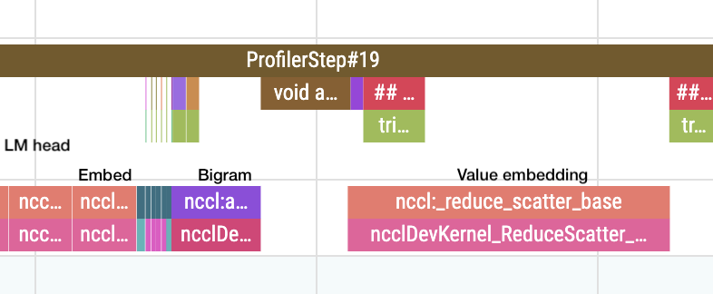
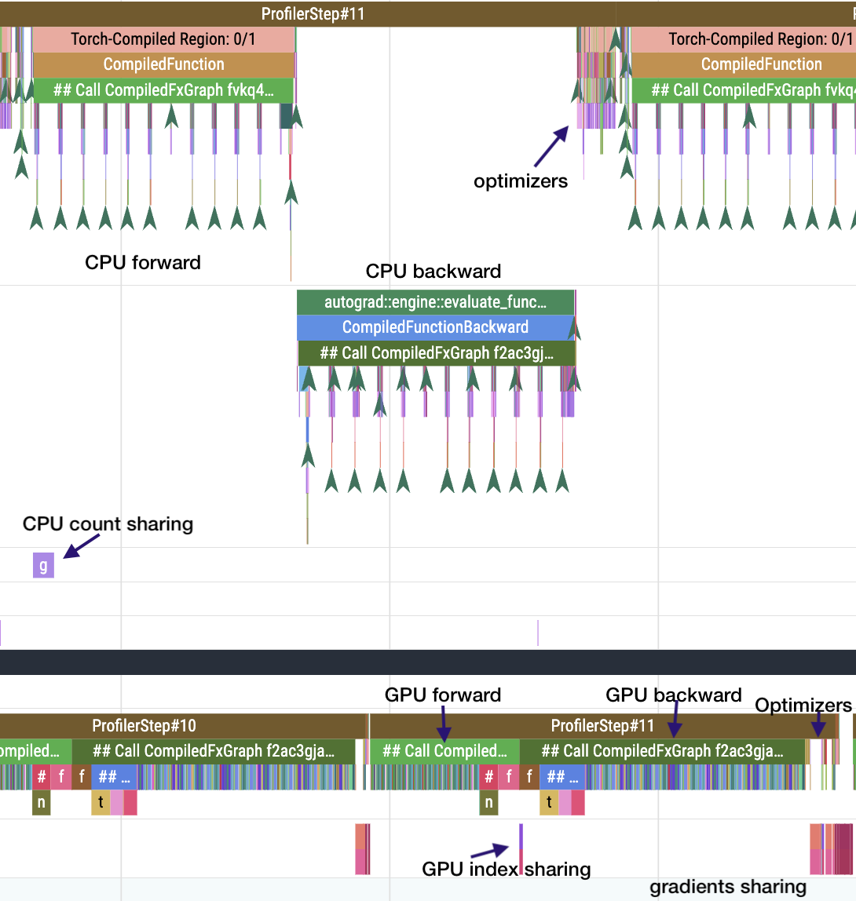

This record does three things:
1. Sparse comms for bigram embeddings
2. Moved the bigram index calculation to write directly into a pinned tensor
3. Changed scatter/gather order a bit to improve overlap

This is a pure-engineering record so I did not run it enough times to achieve significance. 


## Timing and Validation

This PR improves the step time.

```
import scipy.stats
import torch

losses = [3.2789, 3.2772, 3.2804, 3.277, 3.2792]
times = [95.168, 95.219, 95.069, 95.277, 95.303]

print("p=%.4f" % scipy.stats.ttest_1samp(losses, 3.28, alternative="less").pvalue)
# p=0.0423

print("losses:", torch.std_mean(torch.tensor(losses)))
# losses: (tensor(0.0014), tensor(3.2785))

print("time:", torch.std_mean(torch.tensor(times)))
# time: (tensor(0.0933), tensor(95.2072))
```

Previous record (timed on same machine):

```
import scipy.stats
import torch

losses = [3.2766, 3.2768, 3.2777]
times = [95.972, 95.914, 95.985]

print("p=%.4f" % scipy.stats.ttest_1samp(losses, 3.28, alternative="less").pvalue)
# p=0.0064

print("losses:", torch.std_mean(torch.tensor(losses)))
# losses: (tensor(0.0006), tensor(3.2770))

print("time:", torch.std_mean(torch.tensor(times)))
# time: (tensor(0.0378), tensor(95.9570))
```

These timings show $\approx 0.75$ seconds of improvement.

## Sparse Communication Algorithm

The outline of the strategy:
Each rank is owns (=responsible for updating) 1/8th of the bigram embedding table, and needs to send to each rank the local gradient rows that have been populated by bigrams it saw, and likewise needs to receive rows it owns from local gradients of other ranks.

Here's a simplified example with Two ranks (0,1), 4 possible bigram hashes [0,1,2,3]

So rank 0 owns bigrams 0,1 and rank 1 owns bigrams 2,3

Rank 0 batch: [1,2]

Rank 1 batch: [1,3]

So rank 0 needs to send to rank 1 its local gradient row 2, and receive row 1.
Likewise, rank 1 needs to send gradient row 1 to rank 0, and receive gradient row 2.

This example has a sparsity ratio of 50%. In practice, with a rank of 8, the bigram embedding table has 251,520 entries, and the biggest batch size has 49,152 bigrams, and we do Adam every 2nd step (total 98,304 bigrams per step), so at worst a roughly 60% sparsity ratio. In practice there is much more sparsity as there are plenty of collisions in the hash table. We expect close to 80% sparsity by running a measurement on 50 pairs of batches and counting unique hits (Side-note: stronger hash functions make no significant difference here, the current hash is close enough to ideal).

We can see that this aligns pretty well with a measurement: The Value Embeddings parameter happens to be the exact same size as the bigram embeddings, here's how the transfer looks in a profiling session:



The bigram embedding transfer is much closer in duration to the ones for the `lm_head` and `embed` parameters, than it is to the value embeddings parameter which is of the same size. This is in the largest batch size - the difference is more marked in earlier in the training run.

#### Future Work
The above image shows two holes which are unrealized gains - by shuffling the transfer initiation order and work order in the optimizer (`param_table` and `work_order` respectively) it should be possible to overlap those computations with tranfers and save about 0.4ms every other step (0.2ms/step, totaling around 0.7 seconds). Things look different in smaller batch sizes earlier in training.

Also, gather is still dense since our optimizer is dense. Experiments with a sparse optimizer (like [SparseAdam](https://docs.pytorch.org/docs/stable/generated/torch.optim.SparseAdam.html) but with row-level sparsity) showed that the model needs to be re-tuned for this to work. It would save around 0.8ms per Adam step.
### Detailed Communication Strategy

0. Since this is only on Adam steps, we cache the previous muon-only step's bigram indexes on the CPU (only unique indexes)
1. Before the forward pass, each rank shares with the other how many gradient rows it's going to send them. This is done async on the CPU and overlaps with the forward pass
2. After forward, before backwards, we share the actual indexes gradient indexes we're going to send between ranks (GPU, async, overlaps with start of backward)
3. In the scatter phase, we send between ranks the updated rows only (all_to_all_single), and then on each rank we sum those rows into our gradient
4. Gather is still dense since our optimizer is dense



Most of the hard work is done before the call to `model.forward()`: we get a sorted unique list of bigram indexes since the last optimizer step, then find the boundaries between ranks in this list in order to get the list of gradient rows we need to send each rank. It's optimized enough at the moment to overlap with the previous step's execution on the GPU.

#### Abandoned approaches:

* Do all the work on the GPU: unfortunately `all_to_all_single()`, the communication primitive used, only supports split sizes on the CPU, so every method without padding required a cpu<->gpu sync. As is seen in the above profile, the CPU usually queues work for the GPU well in advance, so device syncs are deadly to performace. Device-initiated comms are alpha (symmetric memory) but should theoretically enable this.
* Work in a background thread or even just a different CUDA stream: I moved the cpu<->gpu sync to a background thread, however it's very problematic to use nccl from two threads at the same time. Turns out that the various ranks are very much not in sync so I would get different orders of entering into collectives. Even with two streams on the same thread execution order isn't guaranteed across ranks. A workable solution would be a thread dedicated to all cross-rank communication. This would add more complexity to the code and cross-thread synchronization overhead on the CPU around the optimizers.