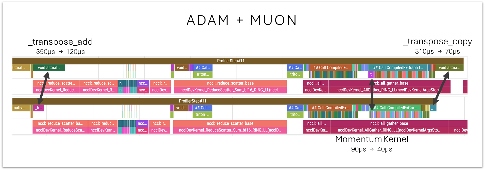

# Flattened GPT Forward, Removed Post Attention Lambdas, Added Transpose Kernels

This PR has gone through a number of revisions as we've been catching up the repo with recent PRs, and as I continued to play with the new parallel residuals feature.

There are three main changes included:
1. Removed the Block and MLP classes
2. Removed the post attention lambdas on the single lane layers
3. A few kernel improvements

```
                        Runs  Steps    Time μ   Time σ  Time +/-   Loss μ   Loss σ  Loss +/-        p
Baseline                   4   1490   89.7995   0.0621    0.0000   3.2782   0.0016    0.0000   0.0601
This PR                    4   1490   88.8340   0.0445   -0.9655   3.2788   0.0005    0.0006   0.0097

Baseline:
  losses = [3.2764, 3.2799, 3.2773, 3.2793]
  times  = [89.8030, 89.7110, 89.8350, 89.8490]

This PR:
  losses = [3.2783, 3.2789, 3.2795, 3.2786]
  times  = [88.8210, 88.8090, 88.8060, 88.9000]
```

## Flattened GPT.forward

The parallel residuals PR was implemented within GPT.forward rather than in Block. I took this further and removed the Block and MLP classes (and the module list) altogether, and I believe this accounts for roughly half the speed improvement in this PR. I don't know what that achieved, exactly, so it may be possible to restore those classes and move the logic to Block while keeping the speedup. I'm partial to inlining code, though, so I didn't look into it. :)

## Post Attention Lambdas

I tried a number of systems and architectural changes to the parallel residual streams. Several gave a speed-up, but at the cost of some validation loss. System improvements rarely seem to justify adding back steps.

The only change I made which ended up being included here was to remove the post attention lambdas from the single lane layers, where they seemed like they might be redundant with the sa lambdas.

Here's everything I tried. All of these may be worth trying again, since they may behave differently in the context of other changes to the code. The baseline changed a couple times over the course of these experiments, and in a couple cases I'm seeing different outcomes depending on the baseline.

Here are things I tried:

1. Moving the x0/bigram injection back before attention.
    * The previous PR moved this injection to after attention instead of before.
    * Switching it back increased loss slightly but improved speed.
    * I ended up reverting this in order to get under 3.28.
2. Adding the x0/bigram injection to layer 6. 
    * It wasn't being injected at layer 6, which seemed like maybe an oversight.
    * Adding it increased both loss and time. 
3. Pre-multiplying the post mlp lambdas into the MLP output projections on the single lane layers.
    * Similar to number 1, this gave a small speed up at the cost of a small increase in loss.
    * I had to abandon it to get under 3.28.
4. Pre-multiplying the post attention lambdas into the attention output projection. 
    * This was faster, but hurt loss significantly.
    * Dropping them altogether seemed to be a better solution.
        * In my last batch of experiments, I tried adding them back to help improve loss, but they actually increased it this time.

Other stuff:
* I did not try "untying" the residual lambdas.
* The post mlp lambdas on the final layer seem to be ~equal, so we may be able to remove them and save some time.

## Kernel Changes

This PR includes a few kernel improvements:
1. Transpose copy and transpose add kernels to speed up the lm head and embedding copies in the optimizer.
2. Eliminated a backwards select kernel on MLP banks
3. Transposed polar express kernel (from my previous abandoned PR)
4. Fused Nesterov momentum calculation into polar express


### 1 - Transpose Copy

Transposing the LM head (in [PR200](https://github.com/KellerJordan/modded-nanogpt/pull/200)) eliminated an expensive gradient accumulation kernel that pytorch would run every step, but the benefit was partially negated because we still had to do some element-wise operations to artificially keep the embeddings and LM head tied. 

My rationale at the time was that this was fine because it would be overlapped with compute, but the trace files have had some glaring communication gaps caused by these steps. I learned it's because the kernels were using all of the SMs, preventing the GPUs from being able to work on communication at the same time. (The fact that communication speed relates to SM availability seems like an interesting insight).

Claude was able to write efficient "transpose add" and "transpose copy" kernels which reduced the cost of these steps significantly. 



Side note--I finally got around to making a tutorial for my trace-reading workflow:
https://www.youtube.com/watch?v=vTdLpaI5gMQ

### 2 - "Select Backwards" Kernels

I noticed recently that my/our efforts to avoid the select-backwards kernels caused by the parameter banks haven't been entirely working--the trace file is still full of them. 

Claude was able to eliminate these by changing the way in which the weights are accessed. 

Curiously, one of the three fixes had a clear, consistent negative impact despite being mathematically equivalent. It must be due to a difference in the compiler's choice of kernel, and the order of operations in it. I had to leave it out. 

Another of the three seemed like it might be hurting loss--less conclusive--but I left it out.

We were able to fix what seemed to be the biggest offender though, surrounding the MLP weights, without impacting loss.

### 3 - Polar Express Transpose

(Copied from my closed PR)

I've also included an improvement to the Polar Express kernel. It was written to work on "wide" matrices, but we've had our MLP weights stored vertically. The current Polar Express code handles this by transposing the matrix, but the algebra can be re-ordered instead to allow for working directly on "tall" matrices:

```
# Polar express
X = g.bfloat16()

X = X / (X.norm(dim=(-2, -1), keepdim=True) * 1.02 + 1e-6)

if g.size(-2) > g.size(-1): # Tall matrix
    for a, b, c in polar_express_coeffs[:ns_steps]:
        A = X.mT @ X
        B = b * A + c * (A @ A)
        X = a * X + X @ B

else: # Wide matrix (original math)
    for a, b, c in polar_express_coeffs[:ns_steps]:
        A = X @ X.mT
        B = b * A + c * (A @ A)
        X = a * X + B @ X

return X
```

I had Claude write an XTX variant for this.

This change doesn't appear to impact the speed of the matrix multiplication itself. Instead, it's relevant to the element-wise momentum kernel preceeding it. The transposed polar express allows for a much faster non-transposed element-wise momentum kernel.

### 4 - Fused Momentum Kernel

In the nanochat variant of the optimizer, Karpathy combined all of the NorMuon steps (from nesterov momentum through the weight update) into a single compiled helper function, which results in more operations being fused.

However, when I tried that on our optimizer, I saw the same fusion / reduction in kernel count, but I was getting slower times. It could relate to us using a triton kernel for polar express, or for our additional precision-enhancing mantissa storage technique. 

This time, I settled for fusing just the nesterov momentum and polar express, and that worked.

I didn't try fusing the normuon variance reduction helper with the cautious weight decay + weight update helper. That might work as well.

### Kernel Tests

Just an AI disclosure: The above include three new triton kernels which Claude wrote and I didn't review / wouldn't know how to. Instead, I asked Claude to also write tests for them which passed, and of course the training seems to be working fine as well.

## Loss Impacts without Math Changes

A small side rant--I've encountered this enough times now to recognize it as common place in our model rather than an anomoly. Systems changes which don't affect the math can easily lead to increased validation loss. It seems that the placement of kernel boundaries and the order of operations in those kernels has the potential to create rounding errors that accumulate and have meaningful impact.

On the plus side, I think this just as often has worked in my favor, where I make a systems optimization and loss 'inexplicably' improves as well.

Just seemed worth sharing for the benefit of anyone else who tries something that increases loss even though it shouldn't!
