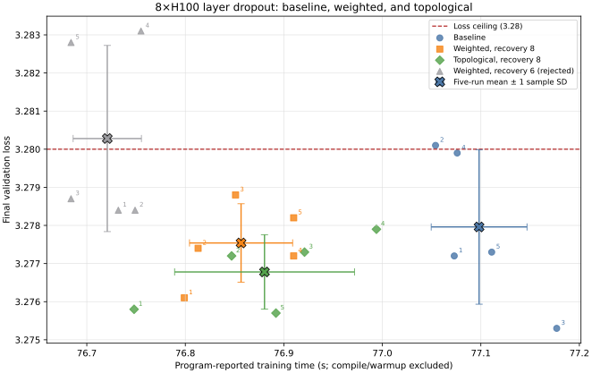

# Topological layer dropout

This PR adapts the whole-block schedule from [*Don't Drop Dropout: Optimizing
Layer Sparsity for Efficient LLM Training and
Inference*](https://openreview.net/pdf?id=AEHn9ya4Re) to modded-nanogpt. It
is a clean port of the validated experiment from
[`jon123boss/modded-nanogpt`](https://github.com/jon123boss/modded-nanogpt/tree/main/records/track_1_short/2026-07-28_LayerDropout).
It starts at pre-experiment commit `bc1b58e` and adds only layer dropout and
this compact evidence record.

Following *Don't Drop Dropout*, the implementation uses one shared whole-block
mask, inverse-density residual scaling, decreasing dropout, and fully active settling.
The proposed **topological** variant adds architecture-specific safeguards: it
restricts skips to alternating ordinary blocks `1,3,5,7,9`, caches the
unchanged input when layer 3 or 7 is skipped so downstream MUDD and skip
connections remain valid, executes equal depth on every rank, and precompiles
each sparse graph.

## Frozen 8xH100 evidence

The frozen comparison contains three run families:

- **Baseline** is the existing 1,300-step recipe with layer dropout disabled.
  No transformer block is skipped.
- **Weighted** uses whole-block layer dropout but allocates dropout events
  unevenly across candidate layers using per-layer weights. It is an
  experimental control for the allocation strategy.
- **Topological** is the proposed simpler variant. It allocates dropout events
  equally over the architecture-safe blocks `1,3,5,7,9`, while ensuring every
  rank executes the same number of blocks.

“Recovery 8” means eight fully active iterations are added after the baseline
1,300-step schedule; “recovery 6” means six are added.

| Configuration | n | Mean loss | Loss SD | Mean time (s) | Time SD (s) | One-sided p vs. 3.28 | Decision |
| --- | ---: | ---: | ---: | ---: | ---: | ---: | --- |
| baseline | 5 | 3.27796 | 0.00203 | 77.0982 | 0.0486 | 0.0438 | control |
| weighted recovery 8 | 5 | 3.27754 | 0.00103 | 76.8566 | 0.0523 | 0.00295 | passes |
| **topological recovery 8** | **5** | **3.27678** | **0.00098** | **76.8804** | **0.0913** | **0.000908** | **proposed** |
| weighted recovery 6 | 5 | 3.28028 | 0.00244 | 76.7208 | 0.0346 | 0.595 | rejected |

Topological recovery eight saves `0.2178 s` (`0.2825%`) versus the baseline
mean. Across its five frozen runs, the one-sample statistic against the `3.28`
loss ceiling is `t(4) = (3.27678 - 3.28) / (0.0009783 / sqrt(5)) = -7.3601`,
giving a one-sided `p=0.000908`. This satisfies the required `p<0.01`
threshold. Topological and weighted recovery eight differ by less than the
five-run noise, so the clean branch uses equal allocation over the
topologically safe layers and one scalar scale rather than carrying per-layer
weights.

One matched smoke on the exact clean code (`5f6f15b`) gave `3.2766` loss in
`77.173 s` for the baseline and `3.2770` in `76.680 s` for topological recovery eight.
The `0.493 s` (`0.6388%`) reduction and exact 712-per-layer counts validate the
port, but this single pair is not pooled into the frozen table.



The plot is generated from [`H100X8_RUNS.csv`](H100X8_RUNS.csv) by
[`plot_h100x8_time_vs_loss.py`](plot_h100x8_time_vs_loss.py). The detailed
environment, commands, statistics, compiler caveat, and 23 full source-snapshot
logs remain in the original experiment's
[`H100X8_RESULTS.md`](https://github.com/jon123boss/modded-nanogpt/blob/main/records/track_1_short/2026-07-28_LayerDropout/H100X8_RESULTS.md).
Run the plotting script from any directory after installing Matplotlib; it
resolves the CSV and output path relative to itself.

## Proposed run (enabled by default)

```bash
torchrun --standalone --nproc_per_node=8 train_gpt.py
```

The effective defaults are `pmax=0.20`, seed `1337`, plateau `400`, decay
`100`, and recovery `8`. Set both `LAYER_DROPOUT_PMAX=0` and
`LAYER_DROPOUT_RECOVERY_ITERATIONS=0` to reproduce the original baseline. On
the proposed 8-GPU run, expected accounting is `3,560 / 10,464` dropped blocks
and exactly 712 drops on each eligible layer.

The benchmark timer excludes compilation and warmup. Cached sparse launches
take about 300-305 seconds end to end because five additional graphs are
materialized; the first cold clean-source sparse smoke took about 1,015
seconds. Portable compiler-cache artifacts are the highest-leverage
operational follow-up.
