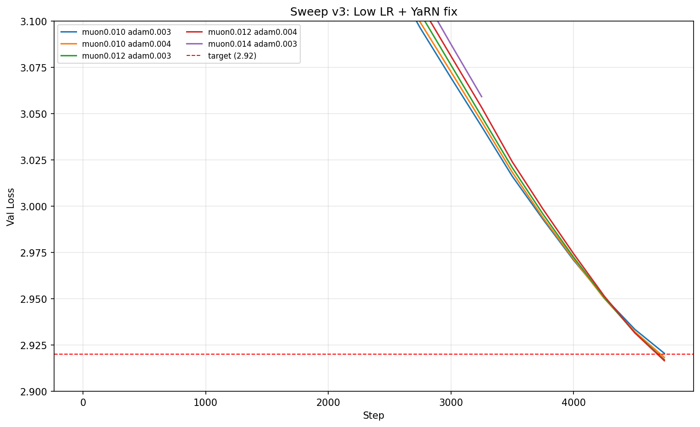
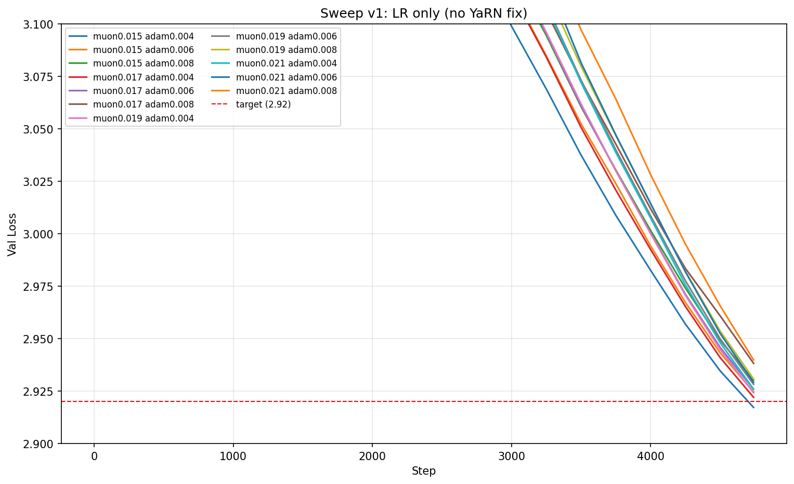
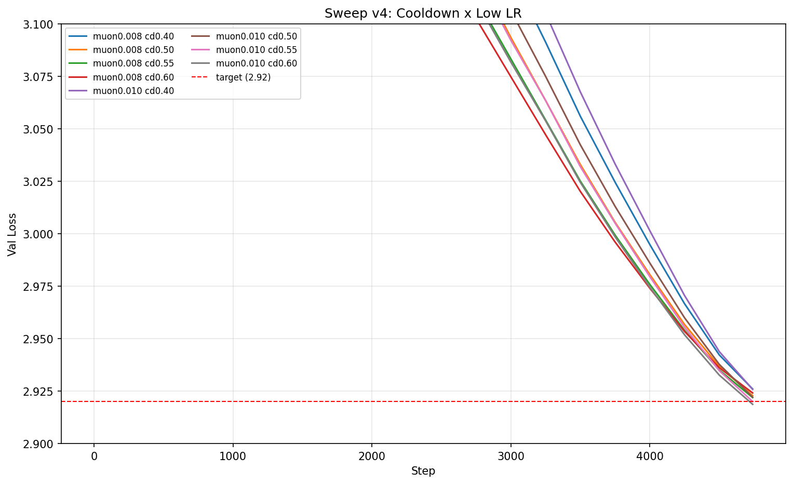

## New Record: FP8 lm_head, YaRN fix, LR tuning (-30s)

The main change I made is re-introducing the FP8 kernel for the `lm_head`, using the following scaling factors: 

`x_s=32/448`, `w_s=2.25/448`, `grad_s=1.5/448`. 

Basically, I ran a few profiling runs, and found that x_max = 31.375, w_max = 2.0000, and grad_max = 1.3438, so I added a bit of leeway and divided by 448 since x and w will be be cast to `float8_e4m3fn` (and 448 is the maximum finite value in e4m3fn). 

Technically, I noticed that grad is cast to `float8_e5m2` which has a wider dynamic range, but the short track currently still computes grad_s by dividing by 448. That means we're not using the entire dynamic range available to us, but it probably doesn't matter, so I kept the 448 factor from the short track. 

Implementing fp8 matmuls for `lm_head` is by far the majority of the speed up, but I tuned the learning rate for muon and adam as well (which accounts for about 2s worth of speedup). I was also able to verify that using YaRN works fine for the larger attention windows, and adding it back provides a small improvement to the validation loss. 

I also tuned the learning rate for Muon and Adam to: (`muon_lr`: 0.015 -> 0.012, and `adam_lr`: 0.008 -> 0.004). 

Interestingly, smaller learning rates perform substantially better at first (up to about 0.008 for Muon), but then at around step 3000 onwards, they lose most of their advantage. They are way ahead at step 3000 though, so I imagine that by tuning the LR warmup schedule a bit, we could preserve that advantage and maybe get around another minute worth of speedup just from that. I tried for a little bit, but didn't manage to make much progress there. 



*Caption: Results of learning rate sweeps for Muon and Adam optimizers with learning rates <0.015. Lower learning rates show much faster progress and are well ahead around step 2000, but after about step 3000 they quickly lose their advantage as higher learning rates catch up and surpass them by the end of training. Note: I stopped the 0.014 learning rate run early, which is why the graph doesn't complete.*



*Caption: Results of learning rate sweeps for Muon and Adam optimizers with learning rates >0.015. Increasing the learning rate beyond 0.015 is totally hopeless*



*Caption: Experimenting with an even lower Muon learning rate of 0.008, I found it performed best mid-run—well ahead of all other rates. However, by the end, it lost its advantage and was surpassed. I also tested various cooldown schedules to see if a less/more aggressive decay could help the 0.008 LR run preserve its early progress. I wasn't able to make this work. Note: Lowering the LR to less than 0.008 no longer improves the performance at step 3000, which is why this graph doesn't test learning rates lower.*

I also switched `CastedLinear` → `CastedLinearT` (transposed weight storage) to match the short track. This saves us some transpositions in backprop, and delivers about a 1 second speedup as opposed compared to our original implementation. 

In summary, I think that tuning the learning rate schedule could substantially improve this run, in addition to implementing the remaining short track features that haven't yet made it to the medium track. 

I think spending some effort to properly tune the LR for this run could be really valuable to provide scaling intuition for hyperparameters with Muon. The difficulty is that tuning the learning rate at least requires running the entire run (since mid-run data can be quite deceiving) and that takes quite a bit. 

## Timing and Validation

```
import scipy.stats
import torch

losses = [2.9174, 2.9182, 2.9183, 2.9179, 2.9177]
times = [1011.438, 1011.512, 1011.451, 1011.359, 1011.098]

print("p=%.4f" % scipy.stats.ttest_1samp(losses, 2.92, alternative="less").pvalue)
# p=0.0001

print("losses:", torch.std_mean(torch.tensor(losses)))
# losses: (tensor(0.0004), tensor(2.9179))

print("time:", torch.std_mean(torch.tensor(times)))
# time: (tensor(0.1624), tensor(1011.3716))
```

timing prior record: 1041.277s
