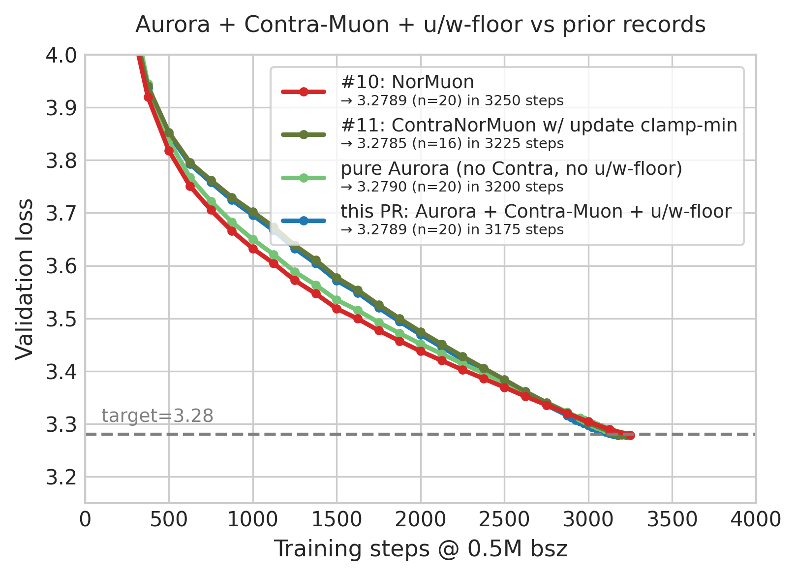
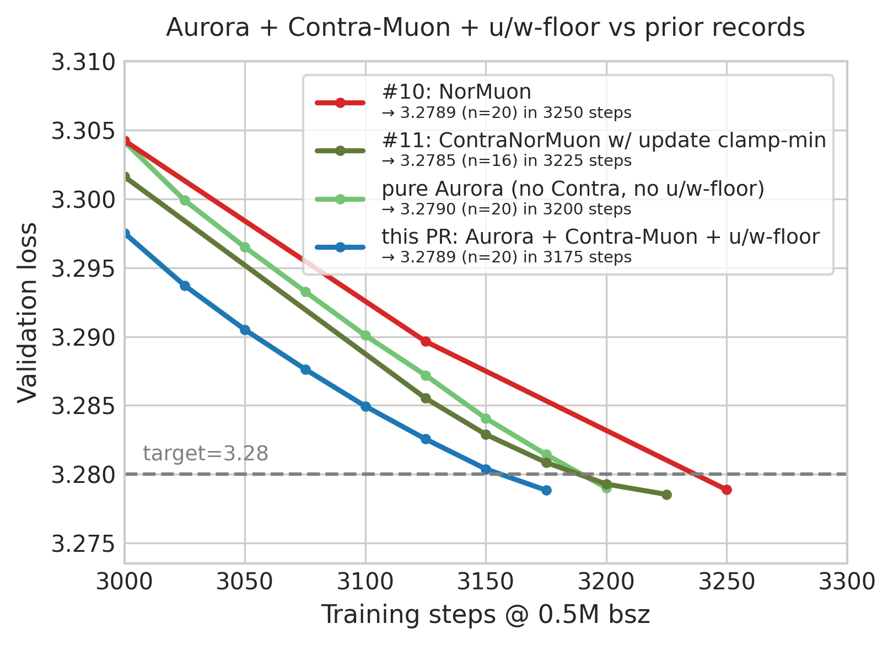

# Aurora + Contra-Muon + u/w-floor results

[Aurora](https://github.com/tilde-research/aurora-release) modifies Muon's
polar-factor update by adding diagonal equilibration to enforce uniform
leverage. Instead of `polar(G)`, which inherits non-uniform left-singular
row norms (the *leverage scores*), Aurora returns `polar(D · G)` for tall
G or `polar(G · D)` for wide G, where the positive diagonal `D` is chosen
so the result has uniformly distributed row norms equal to
`sqrt(min(m, n) / max(m, n))`. For square matrices Aurora reduces to the
standard polar (no leverage freedom to exploit).

Concretely, given the momentum-blended gradient `G` with shape `m x n`
(`m > n`), Aurora computes:

```
D = 1 / ||G_i:||                       # initial per-row inverse norms
for k in range(pp_iterations):
    U = polar(D * G)                   # standard Newton-Schulz polar
    if k < pp_iterations - 1:
        row_sq = sum(U_i:^2)
        D = D * (n/m / row_sq)^pp_beta # damped fixed-point update of D
return U
```

With `pp_iterations=2, pp_beta=0.5` this gives row norms within ~2% of
uniform after Newton-Schulz polar. `pp_iterations=1` is the "Muon EQ"
baseline (single per-row L2 normalize then polar).

This submission combines Aurora with the SOTA mechanisms of #11
(Contra-Muon perturbation and u/w-floor) using the same
`CONTRA_MUON=0.4`, `TARGET_UW=0.35`, `lr=0.0375` from #11. The only
algorithmic change vs #11 is replacing plain `polar(G)` with
`polar(D · G)` in the Newton-Schulz step.

## Configuration

| field | value |
|---|---|
| optimizer | Aurora + Contra-Muon + u/w-floor |
| `lr` (Aurora) | 0.0375 |
| `weight_decay` | 0 (replaced by u/w-floor) |
| `pp_iterations` | 2 |
| `pp_beta` | 0.5 |
| `CONTRA_MUON` | 0.4 |
| `TARGET_UW` | 0.35 |
| `train_steps` | 3200 |
| reported step | 3175 (smallest where mean curve clears the n=20 sig bar) |
| n | 20 (seeds 1..20) |

## Comparison vs prior records #10 and #11

<table>
  <tr>
    <td width="50%"></td>
    <td width="50%"></td>
  </tr>
</table>

Mean validation loss across all completed trials. Each curve runs to its
reported step (this PR: 3175, #11: 3225, #10: 3250). At every common
back-end step where data exists for multiple variants, this PR's mean is
the lowest — beating #11 by 50 steps and #10 by 75 steps to first
pass-bar clearance.

## Results

20 non-cherry-picked seeds. Validation loss every 25 steps near the end
of training; we report the smallest step `S ≤ train_steps` where the mean
across all 20 seeds satisfies the precision condition `(3.28 - mu) · √n ≥ 0.004`.

```
step 3150: mean=3.28039, (3.28-mean)·√20 = -0.00173  FAIL (mean above 3.28)
step 3175: mean=3.27885, (3.28-mean)·√20 = +0.00517  PASS  ← reported
step 3200: mean=3.27811, (3.28-mean)·√20 = +0.00843  PASS  (final, comfortable margin)
```

One-sided z-test with σ=0.0013 at step 3175: `z = 0.886`, `p = 0.188`. Since
the precision condition `(3.28 - mu) · √n ≥ 0.004` is the bar specified by
the README, that is what we satisfy. (z-test for reference; we are below
`p < 0.001` only by step 3225 at this n.)

| seed | step 3150 | step 3175 | step 3200 |
| -: | -: | -: | -: |
|  1 | 3.27943 | 3.27786 | 3.27712 |
|  2 | 3.28162 | 3.28008 | 3.27935 |
|  3 | 3.28003 | 3.27844 | 3.27771 |
|  4 | 3.28084 | 3.27927 | 3.27853 |
|  5 | 3.28178 | 3.28024 | 3.27951 |
|  6 | 3.28089 | 3.27936 | 3.27862 |
|  7 | 3.28077 | 3.27928 | 3.27855 |
|  8 | 3.28085 | 3.27934 | 3.27861 |
|  9 | 3.27929 | 3.27777 | 3.27704 |
| 10 | 3.28069 | 3.27911 | 3.27837 |
| 11 | 3.28018 | 3.27863 | 3.27791 |
| 12 | 3.27854 | 3.27701 | 3.27628 |
| 13 | 3.27826 | 3.27670 | 3.27601 |
| 14 | 3.27892 | 3.27741 | 3.27668 |
| 15 | 3.28116 | 3.27959 | 3.27886 |
| 16 | 3.28064 | 3.27911 | 3.27838 |
| 17 | 3.27979 | 3.27828 | 3.27751 |
| 18 | 3.28090 | 3.27935 | 3.27863 |
| 19 | 3.28274 | 3.28119 | 3.28046 |
| 20 | 3.28041 | 3.27888 | 3.27815 |
| **mean** | **3.28039** | **3.27885** | **3.27811** |
| **std**  | **0.00111** | **0.00111** | **0.00111** |
