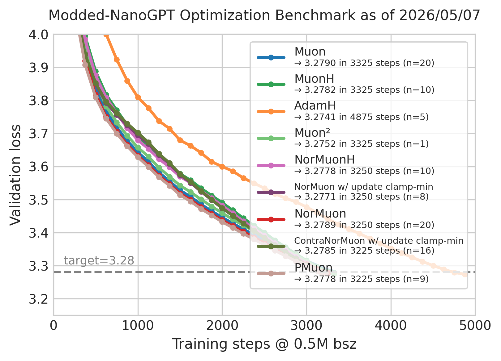
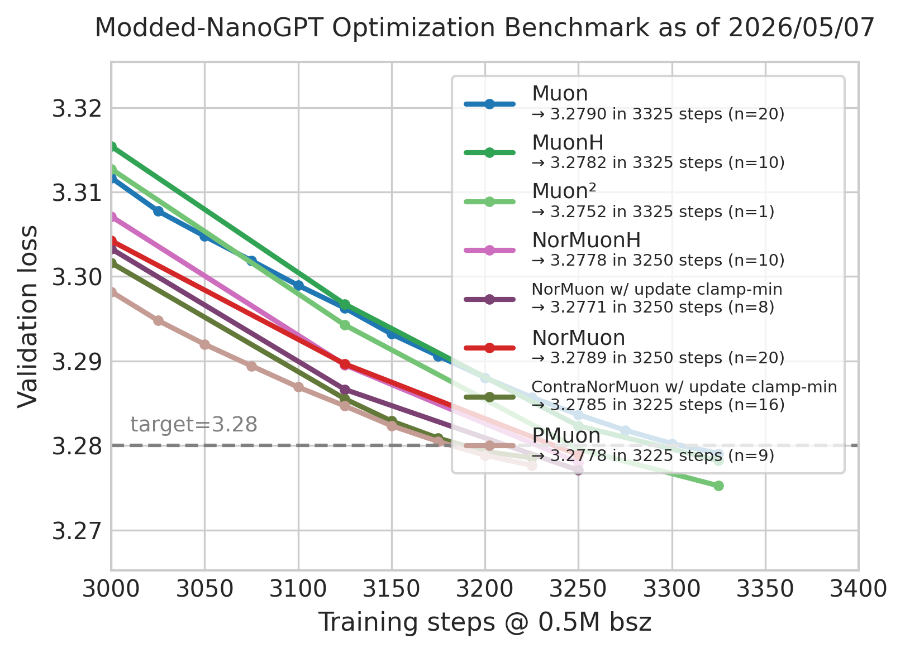

# Record: Track 3 Optimization -- PMuon in 3225 steps

## TL;DR

PMuon (Preconditioned Muon) replaces Muon's `polar(M)` with `polar(L^{-γ} M R^{-γ})`, where `L` and `R` are streaming estimates of the left and right gradient covariance matrices. All hyperparameters (lr, weight decay, momentum, schedule) are inherited from the baseline Muon run ([#12](https://github.com/KellerJordan/modded-nanogpt/blob/master/records/track_3_optimization/results/1bd8db7a-f3a3-4195-856d-cab7e0816443.txt)) without retuning. The only new parameters are `gamma=0.3` and `beta=0.95` for the covariance estimator. This reaches 3.28 val loss at step 3225 across 9 non-cherry-picked runs on 8×H800 (mean=3.27764, significance margin 0.00707 >= 0.004).

## Motivation

Given a matrix momentum `M` with SVD `M = U Σ V^T`, Muon computes

```
polar(M) = U V^T
```

This replaces all nonzero singular values with 1. The effect: poorly conditioned gradient modes get equalized, so no direction is unfairly small just because of bad conditioning.

But Muon trusts the singular basis `U, V` of the raw momentum. That basis can be wrong. The raw momentum directions may be dominated by high-variance activations, batch noise, frequently occurring but low-value tokens, or redundant correlated features. These are directions where gradients happen to be large, not where updates would be most useful.

## Method

### Baseline: standard Muon update

In the baseline, each 2D parameter `W` is updated as:

```
m_t  = μ · m_{t-1} + (1 - μ) · G_t           (momentum)
W_t  = W_{t-1} - η · polar(m_t)              (weight update)
```

where `polar(m_t) = U V^T`, computed via 12-step Newton-Schulz iteration. We skim the nesterov and weight decay here for simplicity. 

### PMuon: preconditioned Muon update

PMuon adds covariance preconditioning before the polar step. The full update rule:

**Step 1. Momentum** (same as baseline Muon).

```
m_t = μ · m_{t-1} + (1 - μ) · G_t
```

**Step 2. Streaming covariance estimation.**

Maintain EMA buffers for right and left gradient covariance:

```
R_t = β · R_{t-1} + G_t^T G_t                 (right covariance buffer, n×n)
L_t = β · L_{t-1} + G_t G_t^T                 (left covariance buffer, m×m)
```

**Step 3. Preconditioned polar.**

```
Ũ = polar(L_t^{-γ} · u_t · R_t^{-γ})
```

Here, `L_t^{-γ}` and `R_t^{-γ}` are calculated via streaming power iterations. 

**Step 4. Weight update** (same as baseline Muon).

```
W_t = W_{t-1} - η · √max(1, m/n) · Ũ
```

### What the covariance correction does

The covariance factors change which directions count as "large" before the polar step:

- If a direction has large eigenvalue in `R` (meaning gradients have large variance there), multiplying by `R^{-γ}` suppresses it. 
- If a direction has small eigenvalue in `R` (low variance), it gets relatively amplified. 

The same logic applies on the left side with `L`.

In short:

```
Muon:  u_t  →  polar(u_t)                              (equalize raw singular modes)
PMuon: u_t  →  L^{-γ} · u_t · R^{-γ}  →  polar(·)     (equalize covariance-corrected modes)
```

### Hyperparameters

All inherited from the baseline Muon run [#12](https://github.com/KellerJordan/modded-nanogpt/blob/master/records/track_3_optimization/results/1bd8db7a-f3a3-4195-856d-cab7e0816443.txt), no retuning:


| Parameter       | Value | Source                      |
| --------------- | ----- | --------------------------- |
| `lr`            | 0.035 | inherited from #12          |
| `weight_decay`  | 0.025 | inherited from #12          |
| `mu`            | 0.95  | inherited from #12          |
| `cooldown_frac` | 0.7   | inherited from #12          |
| `train_steps`   | 3250  | shortened from #12's 3350   |
| `beta`          | 0.95  | new (covariance EMA decay)  |
| `gamma`         | 0.3   | new (matrix power exponent) |


Auxiliary AdamW (embed lr=0.3, proj lr=1/320, 1D params lr=0.01, betas=(0.8, 0.95)), dataset, batch size (0.5M tokens/step), architecture (GPT-124M, 12 layers, dim 768), and validation are unchanged from the Track 3 baseline.

## Summary

### Setup

- **Hardware**: 8× NVIDIA H800, world_size=8
- **Software**: PyTorch 2.7.1+cu128, CUDA 12.8
- **Runs**: 9 non-cherry-picked, each 3250 steps

### Per-run results


| Run      | step 3150   | step 3175   | step 3200   | step 3225   | step 3250   |
| -------- | ----------- | ----------- | ----------- | ----------- | ----------- |
| 1        | 3.28230     | 3.28043     | 3.27881     | 3.27762     | 3.27712     |
| 2        | 3.28196     | 3.28008     | 3.27842     | 3.27722     | 3.27672     |
| 3        | 3.28328     | 3.28142     | 3.27984     | 3.27863     | 3.27814     |
| 4        | 3.28064     | 3.27882     | 3.27722     | 3.27603     | 3.27553     |
| 5        | 3.28329     | 3.28139     | 3.27981     | 3.27864     | 3.27813     |
| 6        | 3.28046     | 3.27861     | 3.27698     | 3.27576     | 3.27525     |
| 7        | 3.28333     | 3.28140     | 3.27980     | 3.27856     | 3.27806     |
| 8        | 3.28377     | 3.28192     | 3.28029     | 3.27908     | 3.27858     |
| 9        | 3.28201     | 3.28013     | 3.27849     | 3.27725     | 3.27675     |
| **mean** | **3.28234** | **3.28047** | **3.27885** | **3.27764** | **3.27714** |
| **std**  | **0.00120** | **0.00118** | **0.00119** | **0.00119** | **0.00119** |


### Statistical significance

The Track 3 rule requires `(3.28 - mean) * sqrt(n) >= 0.004`.


| Step     | Mean        | (3.28 - mean) * sqrt(9) | Pass    |
| -------- | ----------- | ----------------------- | ------- |
| 3150     | 3.28234     | -0.00701                | No      |
| 3175     | 3.28047     | -0.00140                | No      |
| 3200     | 3.27885     | 0.00345                 | No      |
| **3225** | **3.27764** | **0.00707**             | **Yes** |
| 3250     | 3.27714     | 0.00857                 | Yes     |


Step 3225 is the earliest step passing the significance condition. This ties the current SOTA (#11, ContraNorMuon + u/w-floor, 3225 steps, n=16) using a different algorithmic approach: covariance preconditioning of the polar factor rather than contra-gradients or update/weight-floor constraints.

<table>
  <tr>
    <td width="50%"></td>
    <td width="50%"></td>
  </tr>
</table>
