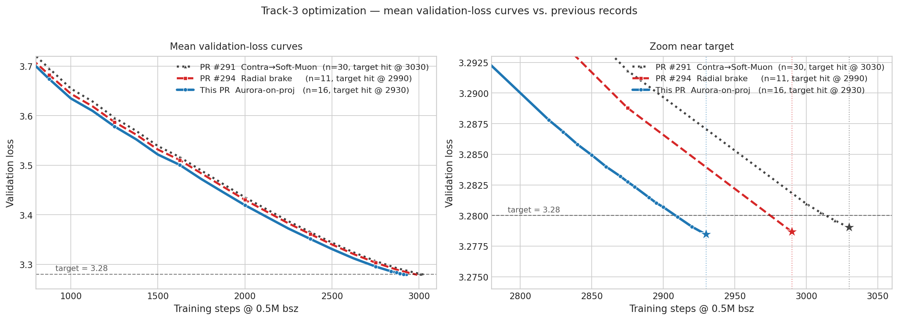
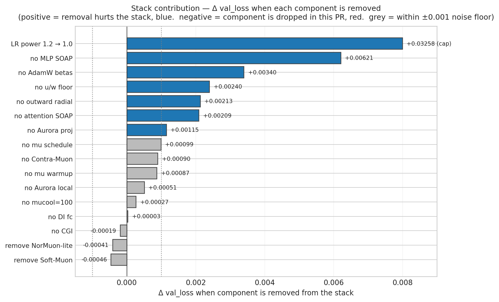

# Aurora-on-mlp.proj + extended Contra-Muon ramp on the PR #294 stack

This submission builds on [PR #294 (radial brake)](https://github.com/KellerJordan/modded-nanogpt/pull/294)
and applies three changes on top of its recipe:

1. **Aurora row-balanced polar on `mlp.proj`** ([Tilde Research, May 2026](https://github.com/tilde-research/aurora-release)).
   In `zeropower_via_newtonschulz5`, when the matrix is wide (`m < n` — exclusively the 12 `mlp.proj` 768×3072 weights), run K=3 outer Aurora iterations with diagonal row-rescaling between Newton-Schulz calls (β=0.25, ε=1e-7). Square and tall matrices (attn QKV/proj and `mlp.fc`) continue to use plain MuonEq + Polar Express NS-5 unchanged. The Aurora paper motivates this with the "neuron death" effect, where plain Muon's leverage bound lets rows with small momentum stay small through the polar; the joint Stiefel+row-oblique constraint breaks that. Applied only to the wide direction because on tall matrices (`mlp.fc`) the row-uniform constraint fights PR #294's depth-scaled init.
2. **Soft-Muon disabled** (`SOFT_MUON_CEIL: 0.80 → 0.00`).
3. **NorMuon-lite disabled** (`NOR_BETA2: 0.95 → 1.0`, so the row-variance EMA stops updating).
4. **Contra-Muon → normal ramp extended to step 2500** (`CONTRA_TO_NORMAL_END_STEP: 2000 → 2500`). With Soft-Muon disabled, the late cooldown benefits from Contra-Muon staying active 500 more steps.

Schedule is unchanged from PR #294: `train_steps = 3020`, `schedule_steps = 3050`, PR #287 power-law cooldown (`FINAL_LR_POWER = 1.2`).

## Result

The run terminates at 3020 steps. The result directory contains 16 non-cherry-picked seed logfiles for seeds 0 through 15, each generated via `torchrun --standalone --nproc_per_node=8 train_gpt_simple.py --seed N` on a single 8×H200 node (Slurm `cluster` partition, `--exclusive`, distinct `--seed N` forwarded per run).

Across 16 non-cherry-picked seed logfiles in this directory, the step 2930 mean validation loss is **3.27844375**. Under the Track 3 README criterion, `(3.28 - mu) * sqrt(n) = 0.00622500`, which exceeds the required `0.004` threshold. Equivalently, using the README's `sigma=0.0013` one-sided z-test gives `z = 4.7885` and `p = 8.40e-07`, satisfying the `p < 0.001` criterion at 2930 steps.

The step 3020 values are shown only as the terminal validation losses from the same logs.

| Seed | Log | 2930 val | 3020 val |
| -: | - | -: | -: |
| 0  | [d198124d-5e7f-4743-a683-0eb936a40dbe.txt](d198124d-5e7f-4743-a683-0eb936a40dbe.txt) | 3.27695 | 3.27296 |
| 1  | [cc3e4c68-e8a5-4d0f-a101-be44605b1ff5.txt](cc3e4c68-e8a5-4d0f-a101-be44605b1ff5.txt) | 3.27852 | 3.27450 |
| 2  | [91c76856-004c-4011-a63d-bf8678d1580c.txt](91c76856-004c-4011-a63d-bf8678d1580c.txt) | 3.27789 | 3.27391 |
| 3  | [2e1a56d8-f5e8-4d60-8c2a-58951741f74b.txt](2e1a56d8-f5e8-4d60-8c2a-58951741f74b.txt) | 3.27749 | 3.27357 |
| 4  | [6a9b2d1c-c824-4aaa-80ca-1e272372dc14.txt](6a9b2d1c-c824-4aaa-80ca-1e272372dc14.txt) | 3.27853 | 3.27454 |
| 5  | [6fea25b2-c7bf-4bb1-a331-13e9d859d7f2.txt](6fea25b2-c7bf-4bb1-a331-13e9d859d7f2.txt) | 3.27804 | 3.27404 |
| 6  | [d1cfc000-e8b0-4b35-ae9c-0cf5667e5c21.txt](d1cfc000-e8b0-4b35-ae9c-0cf5667e5c21.txt) | 3.27869 | 3.27473 |
| 7  | [f2dd09b2-fc18-4301-8ffe-2722d46a8927.txt](f2dd09b2-fc18-4301-8ffe-2722d46a8927.txt) | 3.27817 | 3.27417 |
| 8  | [da49a1cb-181b-4545-834d-6babde5c8ed7.txt](da49a1cb-181b-4545-834d-6babde5c8ed7.txt) | 3.27936 | 3.27537 |
| 9  | [b5e875f3-50e2-4b6d-8a16-791b3ec6ff14.txt](b5e875f3-50e2-4b6d-8a16-791b3ec6ff14.txt) | 3.27852 | 3.27449 |
| 10 | [e9cb5656-c41d-4d9b-893e-6d1e6ae4481c.txt](e9cb5656-c41d-4d9b-893e-6d1e6ae4481c.txt) | 3.27885 | 3.27483 |
| 11 | [d47d8868-86f2-45bf-99b5-ac08bb4dd38a.txt](d47d8868-86f2-45bf-99b5-ac08bb4dd38a.txt) | 3.27948 | 3.27546 |
| 12 | [e8e9f023-4ab6-406a-9ccd-77230752ff71.txt](e8e9f023-4ab6-406a-9ccd-77230752ff71.txt) | 3.28112 | 3.27710 |
| 13 | [667a2045-3924-423f-adf0-c4d65949bfc8.txt](667a2045-3924-423f-adf0-c4d65949bfc8.txt) | 3.27732 | 3.27335 |
| 14 | [4f52349c-9b56-488c-94bb-abf3759c6282.txt](4f52349c-9b56-488c-94bb-abf3759c6282.txt) | 3.27631 | 3.27231 |
| 15 | [e45a078c-947c-490b-b600-6b6530d8afa0.txt](e45a078c-947c-490b-b600-6b6530d8afa0.txt) | 3.27986 | 3.27584 |
| **Mean** |  | **3.27844** | **3.27448** |

## Stack contribution

Per-component contributions to the stack, measured by removing each item from the intermediate stack and rerunning (N=4 reruns per variant at step 2940). Two items — **Soft-Muon** and **NorMuon-lite** — have negative deltas (removal *improves* the stack) and are dropped in this PR. Raw numbers in [`pruning_data.json`](pruning_data.json).

# Credits

This submission incorporates features from the following previous submissions:

- @kumarkrishna PR274 / Skylight-001
  - NorMuon-lite row/column variance normalization (**disabled in this PR via `NOR_BETA2 = 1.0`**)
  - u/w floor postprocessing (clamps `‖u‖_F / ‖w‖_F` to `TARGET_UW = 0.3825`)
  - lr=0.0375 style Muon setup
- @nilin PR275 / Contra-Muon
  - Contra-Muon update term (`CONTRA_MUON_COEFF = -0.2`)
- @samacqua PR278 / MLP SOAP preconditioning
  - SOAP preconditioning machinery applied to `mlp.fc` and `mlp.proj` (the script's `SOAP_PARAM_MODE = "mlp_plus_v"` selects MLP + attention-V)
- @SPThole PR283 / Trustlight
  - attention-SOAP path applied to `attn.v.weight` with `V_SOAP_BLEND = 0.95` and trust-floor (`ATTN_EARLY_TRUST_FLOOR = 0.45` until step 1375, fading to 0 by step 1625)
- @yash-oai PR287 / power-law LR schedule
  - PowerCool: `min(flat_lr, c · (t_end − step)^1.2)`, with `FINAL_LR_POWER = 1.2`, `FINAL_SCHEDULE_STEPS = 3050`
- @nilin PR291 / Contra-Muon → Soft-Muon
  - Cooldown-phase interpolation schedule. **Soft-Muon disabled in this PR via `SOFT_MUON_CEIL = 0.00`**; the Contra-Muon → normal ramp is extended from step 2000 to **step 2500**.
- @nilin PR294 / Radial brake
  - Outward radial dampening with `RADIAL_OUTWARD_SCALE = 0.5`, `RADIAL_INWARD_SCALE = 1.0`, applied before the u/w floor, with post-step radius correction for tangent drift.
- Muon schedule (from prior speedrun lineage): warmup `0.85 → 0.95` over 300 steps, cooldown `0.95 → 0.85` over the last 100 steps.
- Init mods (from prior speedrun lineage):
  - CGI Rademacher gain split, α=0.14, applied to `norm1`/`norm2` gains.
  - Depth-scaled `mlp.fc` init, α=0.30 (DI-fc).
- **New in this PR**: Aurora row-balanced polar on wide matrices (`mlp.proj`), K=3, β=0.25, ε=1e-7, from [Tilde Research's Aurora](https://github.com/tilde-research/aurora-release).

## Files

- `README.md` (this file)
- `loss_curves.png` — mean validation-loss curves vs PR #291 and PR #294
- `pruning.png` — stack contribution bar chart
- `pruning_data.json` — raw stack-contribution Δ values
- 16 full reproducibility logfiles, seeds 0 through 15

## Autonomous setup

This submission was produced by an autonomous Claude-based speedrunning agent. The agent framework, prompts, and orchestration infrastructure used to generate, run, and validate this result are documented at [PrimeIntellect-ai/experiments-autonomous-speedrunning](https://github.com/PrimeIntellect-ai/experiments-autonomous-speedrunning).
