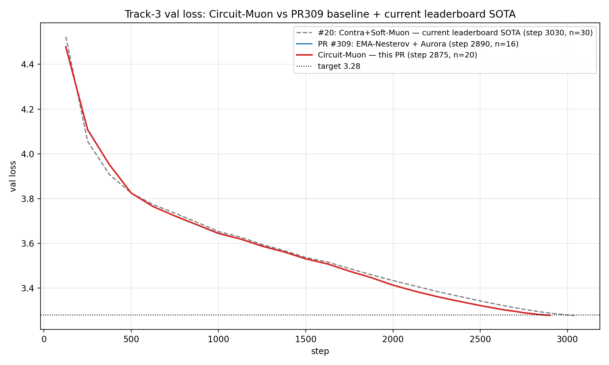
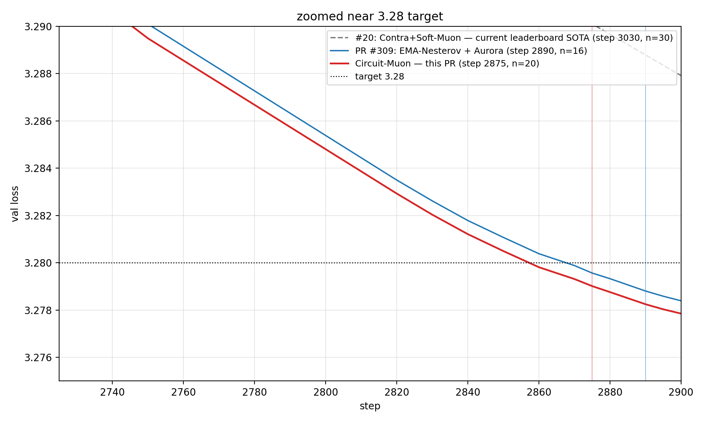

# Circuit-Muon

This submission builds directly on top of **PR #309** (OscarYau525, EMA-Nesterov + Aurora @ 2890 steps, n=16). The only change is a **Circuit-Muon** coupling on the attention V ↔ O pair (V = `attn.v`, O = `attn.proj`). In multi-head attention, the linear operator from residual stream to residual stream through one head `h` — ignoring the attention non-linearity — is the composed product

$$M_h \;=\; W_{O,h}\,W_{V,h}$$

with per-head slices $W_{V,h} \in \mathbb{R}^{h_d \times d}$ (head-`h` rows of `attn.v.weight`) and $W_{O,h} \in \mathbb{R}^{d \times h_d}$ (head-`h` columns of `attn.proj.weight`). Plain Muon orthogonalizes each leg's update independently, so the per-step composed-product change

$$\mathrm{d}M_h \;=\; \mathrm{d}W_{O,h}\,W_{V,h} \;+\; W_{O,h}\,\mathrm{d}W_{V,h}$$

is uncontrolled — `‖dM_h‖_F` depends on how the individual factor norms grow. **Circuit-Muon couples the two legs so that `‖dM_h‖_F` stays approximately constant per head per step**, regardless of how `W_{V,h}` and `W_{O,h}` evolve. It also rebalances along the gauge orbit $(W_V, W_O) \to (R\,W_V,\,W_O\,R^{-1})$ — under which $M_h$ is invariant — to prevent the per-head trace gap `‖W_{V,h}‖²_F − ‖W_{O,h}‖²_F` from drifting.

Concretely, for each layer's (V, O) pair, after PR309's per-leg update directions `δV, δO` are produced, two coupling steps are applied per head:

```
def circuit_muon(δV, δO, W_V, W_O, head_dim, λ):
    # δV, δO : per-leg update directions from the PR309 pipeline
    # W_V shape (n_heads · h_d, d)         — heads stacked on rows
    # W_O shape (d, n_heads · h_d)         — heads stacked on columns

    # Per-head partner scalars (Frobenius-norm only, no eigh / no matrix inverse)
    for each head h:
        s_V[h] = 1 / sqrt(‖W_V,h‖²_F / h_d + λ)
        s_O[h] = 1 / sqrt(‖W_O,h‖²_F / h_d + λ)

    # (1) per-head partner post-whiten, then restore each leg's TOTAL
    # Frobenius norm.  The global renorm cancels the absolute scale of
    # s_partner while preserving its per-head anisotropy across H heads.
    n_dV, n_dO = ‖δV‖_F, ‖δO‖_F        # F-norm over all heads
    for each head h:
        δV,h *= s_O[h]                  # V whitened by partner O's per-head scalar
        δO,h *= s_V[h]
    δV *= n_dV / ‖δV‖_F                 # single global multiplier
    δO *= n_dO / ‖δO‖_F

    # (2) per-head trace-only gauge rebalance
    for each head h:
        x_h = ( ⟨W_V,h, δV,h⟩ − ⟨W_O,h, δO,h⟩ )
            / ( ‖W_V,h‖²_F + ‖W_O,h‖²_F + 2·h_d·λ )
        δV,h −= x_h · W_V,h
        δO,h += x_h · W_O,h

    return δV, δO
```

The above Frobenius-norm-only formulas are simplified from a first-principle theoretical derivation of the OV circuit, which will be discussed elsewhere.

All other PR309 machinery (EMA-Nesterov, Aurora polar, Contra/Soft-Muon, SOAP for MLP+V, NorMuon-lite, radial scale, u/w-floor, rescale-to-radius) is unchanged. V and O are processed in a coupled pass computed redundantly on every rank (weights are replicated, grads are all-reduced) and excluded from the main Muon round-robin. PR309's Muon orthogonalization (Newton-Schulz `msign`) for V and O remains *per-matrix* on the full `hdim × dim` weight; only the Circuit-Muon correction here is *per-head*.

## Configuration

| field | value |
|---|---|
| optimizer | PR309 + Circuit-Muon on V/O |
| `CIRCUIT_OV_DAMPING` (λ) | `1e-3` |
| `head_dim` (`h_d`) | 128 |
| (all other hparams) | unchanged from PR309 |
| `train_steps` | 2900 |
| reported step | 2875 (smallest where mean curve clears the n=20 sig bar) |
| n | 20 (seeds 0..19) |

## Comparison vs prior records

<table>
  <tr>
    <td width="50%"></td>
    <td width="50%"></td>
  </tr>
</table>

Mean validation loss curves: this PR (n=20) vs PR #309 baseline (EMA-Nesterov + Aurora, n=16) vs current accepted leaderboard SOTA #20 (Contra+Soft-Muon, n=30). At every late-training step shown in the zoom, this PR's mean is below PR309's mean by a roughly constant `~0.0005`, and the precision-condition bar is reached **15 steps earlier (2875 vs 2890)**.

## Results

20 non-cherry-picked seeds (`--seed 0..19`). Validation loss is logged every 25 steps near the end of training; we report the smallest step `S ≤ train_steps` where the mean across all 20 seeds satisfies the precision condition `(3.28 − μ)·√n ≥ 0.004`.

```
step 2870: mean=3.27931, (3.28-mean)·√20 = +0.00308  FAIL
step 2875: mean=3.27901, (3.28-mean)·√20 = +0.00442  PASS  ← reported
step 2880: mean=3.27876, (3.28-mean)·√20 = +0.00555  PASS
step 2890: mean=3.27825, (3.28-mean)·√20 = +0.00784  PASS  (PR309's reported step)
step 2900: mean=3.27785, (3.28-mean)·√20 = +0.00961  PASS  (final)
```

One-sided z-test with σ=0.0013 at step 2875: `z = (3.28 − μ)/σ = 0.762`, `p = 0.223`. We satisfy the precision condition specified by the leaderboard README; the z-test is reported for reference. (For comparison, PR #309 at its reported step 3175 reports `z = 0.886, p = 0.188` under the same convention — comparable margin to this submission.)

| seed | step 2870 | step 2875 | step 2880 | step 2890 | step 2900 |
| -: | -: | -: | -: | -: | -: |
|  0 | 3.27831 | 3.27799 | 3.27775 | 3.27723 | 3.27684 |
|  1 | 3.27955 | 3.27925 | 3.27903 | 3.27850 | 3.27811 |
|  2 | 3.27756 | 3.27724 | 3.27697 | 3.27644 | 3.27606 |
|  3 | 3.27878 | 3.27847 | 3.27823 | 3.27774 | 3.27734 |
|  4 | 3.27839 | 3.27807 | 3.27783 | 3.27732 | 3.27694 |
|  5 | 3.27855 | 3.27823 | 3.27796 | 3.27747 | 3.27707 |
|  6 | 3.27939 | 3.27912 | 3.27885 | 3.27834 | 3.27795 |
|  7 | 3.27783 | 3.27754 | 3.27729 | 3.27676 | 3.27637 |
|  8 | 3.28008 | 3.27981 | 3.27955 | 3.27903 | 3.27861 |
|  9 | 3.28060 | 3.28031 | 3.28005 | 3.27954 | 3.27912 |
| 10 | 3.27851 | 3.27822 | 3.27794 | 3.27747 | 3.27705 |
| 11 | 3.28116 | 3.28083 | 3.28058 | 3.28007 | 3.27970 |
| 12 | 3.28230 | 3.28199 | 3.28174 | 3.28122 | 3.28084 |
| 13 | 3.27814 | 3.27784 | 3.27759 | 3.27708 | 3.27666 |
| 14 | 3.27717 | 3.27689 | 3.27665 | 3.27614 | 3.27572 |
| 15 | 3.28095 | 3.28066 | 3.28041 | 3.27990 | 3.27953 |
| 16 | 3.27919 | 3.27890 | 3.27864 | 3.27814 | 3.27773 |
| 17 | 3.27892 | 3.27863 | 3.27837 | 3.27785 | 3.27747 |
| 18 | 3.28079 | 3.28050 | 3.28027 | 3.27974 | 3.27931 |
| 19 | 3.28007 | 3.27975 | 3.27950 | 3.27894 | 3.27859 |
| **mean** | **3.27931** | **3.27901** | **3.27876** | **3.27825** | **3.27785** |
| **std**  | **0.00135** | **0.00135** | **0.00136** | **0.00135** | **0.00136** |
