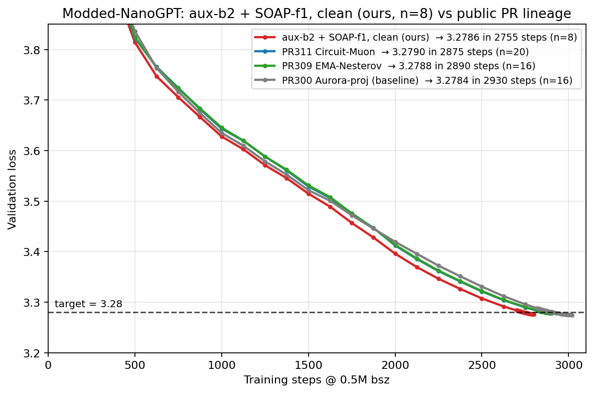
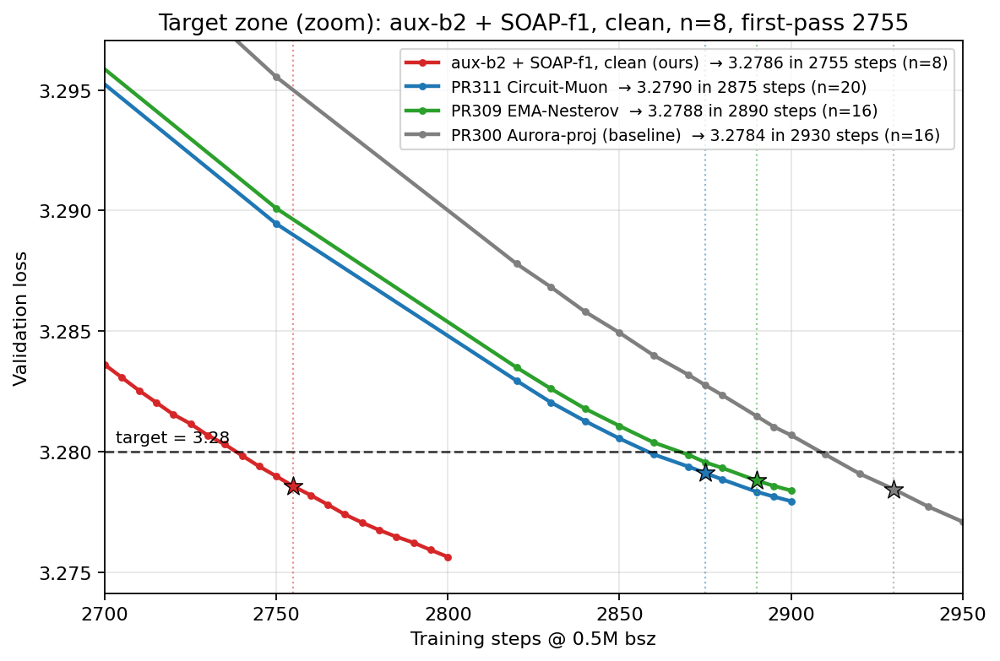

# Record: Track 3 Optimization -- aux-β2 + SOAP-f1, clean -- 2755 steps (n=8)

## TL;DR

Not a new optimizer: this is the existing **SOAP-Muon** (PR [#278](https://github.com/KellerJordan/modded-nanogpt/pull/278))
with an **auxiliary-β2 split** (longer 2nd-moment memory for the 1-D params — the single biggest lever),
SOAP **extended to all hidden matrices and refreshed every step**, and schedule/momentum tuning, on a
**cleaned-up** stack (seven redundant geometry modules removed).

Reaches **3.28 val loss in 2755 steps over n=8 seeds (0–7)** — mean 3.278565, significance
`(3.28 − mean)·√8 = 0.00406 ≥ 0.004` (just clears the bar; 2760 clears comfortably at 0.0051) — while
**shrinking the stack to 910 lines** (smaller and ~19% faster per step). This is **−20 steps below the
prior 2775 boundary** at lower loss and far simpler code.

Relative to the **2875 base (PR [#311](https://github.com/KellerJordan/modded-nanogpt/pull/311),
@liyang2019 — Circuit-Muon on EMA-Nesterov + Aurora)** it applies the local accuracy levers (SOAP on all
hidden matrices + every-step refresh, an auxiliary-β2 split, and schedule/momentum tuning) and **removes
seven redundant geometry modules — including Circuit-Muon itself** — that ablate neutral once the
all-hidden, every-step SOAP is in.

> Note: PR #309/#311 machinery is bundled into the script self-contained, so it reproduces standalone.

## Changes (vs the 2875 base, PR #311)

Every constant that differs from the PR #311 code is listed. The parenthetical is the approximate effect
on the first-passing boundary where measured; the removals are loss-neutral (verified identity / within
GPU noise) and their win is **998 → 910 lines (−88) + ~19% faster/step**. Cumulative (n=8):
**2875 → 2830 → 2800 → 2775 → 2755.**

**Added / changed — local accuracy levers:**

1. **Auxiliary-Adam β2 split** — non-gain aux `β2 0.99 → 0.997`, `attn.proj.bias 0.99 → 0.9965` (gains stay
   0.99). Longer 2nd-moment memory for the under-smoothed 1-D bias group. ***≈ −45 steps (2875 → 2830);
   largest single local lever.***
2. **SOAP coverage `mlp_plus_v` → `all_hidden`** (adds q, k, attn.proj — every hidden 2-D matrix) **+
   `SOAP_PRECONDITION_FREQUENCY` 10 → 1** (every-step eigenbasis refresh). ***≈ −30 steps (2830 → 2800).***
3. **LR cooldown horizon `FINAL_SCHEDULE_STEPS` 2980 → 2900** (lever pointed out by @kaiyue-wen).
   ***≈ −25 steps (2800 → 2775).***
4. **Muon-momentum cooldown `MU_COOLDOWN` 100 → 200** (momentum cools from step 2700; late-dynamics / margin).

***Change 4 and the removals below together account for the final ≈ −20 steps (2775 → 2755).***
(One further small init change — the CGI gain-split α — is listed in the config table only.)

**Removed — modules present in PR #311 that ablate neutral on this stack:**

5. **Circuit-Muon** (`CIRCUIT_OV_DAMPING`; the PR #311 headline — per-head OV coupling).
6. **Contra-Muon** (`CONTRA_MUON_COEFF -0.2 → 0`).
7. **Soft-Muon** (`SOFT_MUON_CEIL`; the Schatten-soft orthogonalization branch).
8. **Aurora** wide-matrix row-rescale (`_AURORA_K 3 → 0`; Newton-Schulz reverts to standard Muon).
9. **attn-SOAP denominator floor** (`ATTN_SOAP_DENOM_FLOOR 0.55 → 0`; note the SOAP `denom_power=0.50` is
   a *different* knob and is kept unchanged).
10. **V-SOAP-blend** (`V_SOAP_BLEND 0.95 → 1.0`; attn.v now full SOAP).
11. **NorMuon-lite per-row 2nd-moment** (the Adafactor-like row/col variance half of Skylight-001; was
    inert, `NOR_BETA2=1.0` → identity) + dead `MUON_WEIGHT_DECAY` + dead code. **Only the u/w-floor half of
    NorMuon-lite is retained.**

**Unchanged from PR #311 (kept, load-bearing):** u/w-floor `TARGET_UW=0.3825`, radial dampening +
rescale-to-radius, attn trust gate + early-trust-floor, EMA-Nesterov (`0.3 / 0.99 / 300 / rest−950`),
PowerCool LR `power=1.2`, Muon-μ warmup/cooldown schedule, SOAP core (`β2=0.90`, `denom_power=0.50`),
`MU=0.95`, `MUON_LR=0.0375`, depth-scaled `mlp.fc` init (`0.30`, unchanged).

## Configuration

| field | value (was, in PR #311) |
|---|---|
| `SOAP_PARAM_MODE` | `all_hidden` (was `mlp_plus_v`) |
| `SOAP_PRECONDITION_FREQUENCY` | `1` (was `10`) |
| non-gain aux `β2` / `attn.proj.bias` `β2` | `0.997` / `0.9965` (were `0.99` / `0.99`) |
| `FINAL_SCHEDULE_STEPS` | `2900` (was `2980`) |
| `MU_COOLDOWN` | `200` (was `100`) |
| `_CGI_ALPHA` (init) | `0.125` (was `0.14`) |
| u/w-floor `TARGET_UW` | `0.3825` (unchanged) |
| SOAP denom floor / V-blend | removed (`0` / `1.0`; were `0.55` / `0.95`) |
| Contra / Circuit / Soft-Muon / Aurora | removed (all present in #311) |
| `FINAL_TRAIN_STEPS` / `FINAL_LR_POWER` | `2900` / `1.2` |

## Result

n = 8 non-cherry-picked seeds (0–7), run to step 2850. Validation loss around the crossing:

| seed | step 2750 | step 2755 | step 2760 | step 2775 |
|---:|---:|---:|---:|---:|
| 0 | 3.27965 | 3.27925 | 3.27884 | 3.27770 |
| 1 | 3.27814 | 3.27771 | 3.27733 | 3.27619 |
| 2 | 3.27948 | 3.27906 | 3.27874 | 3.27761 |
| 3 | 3.27995 | 3.27955 | 3.27918 | 3.27806 |
| 4 | 3.27984 | 3.27941 | 3.27905 | 3.27790 |
| 5 | 3.27748 | 3.27705 | 3.27668 | 3.27556 |
| 6 | 3.27849 | 3.27809 | 3.27771 | 3.27657 |
| 7 | 3.27885 | 3.27840 | 3.27806 | 3.27691 |
| **mean** | **3.278985** | **3.278565** | **3.278199** | **3.277062** |
| **(3.28 − mean)·√8** | **0.00287 (✗)** | **0.00406 (✓)** | **0.00510 (✓)** | **0.00831 (✓)** |

**First-passing step = 2755** (n=8; sig 0.00406, the first bin clearing the 0.004 bar; 2750 fails at 0.00287).
2760 clears with more margin (0.0051); the first **25-step** boundary is **2775**.

## Files

- `train_gpt_clean_SOTA.py` — self-contained training script (910 lines; hyperparameters hardcoded, only
  `--seed` is a command-line argument). Byte-identical to the source embedded at the top of every log below.
- 8 `*.txt` reproducibility logs (seeds 0–7, each run to step 2850); each embeds the full source then the run.
- `figure.png`, `zoomed_figure.png` — n=8 loss curves vs prior records.

## Setup & credits

This record was produced by an autonomous research agent (**Claude Code**), adapted from the
[ScaleAutoResearch-Ramsey](https://github.com/ypwang61/ScaleAutoResearch-Ramsey) harness; this report was
written by Claude Code and the experiments were run by **Claude Code and Codex**. The local changes above
(SOAP all-hidden + freq=1, aux-β2 split, schedule/momentum tuning, the cleanup) were found by the agent.

Runs were on **8×A40**. Kept load-bearing components, with their upstream PRs:

| component | PR | author |
|---|---|---|
| u/w-floor hyperball (Skylight-001; its NorMuon 2nd-moment half removed) | #274 | @kumarkrishna |
| SOAP preconditioning on MLP (extended to all-hidden here) | #278 | @samacqua |
| SOAP for attention + trust gate (Trustlight) | #283 | @SPThole |
| PowerCool power-law LR schedule | #287 | @yash-oai |
| radial dampening + rescale-to-radius | #294 | @nilin |
| EMA-Nesterov lookahead | #309 | @OscarYau525 |
| LR-cooldown-horizon lever; hyperball + `freq=1` (KL-SOAP) inspiration | #267 / #272 / #290 | @kaiyue-wen |

> Removed in the simplification (no longer in the code): Aurora (#284) & Circuit-Muon (#311, @liyang2019);
> Contra-Muon (#275) & Soft-Muon (#291, @nilin — their radial dampening #294 is kept); CenterShrinkAdam
> (local). All ablate neutral on this stack.
