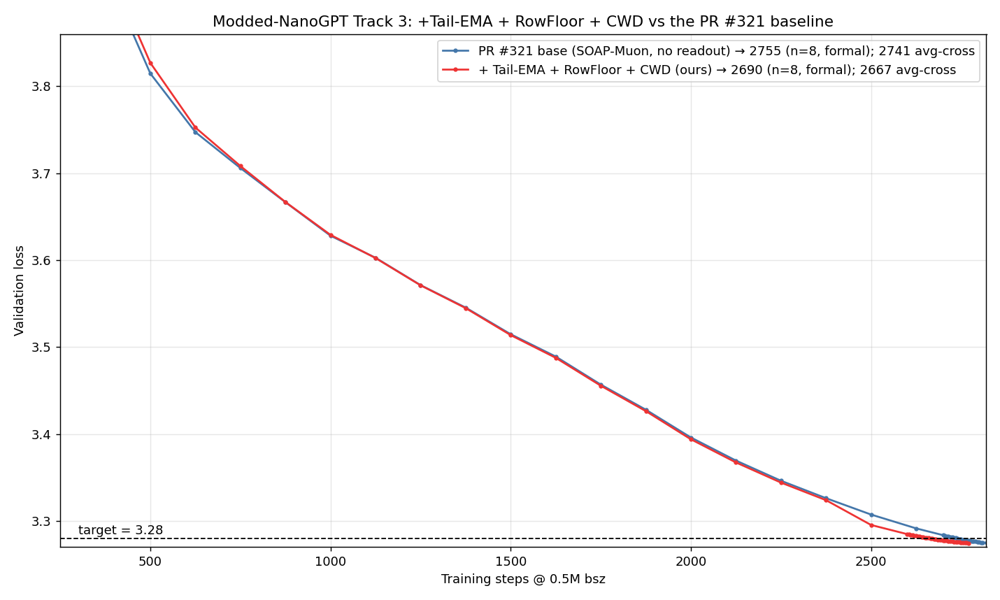
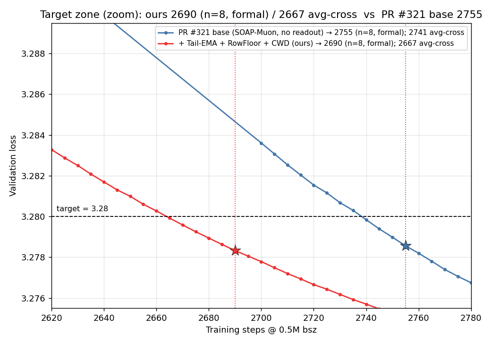

# Record: Track 3 Optimization -- Tail-EMA readout + RowFloor + Cautious Weight Decay -- 2690 steps (n=8)

## TL;DR

Not a new optimizer: this is the clean **SOAP-Muon** base from PR
[#321](https://github.com/KellerJordan/modded-nanogpt/pull/321) (the 2750/2755 "aux-β2 + SOAP-f1
clean" record) with **three small, independently-ablated levers** stacked on top, each on a
different axis chosen to survive the per-step **radius pin** (which re-pins each hidden matrix's
global Frobenius magnitude every step, so only **readout / directional / shape** changes persist):

1. **Tail-EMA eval readout** (PR [#325](https://github.com/KellerJordan/modded-nanogpt/pull/325), @jn2clark) — an
   eval-time-only partial weight-EMA blend over the cooldown tail. ***≈ −42 steps (avg-cross).***
2. **RowFloor** — a per-output-**row** u/w-floor on the orthogonalized update (replaces the scalar
   floor). ***≈ −18 steps (avg-cross).***
3. **Cautious Weight Decay (CWD)** — anisotropic per-coordinate decay, sign-gated to the coords the
   optimizer is already shrinking, applied **after** the radius pin. ***≈ −19 steps (avg-cross).***

All runs are on **A40** (2 GPUs; the global batch is world-size-independent, so 2-GPU matches the
benchmark's 8-GPU up to FP-summation order). We therefore compare against the **A40 PR #321 baseline
(2755, n=8)** — the same hardware. On **n = 8 seeds (0–7)**, run with the Tail-EMA readout the eval
model reaches 3.28 in **2690 steps**: mean `val_ema = 3.278329`, significance
`(3.28 − mean)·√8 = 0.00473 ≥ 0.004` (2685 fails at 0.00387). The **raw** (no-readout) crossing of the
same runs is **2735** (`(3.28 − mean)·√8 = 0.00468`); the readout buys the −45 in between. The per-seed
first val_ema crossing of 3.28 averages **2667**; the **2690** above is the formal stat-sig step, the
same convention PR #321 used for 2755. Net vs the A40 PR #321 baseline: **−65** (formal, 2755 → 2690) /
**≈ −74** (average crossing, 2741 → 2667).

The whole stack adds **+71 lines** over the 910-line PR #321 base.

## Changes (vs the clean PR #321 base)

Each lever is one isolated block; `CWD=0.0`, `ROWFLOOR=False`, `TAILEMA_TAU=0` recovers the PR #321
base. The three stack cleanly because each lives on a different radius-pin-surviving axis (a parallel
down-shift of the val_ema curve; the late descent slope is unchanged in every case). **Per-lever
deltas below are reported as average per-seed crossing (`avg-cross`), not the formal stat-sig step**,
because the three stages were run on slightly different seed sets/counts — avg-cross is the offset-free
contribution metric. (The formal stat-sig step is reported only for the final result; see Result.)

1. **Tail-EMA eval readout** (PR #325). Maintain `ema += (w − ema)/τ` (τ=150) over the tail
   `[2400, 2900]` for every parameter **except the token embedding**; at validation, evaluate the
   **partial** blend `w_eval = (1−λ)·w + λ·ema`, **λ=0.6**. Training is untouched — only the weights
   used for the val forward change. The partial (not full) blend cancels the late cross-valley
   oscillation while still tracking the descending floor (a full LAWA/SWA average *lags*; a forward
   BEMA push *overshoots* — both tested and rejected). ***≈ −42 (avg-cross: on the same runs, raw
   2745 → val_ema 2704; offset-free −41 on the base, −49/−52 stacked. The single biggest lever.)***
2. **RowFloor** — a per-output-row generalization of the scalar u/w-floor (Skylight-001, PR #274), and
   the one small original lever in this record (no prior public PR). For each output row whose update
   norm is below `TARGET_UW·‖row‖`, lift it to that target (RHO=1.0, no Frobenius renorm; the magnitude
   is then re-pinned, so only the per-row **shape** survives). A per-row shape change, immune to the
   radius pin. ***≈ −18 (avg-cross: +Tail-EMA 2704 → +RowFloor 2686, n=8).***
3. **Cautious Weight Decay** `CWD=0.025`, **POST-pin** (not novel — CWD was already used in Track-3 PR
   #265 by @alint77; Cautious Weight Decay, [arXiv:2510.12402](https://arxiv.org/abs/2510.12402)). Mask
   `m = 1[update·p > 0]` (the coords where
   the step `p ← p − lr·update` is already shrinking `|p|`); decay only those, `p ← p·(1 − lr·CWD·m)`,
   **after** `rescale_to_radius` so the per-coord shape change is not re-normalized away. Cautious ⇒
   WD never fights a coord the optimizer is trying to grow (isotropic WD is a no-op on the Muon path;
   the sign-gated version is not); per-coordinate ⇒ a matrix **shape** change, the one axis the radius
   pin leaves untouched.
   ***≈ −19 (avg-cross, matched seeds 0–7: +RowFloor 2686 → +CWD 2667). Dose is an inverted-U:
   0.0125 weak, 0.025 optimum, 0.05 over-shrinks.***

**Unchanged from PR #321 (kept, load-bearing):** SOAP on all hidden matrices (`freq=1`, `β2=0.90`,
`denom_power=0.50`), u/w-floor `TARGET_UW=0.3825` (here per-row), radial dampening +
rescale-to-radius (the radius pin), attn trust gate + early-trust-floor, EMA-Nesterov
(`0.3 / 0.99 / 300 / rest−950`), PowerCool LR (`power=1.2`, `t_end=2900`), `MU=0.95`,
`MUON_LR=0.0375`, aux-Adam β2 split, depth-scaled `mlp.fc` init.

## Configuration

| field | value (was, in PR #321) |
|---|---|
| `TAILEMA_TAU` / `TAILEMA_LAMBDA` | `150` / `0.6` (new; #325) |
| `TAILEMA_START` / `TAILEMA_END` | `2400` / `2900`, token embedding excluded (new) |
| `ROWFLOOR` / `ROWFLOOR_RHO` | `True` / `1.0`, per-row floor, no Frobenius renorm (was scalar floor) |
| `CWD` / CWD timing | `0.025` / POST-pin, mask `1[update·p>0]`, 2-D Muon params (new) |
| u/w-floor `TARGET_UW` | `0.3825` (unchanged) |
| `MUON_LR` / `MU` | `0.0375` / `0.95` (unchanged) |
| `FINAL_TRAIN_STEPS` / `FINAL_SCHEDULE_STEPS` / `FINAL_LR_POWER` | `2900` / `2900` / `1.2` (unchanged) |

## Result

**2×A40, n = 8 non-cherry-picked seeds (0–7).** Reported with the **Tail-EMA readout** (`val_ema`),
the readout this configuration ships (PR #325). Run to the dense tail; per-seed first val_ema
crossing of 3.28: `{2660, 2660, 2660, 2695, 2680, 2665, 2650, 2665}` (mean 2667).

| seed | step 2680 | step 2685 | step 2690 | step 2695 | step 2700 |
|---:|---:|---:|---:|---:|---:|
| 0 | 3.27858 | 3.27825 | 3.27795 | 3.27769 | 3.27741 |
| 1 | 3.27853 | 3.27823 | 3.27791 | 3.27765 | 3.27739 |
| 2 | 3.27840 | 3.27806 | 3.27776 | 3.27749 | 3.27723 |
| 3 | 3.28070 | 3.28039 | 3.28008 | 3.27979 | 3.27953 |
| 4 | 3.27995 | 3.27964 | 3.27935 | 3.27907 | 3.27877 |
| 5 | 3.27871 | 3.27840 | 3.27810 | 3.27783 | 3.27756 |
| 6 | 3.27772 | 3.27742 | 3.27713 | 3.27686 | 3.27658 |
| 7 | 3.27894 | 3.27865 | 3.27835 | 3.27806 | 3.27783 |
| **mean** | **3.278941** | **3.278630** | **3.278329** | **3.278055** | **3.277787** |
| **(3.28 − mean)·√8** | **0.00299 (✗)** | **0.00387 (✗)** | **0.00473 (✓)** | **0.00550 (✓)** | **0.00626 (✓)** |

**First-passing step = 2690** (val_ema; 2685 fails at 0.00387, 2690 clears at 0.00473).

The **raw** crossing (no readout) of the same 8 runs, for reference: mean at 2730 = 3.278736
(0.00357 ✗), at **2735** = 3.278345 (**0.00468 ✓**). Raw first-passing step = **2735**; the Tail-EMA
readout accounts for the −45 to 2690.

### Per-lever contributions (average per-seed crossing)

Per-lever deltas use **avg-cross** (mean per-seed step where val_ema first drops below 3.28), because
the three stages were run on slightly different seed sets — avg-cross is the offset-free contribution
metric. (The final result is additionally reported with the formal stat-sig step above.)

| stack | avg-cross | n | lever Δ (avg-cross) |
|---|---:|---:|---:|
| PR #321 base (no readout)¹ | 2745 (raw) | 4 | — |
| + Tail-EMA | 2704 | 4 | **Tail-EMA ≈ −42** |
| + RowFloor | 2686 | 8 | **RowFloor ≈ −18** |
| + Cautious Weight Decay (ours) | **2667** | 8 | **CWD ≈ −19** |

Each is a clean parallel down-shift of the val_ema curve (≈ −0.0015 / −0.0017 at every step in
`[2600,2800]`) with the late descent slope unchanged. The no-CWD and Tail-EMA-only control runs the
lineage above is computed from live in our research repository (not part of this submission). **Tail-EMA's
−42** is a same-runs raw→ema delta (the same n=4 runs) and **CWD's −19** is a matched-seed (0–7, n=8)
paired delta — both clean; only **RowFloor's −18** spans different seed counts (n=4 → n=8), so treat it as
an estimate.

¹ This base row is the 2×A40 proxy (= the raw crossing of the Tail-EMA-only runs, since the readout is
eval-only); it equals the published PR #321 A40 base (2741 avg-cross, n=8) within hardware noise. Because
the lineage uses this 2×A40 base, the per-lever deltas sum to slightly more than the headline net (which
is taken against the 8×A40 published base).

## Reproducing

Run `torchrun --standalone --nproc_per_node=<N> train_gpt_cwd_SOTA.py --seed <S>` (the Track-3
quickstart). All hyperparameters are hardcoded; only `--seed` varies. Dataset / batch (`8·64·1024`) /
architecture (`GPT(50304, 12, 768)`) / sequence length (1024) / validation (`cross_entropy
reduction="sum"`, `val_tokens=20·524288`) are byte-identical to
`records/track_3_optimization/train_gpt_simple.py`; one forward-backward per step; no third-party
optimizer import; the stopping rule (smallest 5-step boundary with `(3.28−mean)·√n ≥ 0.004`) is fixed
in advance.

## Files

- `train_gpt_cwd_SOTA.py` — clean, self-contained submission script (981 lines; hyperparameters
  hardcoded, only `--seed` is a command-line argument). Running it via the quickstart reproduces a run.
- `A40_seed{0..7}_*.txt` — the n=8 A40 logs the numbers above are computed from, each embedding its full
  source. These embed our env-gated research trainer; running that embedded source reproduces this result
  when launched with `ROWFLOOR=1 ROWFLOOR_FROB=0 ROWFLOOR_RHO=1.0 CWD=0.025 CWD_POST=1 TAILEMA_TAU=150
  TAILEMA_LAMBDA=0.6` (equivalently, `train_gpt_cwd_SOTA.py` hardcodes exactly these).
- `figure.png` — full descent: our final stack (val_ema, 2×A40, n=8) vs the published PR #321 baseline
  (raw, A40, n=8). `zoomed_figure.png` — target-zone zoom with the formal first-pass ★ for each (ours
  2690, base 2755).

## Setup & credits

This record was produced by an autonomous research agent (**Claude Code**), adapted from the
[ScaleAutoResearch-Ramsey](https://github.com/ypwang61/ScaleAutoResearch-Ramsey) harness; the report
was written by Claude Code and the experiments were run by **Claude Code and Codex** on **A40** GPUs.
The three levers, each on a different radius-pin-surviving axis:

| component | source | note |
|---|---|---|
| clean SOAP-Muon base (2750/2755) | PR [#321](https://github.com/KellerJordan/modded-nanogpt/pull/321) | @ypwang61 (this project's own published base) |
| **Tail-EMA eval readout** | PR [#325](https://github.com/KellerJordan/modded-nanogpt/pull/325) (@jn2clark) | the single biggest lever (≈ −42 avg-cross); adopted here |
| **Cautious Weight Decay** | [Cautious Weight Decay](https://arxiv.org/abs/2510.12402) (arXiv:2510.12402); also used in Track-3 PR [#265](https://github.com/KellerJordan/modded-nanogpt/pull/265) (@alint77) | not novel here — CWD was already used in Track-3 #265; we adopt it POST-pin on the SOAP-Muon stack (≈ −19 avg-cross) |
| **RowFloor** (per-output-row u/w-floor) | **a small original contribution here**, extending the u/w-floor of Skylight-001, PR [#274](https://github.com/KellerJordan/modded-nanogpt/pull/274) (@kumarkrishna) | the only genuinely new piece in this record: a per-output-row generalization of the scalar u/w-floor (no prior public PR); ≈ −18 avg-cross |

Kept load-bearing components inherited via PR #321, with their upstream PRs: u/w-floor hyperball
(#274, @kumarkrishna), SOAP-on-MLP→all-hidden (#278, @samacqua), SOAP-for-attn trust gate (#283,
@SPThole), PowerCool power-law LR (Yash Pande), radial dampening + rescale-to-radius (#294, @nilin),
EMA-Nesterov (#309, @OscarYau525), LR-cooldown-horizon + freq=1 inspiration (#267/#272/#290,
@kaiyue-wen).

---

*Generated by Claude Code.*
