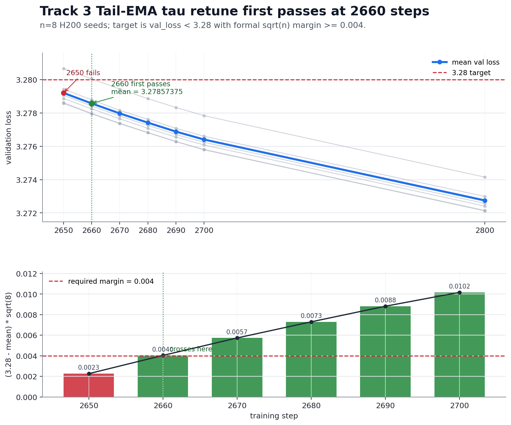

# Record: Track 3 Optimization - Tail-EMA tau retune - 2660 steps (n=8)

## TL;DR

This is not a new optimizer. It is a local retune of the current Track 3 SOAP-Muon lineage from PR
[#328](https://github.com/KellerJordan/modded-nanogpt/pull/328), which itself builds on the clean
SOAP-Muon base from PR [#321](https://github.com/KellerJordan/modded-nanogpt/pull/321).

The main change is a narrower Tail-EMA eval readout window:

```text
TAILEMA_TAU:    150 -> 120
TAILEMA_LAMBDA: 0.65
```

The rest of the PR #328 stack is kept: Tail-EMA eval readout, RowFloor per-output-row u/w floor,
post-pin Cautious Weight Decay, SOAP-Muon, radius pin, EMA-Nesterov lookahead, and PowerCool LR.

On n = 8 seeds (0-7), the formal Track 3 statistic first passes at **2660 steps**:

```text
mean val_loss at 2660 = 3.27857375
(3.28 - mean) * sqrt(8) = 0.00403404 >= 0.004
```

Step 2650 fails:

```text
mean val_loss at 2650 = 3.27920125
(3.28 - mean) * sqrt(8) = 0.00225921
```

So the formal first-passing step is **2660**.

## Changes vs PR #328

This keeps the PR #328 readout/shape stack and retunes the late Tail-EMA readout dynamics.

| field | PR #328 / predecessor | this result |
|---|---:|---:|
| `TAILEMA_TAU` | `150` | `120` |
| `TAILEMA_LAMBDA` | `0.65` in local predecessor | `0.65` |
| `MUON_SCHEDULE_STEPS` | local tuned stack | `2875` |
| `MUON_LR_POWER` | local tuned stack | `1.183` |
| EMA-Nesterov `lookahead_stepsize` | local tuned stack | `0.325` |
| `ROWFLOOR_RHO` | `1.0` | `1.0` |
| `CWD` | `0.025` | `0.025` |

The local search found the Tail-EMA memory length to be narrow. The previous local best was
`tau=150, lambda=0.65`, around 2690 on the n=4 evaluator. Retuning to `tau=120` reached 2670 on n=4,
and the full n=8 run clears the formal statistic at 2660.

Nearby Tail-EMA values regressed in the local evaluator:

```text
tau=100  regressed
tau=115  regressed
tau=121  regressed
tau=125  regressed
```

## Result

n = 8 seeds, dense validation around the target zone.



| seed | step 2650 | step 2660 | step 2670 | step 2680 | step 2690 | step 2700 | step 2800 |
|---:|---:|---:|---:|---:|---:|---:|---:|
| 0 | 3.27887 | 3.27825 | 3.27765 | 3.27708 | 3.27655 | 3.27608 | 3.27241 |
| 1 | 3.27906 | 3.27842 | 3.27782 | 3.27726 | 3.27671 | 3.27624 | 3.27257 |
| 2 | 3.27943 | 3.27879 | 3.27816 | 3.27762 | 3.27708 | 3.27660 | 3.27299 |
| 3 | 3.27857 | 3.27795 | 3.27736 | 3.27682 | 3.27629 | 3.27579 | 3.27215 |
| 4 | 3.28066 | 3.28005 | 3.27943 | 3.27886 | 3.27833 | 3.27784 | 3.27415 |
| 5 | 3.27862 | 3.27797 | 3.27738 | 3.27682 | 3.27628 | 3.27581 | 3.27212 |
| 6 | 3.27920 | 3.27858 | 3.27800 | 3.27745 | 3.27692 | 3.27645 | 3.27278 |
| 7 | 3.27920 | 3.27858 | 3.27799 | 3.27744 | 3.27690 | 3.27643 | 3.27280 |
| **mean** | **3.27920125** | **3.27857375** | **3.27797375** | **3.27741875** | **3.27688250** | **3.27640500** | **3.27274625** |
| **margin** | **0.00225921** | **0.00403404** | **0.00573110** | **0.00730088** | **0.00881762** | **0.01016820** | **0.02051670** |

**First-passing step = 2660** under the same formal n=8 statistic convention used in PR #328.

## Interpretation

The working hypothesis is that PR #328's Tail-EMA eval readout remains the largest lever because it
changes the validation readout while leaving training untouched. Shortening `tau` from 150 to 120
reduces late-cooldown lag while still smoothing tail oscillation. The schedule horizon and lookahead
settings are kept at the locally tuned values that line up the raw trajectory with this readout window.

## Files

- `train_gpt_tailema120_2660.py` - self-contained solution artifact.
- `summary.tsv` - n=8 formal result table.
- `H200_seed{0..7}.txt` - full H200 seed logs with embedded source.
- `figure.png` - combined validation-loss and formal-margin plot.
- `PR_SUMMARY.md` - pull request summary.

## Credits

This is a retune of the PR #328 stack by @ypwang61, which builds on PR #321 and the surrounding
Track 3 SOAP-Muon lineage.

Key inherited components include Tail-EMA eval readout, RowFloor, Cautious Weight Decay, SOAP-Muon,
radial dampening + radius pin, EMA-Nesterov lookahead, and PowerCool LR cooldown.
