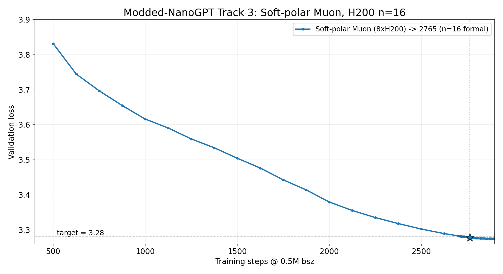
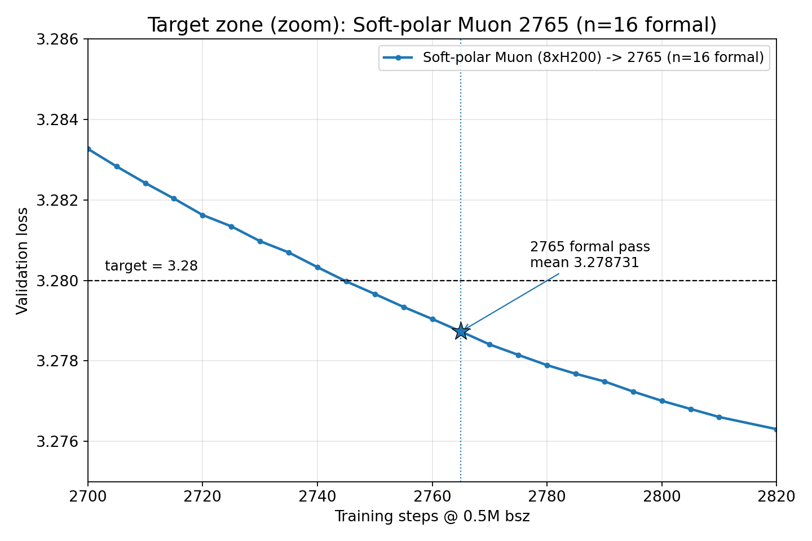

# PR submission — Soft-polar Muon, 2765 steps (n=16)

Track 3 submission materials for the Modded-NanoGPT Optimization Benchmark.

## Contents

| File | Purpose |
|---|---|
| `PR_DESCRIPTION.md` | PR body (paste into GitHub) |
| `train_gpt_simple.py` | self-contained training script (matches code embedded in each log) |
| `logs/softpolar_2765_seed0.txt` ... `seed15.txt` | 16 per-seed logs; each = full code + `====` + run output |
| `figure.png` | full validation-loss mean curve |
| `zoomed_figure.png` | target-zone zoom around the formal crossing |

## Headline

```
fixed step = 2765   n = 16   (0 crashes)
hardware = 8xH200
mean = 3.278731
(3.28 - mean) * sqrt(16) = 0.005077  >= 0.004   PASS
z = 3.906,  p = 4.7e-5
```





## Positioning

Soft-polar is an energy-preserving spectral-shaping modification to the Muon
update. It blends a small amount of the raw momentum spectrum back into the
orthogonalized Muon direction, then renormalizes to the original update energy.
The result is statistically significant at 2765 over 16 consecutive seeds on
8xH200, using the established SOAP-Muon stack.

## Mechanism

Standard Muon takes a momentum-like matrix update and applies Newton-Schulz
orthogonalization, producing an update close to `UV^T`: the singular directions
are kept, but the singular values are flattened. In the submitted code,
Soft-polar is inserted inside `muon_update`, immediately after
`zeropower_via_newtonschulz5(update)` and before the usual aspect-ratio scaling.
It keeps the orthogonalized Muon direction as the base, then blends back a small
amount of the raw momentum direction after matching its Gram-Frobenius energy to
the orthogonalized update:

```python
SOFT_POLAR_ALPHA = 0.20

ortho = newton_schulz(update)
o_fro = gram_frobenius_norm_estimate(ortho)
u_fro = gram_frobenius_norm_estimate(update)
raw_dir = update * (o_fro / u_fro)
blended = ortho + SOFT_POLAR_ALPHA * (raw_dir - ortho)
b_fro = gram_frobenius_norm_estimate(blended)
ortho = blended * (o_fro / b_fro)
```

So the update keeps Muon's orthogonalized direction, but it is no longer forced
to have a perfectly flat singular spectrum. Dominant directions from the raw
momentum retain slightly more weight, weaker directions slightly less, while the
Gram-Frobenius energy is renormalized back to the pure Muon update's energy.
Setting `SOFT_POLAR_ALPHA = 0` recovers the original Muon path.

## Compliance checklist (verified)

- [x] dataset / batch / architecture unchanged; one fwd-bwd per step
- [x] mean < 3.28 and (3.28-mean)*sqrt(n) >= 0.004
- [x] each logfile embeds full code; no third-party optimizer imports
- [x] reported step 2765 is identical for all 16 seeds; no per-run val early stop
- [x] 16 seeds all ran full 2900, 0 crashes, not cherry-picked

## Key distinction to disclose (in PR body)

Soft-polar vs Soft-Muon (PR #291): related names, different spectral effect.
Soft-Muon compresses the spectrum toward uniformity via f(sigma)=sigma^p inside
Newton-Schulz; Soft-polar increases anisotropy by blending the raw momentum
spectrum back into UV^T outside NS, energy-renormalized.

## Notes

- The reported step is the same 5-step boundary for all seeds: 2760 fails the
  aggregate threshold (0.003830), and 2765 is the first aggregate passing boundary
  in these fixed-step logs. Larger-margin steps (2780, 2800) are available from
  the same runs.
- in-log train_time is inflated (val every 5 steps over tail); benchmark scores
  step count not wall-clock.
- `PR_DESCRIPTION.md` contains the longer mechanism explanation and the full
  result table for the GitHub PR body.
