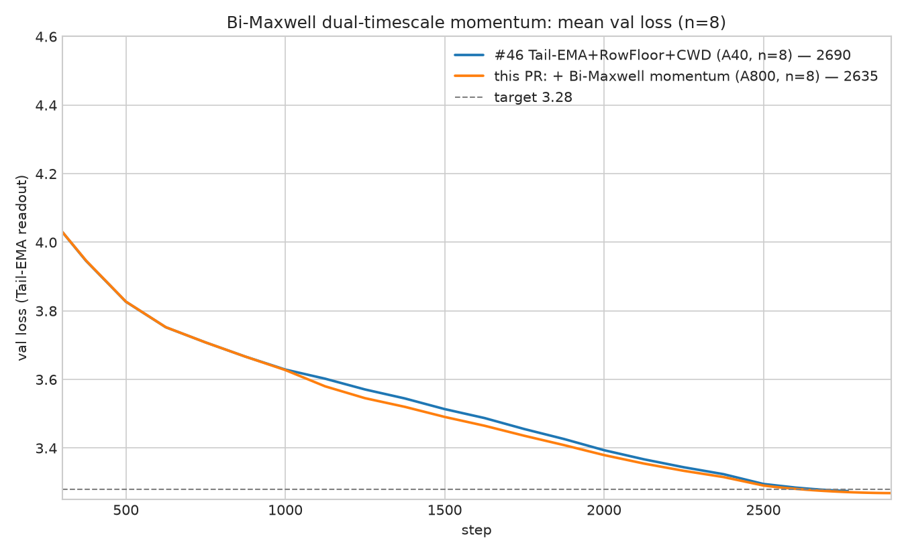

# Record: Track 3 Optimization — Bi-Maxwell dual-timescale momentum — 2635 steps (n=8)

## TL;DR

This is the PR [#328](https://github.com/KellerJordan/modded-nanogpt/pull/328) stack (#46, 2690
steps) plus **one new 23-line component**: from step 1000 onward, the Muon first moment's
single-EMA stress memory is replaced by a convex combination of two fixed-rate EMA buffers
(a **bi-Maxwell memory kernel**):

```python
# per hidden 2-D Muon param, step >= 1000:
M_fast.lerp_(g, 1 - 0.85)                     # fast unit, relaxation ~6 steps
M_slow.lerp_(g, 1 - 0.98)                     # slow unit, relaxation ~49 steps
M_eff = 0.4385 * M_fast + 0.5615 * M_slow     # kernel mean age ~30 steps
update = grad.lerp(M_eff, mu_t)               # scheduled Nesterov mix unchanged
```

Everything else in the #46 stack is unchanged (SOAP-Muon, Tail-EMA readout, RowFloor, CWD,
radius pin, EMA-Nesterov, PowerCool LR, mu schedule).

On **n = 8 seeds (0-7, A800)** the formal Track 3 statistic first passes at **2635 steps**:

```text
mean val_ema at 2635 = 3.27852,  (3.28 - mean) * sqrt(8) = 0.00419 >= 0.004
step 2630 fails: 0.00309
```

Per-seed first crossings: [2620, 2620, 2640, 2600, 2630, 2585, 2630, 2610] (mean 2617).
An independent H100 n=8 of the same recipe is in flight; an earlier variant of the recipe
(enable at 700) already passed an independent H100 n=8 at 2635.

Per-step wall-clock is unchanged (two extra `lerp_`s per hidden matrix, within rerun noise);
memory adds two momentum-sized buffers per hidden matrix.




## Why this works (short version)

Muon's momentum is an exponentially-weighted memory of past gradients with a single relaxation
time (mean age `mu/(1-mu) = 19` steps at mu=0.95). Physical stress-relaxation spectra are
generally not single-exponential; a two-timescale convex kernel gives the first moment a
fat-tailed memory at a controlled mean age. All three constants were set by measured
dose-response curves, each single-peaked:

1. **Kernel shape**: validated at mean-age parity with the baseline (age 19), where two
   different parameterizations (0.85/0.98 and 0.90/0.985) independently gave the same
   improvement — the gain comes from the kernel shape, not from changing the mean age.
2. **Mean age 30**: scanning the mixing weight over mean ages {15, 19, 25, 30, 36, 42}
   gives a clean single-peaked dose-response with the peak at 30; ages 15 and 42 both
   regress. The baseline's implicit age 19 sits left of the peak.
3. **Enable at step 1000**: enabling from step 0 regresses (+15 steps), 500 regresses,
   1000 is the peak, 1150 regresses — early in training the landscape shifts too fast for
   deep memory, and the deeper the kernel the later the optimal enable point. The switch is
   a plain hyperparameter schedule: at the enable step the buffers lazy-initialize to the
   current momentum, so that step's update is bit-identical to the baseline's.

Two controls worth noting:

- **Raw-readout control**: with the Tail-EMA eval readout disabled, the same n=8 passes the
  formal statistic at raw step 2690 — i.e. the raw model matches the previous record's
  readout-assisted number. The gain is in the training dynamics, not the readout.
- **Annealing control**: deepening the kernel only over the cooldown tail is neutral; the
  benefit accrues from the mid-training trajectory (the deep-memory run temporarily trails
  by up to 2e-2 mid-run and recovers it all, plus the gain, before the target zone).

Directions that did **not** survive (all preregistered): per-spectral-bucket adaptive
timescales (transient gain only), raising the Nesterov mix mu to 0.96/0.97 (monotone
regression), and stacking with a tail LR floor or robust readout variants (overlapping
benefit surface).

## Result

n = 8 seeds, A800, dense validation every 5 steps over [2500, 2800] (same fixed schedule
for every seed).

| seed | 2620 | 2630 | 2635 | 2640 | 2660 | 2690 |
|---:|---:|---:|---:|---:|---:|---:|
| 0 | 3.27981 | 3.27908 | 3.27871 | 3.27835 | 3.27707 | 3.27524 |
| 1 | 3.27978 | 3.27906 | 3.27868 | 3.27831 | 3.27702 | 3.27521 |
| 2 | 3.28123 | 3.28050 | 3.28011 | 3.27976 | 3.27847 | 3.27668 |
| 3 | 3.27846 | 3.27773 | 3.27733 | 3.27696 | 3.27570 | 3.27389 |
| 4 | 3.28050 | 3.27976 | 3.27940 | 3.27906 | 3.27775 | 3.27592 |
| 5 | 3.27738 | 3.27668 | 3.27627 | 3.27590 | 3.27461 | 3.27278 |
| 6 | 3.28071 | 3.28000 | 3.27960 | 3.27924 | 3.27793 | 3.27613 |
| 7 | 3.27913 | 3.27844 | 3.27804 | 3.27765 | 3.27638 | 3.27459 |
| **mean** | 3.27962 | 3.27891 | **3.27852** | 3.27815 | 3.27687 | 3.27506 |
| **margin** | 0.00106 | 0.00309 | **0.00419** | 0.00522 | 0.00886 | 0.01399 |

**First-passing step = 2635** under the same formal n=8 statistic convention as #44-#46.

## Files

- `train_gpt_bimaxwell_st1000.py` — self-contained solution artifact (#46 script + the
  23-line component; nothing else changed). All logfiles embed this exact script.
- `A800_seed{0..7}.txt` — full seed logs with embedded source.
- `summary.tsv` — n=8 formal result table.
- `figure.png`, `zoomed_figure.png`.

## Credits

Builds directly on the Track 3 SOAP-Muon lineage: PR
[#328](https://github.com/KellerJordan/modded-nanogpt/pull/328) (@ypwang61; Tail-EMA readout,
RowFloor, CWD), PR [#325](https://github.com/KellerJordan/modded-nanogpt/pull/325) (@jn2clark),
PR [#321](https://github.com/KellerJordan/modded-nanogpt/pull/321) (@ypwang61, @nooraovo), and
the EMA-Nesterov and radius-pin components inherited through that lineage.
