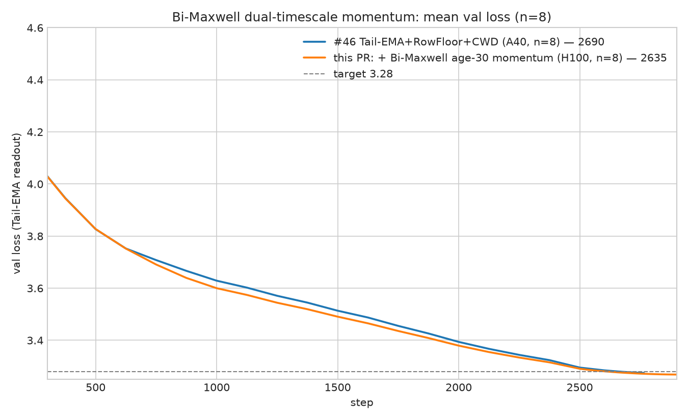
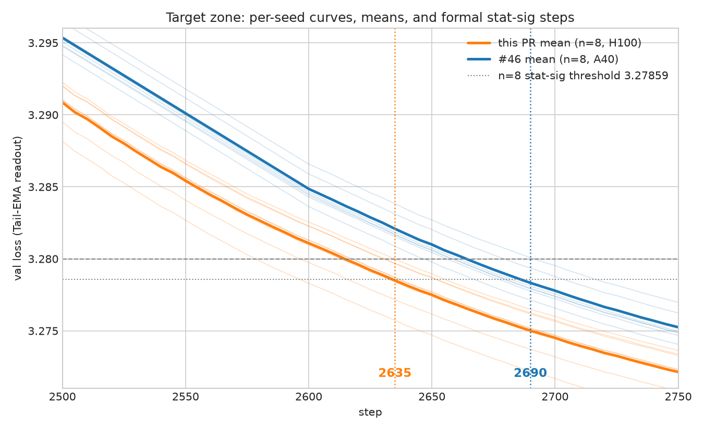

# Record: Track 3 Optimization — Bi-Maxwell dual-timescale momentum — 2635 steps (n=8)

## TL;DR

This is the PR [#328](https://github.com/KellerJordan/modded-nanogpt/pull/328) stack (#46, 2690
steps) plus **one new 23-line component**: the Muon first moment's single-EMA stress memory is
replaced, from step 700 onward, by a convex combination of two fixed-rate EMA buffers
(a **bi-Maxwell memory kernel**):

```python
# per hidden 2-D Muon param, step >= 700:
M_fast.lerp_(g, 1 - 0.85)                     # fast unit, relaxation ~6 steps
M_slow.lerp_(g, 1 - 0.98)                     # slow unit, relaxation ~49 steps
M_eff = 0.4385 * M_fast + 0.5615 * M_slow     # kernel mean age ~30 steps
update = grad.lerp(M_eff, mu_t)               # scheduled Nesterov mix unchanged
```

Everything else in the #46 stack is kept unchanged (SOAP-Muon, Tail-EMA readout, RowFloor,
CWD, radius pin, EMA-Nesterov, PowerCool LR, mu schedule).

On **n = 8 seeds (0–7, H100)** the formal Track 3 statistic first passes at **2635 steps**:

```text
mean val_ema at 2635 = 3.27850,  (3.28 - mean) * sqrt(8) = 0.00425 >= 0.004
step 2630 fails: 0.00320
```

An independent n = 8 on **A800** passes at **2655** (margin 0.00472); pooling all 16 runs
passes at 2640. Per-seed first crossings (H100): [2615, 2635, 2620, 2620, 2635, 2580, 2635, 2600].

Per-step wall-clock is unchanged (two extra `lerp_`s per hidden matrix, measured within rerun
noise); memory adds two momentum-sized buffers per hidden matrix.





## Why this works (short version)

Muon's momentum is an exponentially-weighted memory of past gradients with a single relaxation
time (mean age `mu/(1-mu) = 19` steps at mu=0.95). Physical stress-relaxation spectra are
generally not single-exponential; a two-timescale convex kernel gives the first moment a
fat-tailed memory at a controlled mean age. The three constants were set empirically:

1. **Kernel shape**: validated at mean-age parity with the baseline (age 19), where two
   different parameterizations (0.85/0.98 and 0.90/0.985) independently gave the same
   improvement — the gain comes from the kernel shape, not from changing the mean age.
2. **Mean age 30**: scanning the mixing weight over mean ages {15, 19, 25, 30, 36, 42}
   (paired forks from a step-700 checkpoint) gives a clean single-peaked dose-response with
   the peak at 30. Ages 15 and 42 both regress. Note the baseline's implicit age 19 sits
   left of the peak.
3. **Start at step 700**: enabling the kernel from step 0 regresses (+15 steps) — early in
   training the loss landscape shifts too fast for deep memory. The switch is a plain
   hyperparameter schedule: at the enable step the buffers lazy-initialize to the current
   momentum, so that step's update is bit-identical to the baseline's.

A control that anneals the kernel deep only over the cooldown tail is neutral: the benefit
comes from the mid-training trajectory (the deep-memory run temporarily trails by up to 2e-2
mid-run and recovers it all, plus the gain, before the target zone), not from a smoother
readout near the end.

Directions that did **not** survive (all tested with preregistered criteria): per-spectral-bucket
adaptive timescales (transient gain only), raising the Nesterov mix mu to 0.96/0.97 (monotone
regression; mu's optimum is insensitive to the kernel change), enabling at step 500, and
stacking with a tail LR floor or robust readout variants (overlapping benefit surface).

## Result

n = 8 seeds, H100, dense validation every 5 steps from 2500.

| seed | 2630 | 2635 | 2640 | 2645 | 2655 | 2690 |
|---:|---:|---:|---:|---:|---:|---:|
| 0 | 3.27876 | 3.27837 | 3.27802 | 3.27769 | 3.27703 | 3.27493 |
| 1 | 3.28005 | 3.27969 | 3.27934 | 3.27899 | 3.27835 | 3.27625 |
| 2 | 3.27908 | 3.27873 | 3.27834 | 3.27800 | 3.27733 | 3.27517 |
| 3 | 3.27907 | 3.27868 | 3.27833 | 3.27798 | 3.27733 | 3.27519 |
| 4 | 3.28002 | 3.27966 | 3.27932 | 3.27898 | 3.27834 | 3.27617 |
| 5 | 3.27610 | 3.27573 | 3.27534 | 3.27501 | 3.27433 | 3.27220 |
| 6 | 3.28036 | 3.27997 | 3.27963 | 3.27927 | 3.27859 | 3.27649 |
| 7 | 3.27752 | 3.27716 | 3.27681 | 3.27648 | 3.27582 | 3.27372 |
| **mean** | **3.27887** | **3.27850** | **3.27814** | **3.27780** | **3.27714** | **3.27501** |
| **margin** | 0.00320 | **0.00425** | 0.00526 | 0.00622 | 0.00809 | 0.01410 |

**First-passing step = 2635** under the same formal n=8 statistic convention as #44–#46.

## Files

- `train_gpt_bimaxwell_2635.py` — self-contained solution artifact (#46 script + the 23-line
  component; nothing else changed).
- `H100_seed{0..7}.txt` — full seed logs with embedded source.
- `summary.tsv` — n=8 formal result table.
- `figure.png`, `zoomed_figure.png`.

## Credits

Builds directly on the Track 3 SOAP-Muon lineage: PR
[#328](https://github.com/KellerJordan/modded-nanogpt/pull/328) (@ypwang61; Tail-EMA readout,
RowFloor, CWD), PR [#325](https://github.com/KellerJordan/modded-nanogpt/pull/325) (@jn2clark),
PR [#321](https://github.com/KellerJordan/modded-nanogpt/pull/321) (@ypwang61, @nooraovo), and
the EMA-Nesterov and radius-pin components inherited through that lineage.
