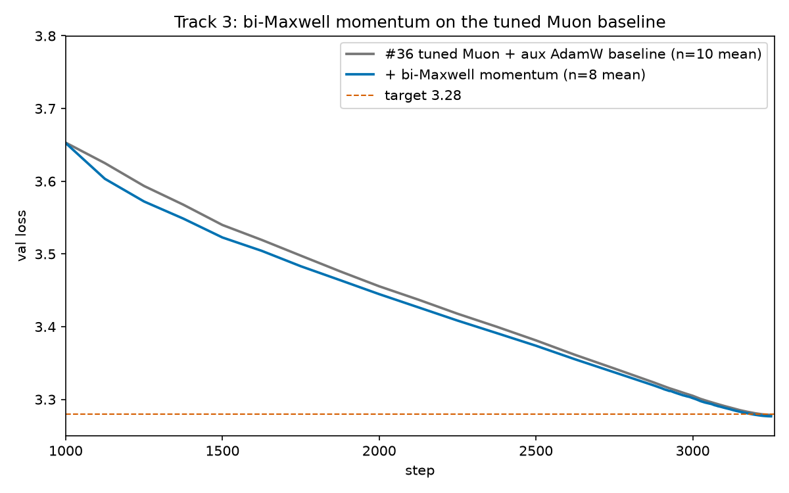
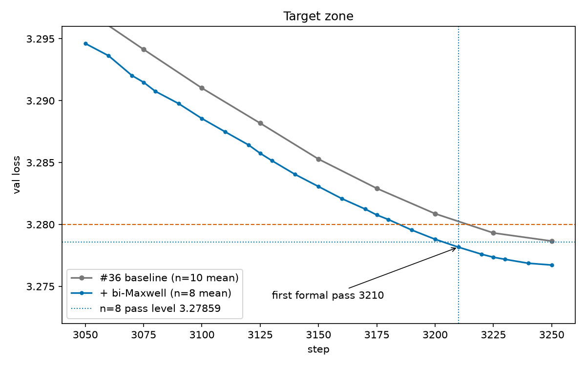

# Record: Track 3 Optimization — bi-Maxwell momentum on the tuned Muon baseline — 3210 steps (n=8)

## TL;DR

This is the **tuned Muon + aux AdamW baseline** (result #36, PR
[#323](https://github.com/KellerJordan/modded-nanogpt/pull/323)) plus **one change**: from
Muon step 1000 onward, the momentum's single-EMA memory is replaced by a convex combination
of two fixed-rate EMA buffers (a **bi-Maxwell memory kernel**):

```python
# per Muon 2-D param, step >= 1000:
m_fast.lerp_(g, 1 - 0.85)                     # fast unit, relaxation ~6 steps
m_slow.lerp_(g, 1 - 0.98)                     # slow unit, relaxation ~49 steps
m_eff = 0.4385 * m_fast + 0.5615 * m_slow     # kernel mean age ~30 steps
update = g.lerp_(m_eff, mu)                   # Nesterov mix unchanged
```

At the switch step both buffers lazy-initialize to the current single-EMA momentum, so that
step's update is bit-identical to the baseline's. Everything else — architecture, data,
batch size, one forward-backward per step, aux AdamW hyperparameters, LR schedule, weight
decay — is the #36 baseline, unchanged.

On **n = 8 seeds (0-7, A800, nothing held back)** the formal Track 3 statistic first passes
at **3210 steps**:

```text
mean val loss at 3210 = 3.27817,  (3.28 - mean) * sqrt(8) = 0.00518 >= 0.004
step 3200: 0.00338 (fails); step 3210 is the first pass
```

vs the #36 baseline at 3250 (n=10): **-40 steps**, and **pairwise statistically
significant** — in fact significant at every common tail step *without any step-count
extrapolation*: at the same step, the bi-Maxwell mean is ~2e-3 below the baseline mean
(3200: `0.00207/sqrt(1/8+1/10) = 0.00436`; 3225: `0.00413`; 3250: `0.00408`; all >= 0.004).
Under the README's endpoint convention the statistic is `0.00483 >= 0.004`.

Per-seed first crossings of 3.28: `[3210, 3180, 3175, 3200, 3190, 3210, 3170, 3190]`.

Per-step wall-clock is unchanged (two extra `lerp_`s per hidden matrix); memory adds two
momentum-sized buffers per hidden matrix.





## Why this works (short version)

Muon's momentum is an exponentially-weighted memory of past gradients with a single
relaxation time (mean age `mu/(1-mu) = 19` steps at mu=0.95). Physical stress-relaxation
spectra are generally not single-exponential; a two-timescale convex kernel gives the first
moment a fat-tailed memory at a controlled mean age. The constants come from dose-response
curves measured on a separate stack (see below) and were **frozen before** this fleet ran:

1. **Kernel shape vs mean age**: at mean-age parity with the baseline, two different
   parameterizations independently improve — the gain comes from the kernel shape, not
   from just lengthening the memory.
2. **Mean age 30**: a scan over mean ages {15, 19, 25, 30, 36, 42} is single-peaked at 30;
   both directions regress. Muon's implicit age 19 sits left of the peak.
3. **Enable at step 1000**: enabling deep memory from step 0 regresses — early in training
   the loss landscape shifts too fast for deep memory, so the kernel switches on after the
   fast-drift phase. The switch step's update is bit-identical to the baseline's by
   construction (lazy init).

A screening control on this exact baseline (single paired seed, screening grade): the
age-30 kernel improves the tail window by ~3e-3 while an **age-parity control**
(age-19-shaped kernel) *regresses* — the benefit tracks the kernel's mean age + shape, not
the mere presence of two buffers.

This component was first validated on the current record stack (PR
[#339](https://github.com/KellerJordan/modded-nanogpt/pull/339): 2690 → 2635 on the #46
stack). This entry isolates it on the canonical tuned baseline with no other components —
a per-optimizer result in the sense of the track README ("results which advance the
per-optimizer SOTA").

## Result

n = 8 consecutive seeds, A800, one GPU per run. Dense eval-only validation every 10 steps
over [2900, 3250], identical for every seed (rule 5: uniform selection).

| step | 3150 | 3175 | 3200 | **3210** | 3225 | 3250 |
|---:|---:|---:|---:|---:|---:|---:|
| mean (ours, n=8) | 3.28306 | 3.28098 | 3.27881 | **3.27817** | 3.27735 | 3.27672 |
| margin ×√8 | -0.00866 | -0.00278 | 0.00338 | **0.00518** | 0.00748 | 0.00927 |
| mean (#36, n=10) | 3.28438 | 3.28268 | 3.28087 | — | 3.27931 | 3.27866 |

**First formally-passing step = 3210.**

## Reproduce

```bash
torchrun --nproc_per_node=1 \
    records/track_3_optimization/results/20260715_bimaxwell_baseline_3210/train_gpt_bimaxwell_baseline.py --seed 0
```

## Files

- `train_gpt_bimaxwell_baseline.py` — self-contained solution artifact (#36 baseline script
  + the bi-Maxwell kernel; nothing else changed). All logfiles embed this exact script.
- `A800_seed{0..7}.txt` — full seed logs with embedded source.
- `summary.tsv` — n=8 result table over [3150, 3250].
- `figure.png`, `zoomed_figure.png`.

## Credits

Baseline: result #36 (tuned Muon + aux AdamW) by [@konstmish](https://github.com/konstmish)
(PR [#323](https://github.com/KellerJordan/modded-nanogpt/pull/323)); `train_gpt_simple.py`
by [@kellerjordan0](https://x.com/kellerjordan0). Related momentum-mixture prior work:
AggMo (Lucas et al., 2018), QHM (Ma & Yarats, 2019), AdEMAMix (Pagliardini et al., 2024) —
this entry differs in acting on the orthogonalized (Muon) update's first moment with a
convex two-timescale kernel at controlled mean age and a scheduled onset.
