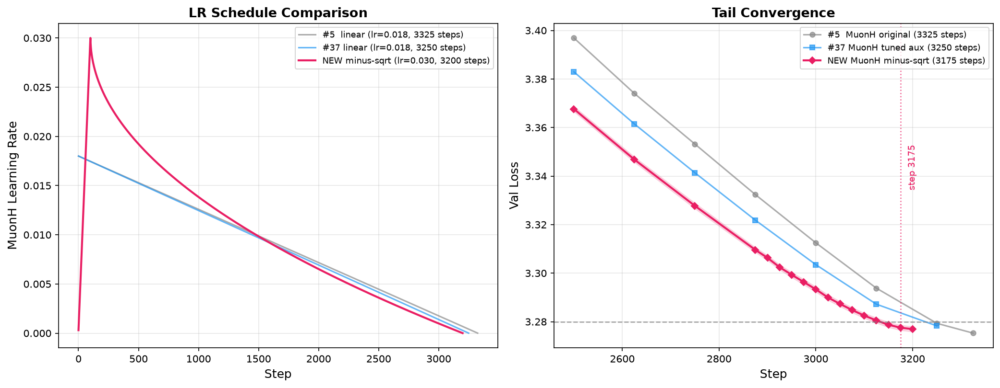

# MuonH with Minus-Sqrt LR Schedule

**Per-optimizer SOTA for MuonH: 3175 steps, 3.2775 (n=9)**

**TL;DR**. This submission improves the MuonH per-optimizer SOTA from 3250 steps (#37) to 3175 steps by replacing the linear LR cooldown for the MuonH optimizer with a **minus-sqrt schedule** (`η = 1 - √t`) and re-tuning the learning rate and warmup.

## Changes from result #37 (MuonH tuned aux)

| Hyperparameter | #37 (previous MuonH SOTA) | This submission |
| --- | --- | --- |
| MuonH LR schedule | Linear cooldown (cooldown_frac=1.0) | Minus-sqrt: `η = 1 - √(t)` where `t = (step - warmup) / (total - warmup)` |
| MuonH LR | 0.018 | **0.030** |
| MuonH warmup | None | **100 steps linear warmup** |
| AdamW aux schedule | Linear cooldown (cooldown_frac=0.85) | Unchanged |
| AdamW aux hyperparams | Same as #36 baseline | Unchanged |
| train_steps | 3250 | 3200 |

> The **higher LR** (0.030 vs 0.018) compensates for the faster decay of the minus-sqrt schedule, which decays more aggressively early on but has a longer tail than linear decay.

## Results

9 non-cherry-picked runs on 8×H20:

| Step | Mean val_loss | Stat sig value | Pass? |
| --- | --- | --- | --- |
| 3100 | 3.28252 | -0.00755 | no |
| 3125 | 3.28054 | -0.00161 | no |
| 3150 | 3.27874 | 0.00379 | no |
| **3175** | **3.27752** | **0.00744** | **YES** |
| 3200 | 3.27694 | 0.00917 | YES |

Statistical significance condition: `(3.28 - 3.27752) × √9 = 0.00744 ≥ 0.004` ✓

## Comparison with previous MuonH results

| # | Steps | Mean val_loss | Description |
| --- | --- | --- | --- |
| #5 | 3325 | 3.2782 (n=10) | MuonH original |
| #37 | 3250 | 3.2786 (n=10) | MuonH tuned aux |
| **NEW** | **3175** | **3.2775 (n=9)** | **MuonH minus-sqrt schedule** |

Improvement: **75 steps** (2.3%) over the previous MuonH SOTA (#37).

## Acknowledgement 

Collaboration with @Garios_wenjie, @Yufei-Gu-451, and @Juqiu-Wang. Many thanks to the Tencent Hunyuan team for providing the computational resources.