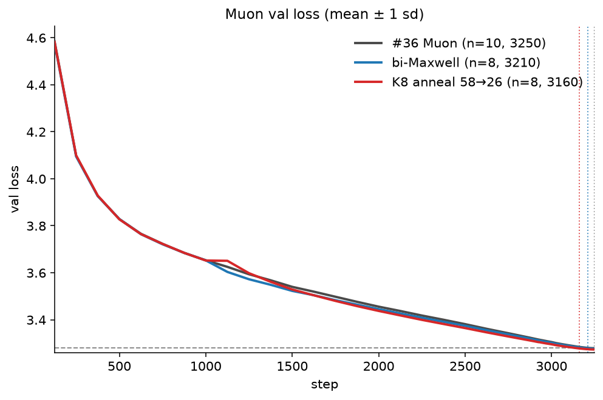
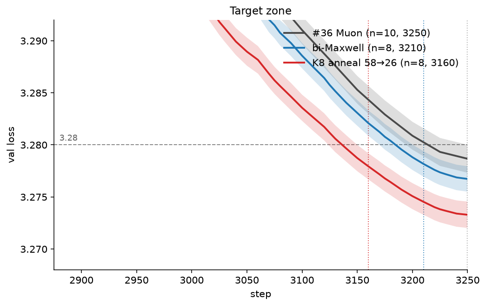
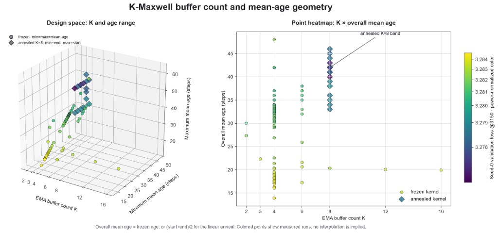
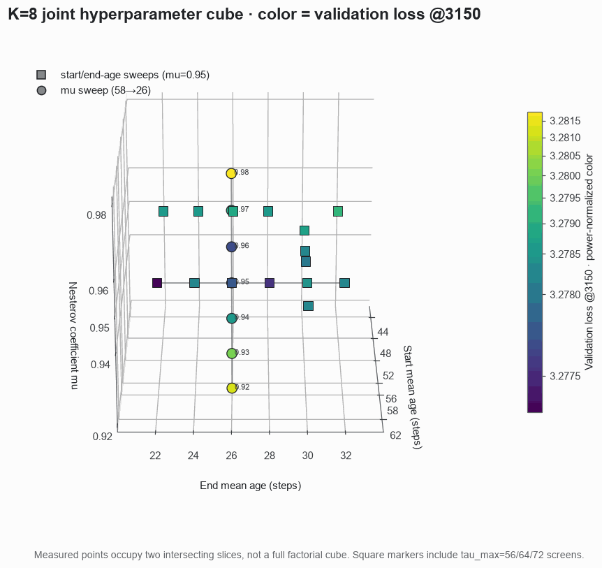

# Record: Track 3 Optimization — K-Maxwell annealed momentum on the tuned Muon baseline — 3160 steps (n=8)

Collaborator: [Jeffrey Cheng](https://github.com/jeffreycider) ([@jeffreycider](https://github.com/jeffreycider)).

## TL;DR

This is [PR #340](https://github.com/KellerJordan/modded-nanogpt/pull/340)'s trainer
(tuned Muon + aux AdamW, result #36) plus **one change**: the two-buffer bi-Maxwell
mix is replaced by **K=8 log-spaced EMA buffers** (decay rates 0.75 … 64/65). The
buffers' decay rates are fixed.

However, from step 1000 through step 3250, the active mixture weights are linearly interpolated between two start and end weight vectors. The start vector has aggregate mean age 58, and the end vector has aggregate mean age 26.

```python
# per Muon 2-D param, step >= 1000:
for k, beta in enumerate(kmaxwell_decay_rates):  # 8 log-spaced τ in [3, 64]
    m[k].lerp_(g, 1 - beta)
frac = (step - 1000) / 2250
w = (1 - frac) * w_age58 + frac * w_age26        # mixture mean age 58 → 26
m_eff = sum(w[k] * m[k] for k in range(8))
update = g.lerp_(m_eff, mu)                       # Nesterov mix unchanged
```

At the switch step all eight buffers lazy-initialize to the current single-EMA momentum, so that step's update is identical to the bimaxwell baseline's. Everything else: architecture, data, batch size, one forward-backward per step, aux AdamW hyperparameters, LR schedule, weight decay, is the #36 baseline, remain unchanged.

On **n = 8 seeds (0–7, 8×H100)** the formal Track 3 statistic first passes at **3160 steps**:

```text
mean val loss at 3160 = 3.27794,  (3.28 - mean) * sqrt(8) = 0.00584 >= 0.004
step 3150: 0.00360 (fails); step 3160 is the first pass
```

vs the #36 baseline at 3250 (n=10): **−90 steps**, and **pairwise statistically
significant** at every common tail step (3200: LHS `0.0122`; 3250: LHS `0.0113`;
both ≥ 0.004). Per-seed first crossings of 3.28:
`{3130, 3125, 3130, 3140, 3150, 3170, 3140, 3140}` (mean 3141). The **3160**
above is the formal stat-sig step, the same convention #36 used for 3250.

This improves on the Muon SOTA, result #36, but does not generalize to SOAP (see
the negative result over baseline #46 in the companion [2680
record](https://github.com/jacknzheng/kmaxwell-sota/tree/track3-kmaxwell-sota/records/track_3_optimization/results/20260824_kmaxwell_2680)).





## Why this works (short version)

Bi-maxwell begins training with standard single-decay EMA momentum buffer and switches at minibatch 1000 to a linear combination of two EMA momentum buffers. Instead of $k=2$ buffers, we generalize momentum at time $T$ to a linear combination of $k=8$ buffers as:

$$
m(T)=\sum_{k=1}^{K}w_k\sum_{\tau=0}^{T}(1-\beta_k)\,\beta_k^{T-\tau}g_\tau
$$

The buffer mean ages $\tau_k$ are log-uniformly spaced from 3 to 64 steps, with
$\beta_k = \dfrac{\tau_k}{\tau_k+1}$. The mixture coefficients $w_k(T)$ are tuned.


Even with extensive tuning, the more expressive fixed-weight $k=8$ momentum
implementation did not produce a win in the configurations tested.



However,
linearly annealing from one tuned set of coefficients
$w_1^{(1000)}, …, w_8^{(1000)}$ to another set $w_1^{(end)}, …, w_8^{(end)}$
quickly demonstrated convincing wins.

The starting and ending coefficients were tuned jointly. The measured points
below are intersecting slices of the start-age, end-age, and Nesterov-coefficient
search.



This may be further evidence that exposing expressiveness in momentum scheduling
can unlock additional wins. We hope this eventually admits a concise,
parsimonious theory.

## Configuration

| field                            | value (was, in #36)                                                       |
| -------------------------------- | ------------------------------------------------------------------------- |
| K-Maxwell `k` / `[τ_min, τ_max]` | `8` / `[3, 64]`                                                           |
| mix weights (start, age 58)      | `0.005094,0.010188,0.015282,0.020376,0.025470,0.030564,0.035658,0.857369` |
| mix weights (end, age 26)        | `0.032262,0.064524,0.096786,0.129047,0.161309,0.193571,0.225833,0.096669` |
| anneal                           | linear lerp over post-1000 steps, `anneal-frac=1.0`                       |
| enable at                        | step 1000 (lazy-init identity)                                            |
| `MUON_LR` / `MU` / aux AdamW     | unchanged from #36                                                        |
| `train_steps`                    | 3250 (unchanged)                                                          |

## Result

**8×H100, n = 8 seeds (0–7).** Raw `val_loss` (this trainer
has no Tail-EMA readout). Dense eval-only validation every 10 steps over
`[2900, 3250]`, identical for every seed (rule 5: uniform selection).

| seed                 | step 3150       | step **3160**   | step 3170       | step 3200       | step 3250       |
| -------------------- | --------------- | --------------- | --------------- | --------------- | --------------- |
| 0                    | 3.27779         | 3.27702         | 3.27626         | 3.27419         | 3.27240         |
| 1                    | 3.27717         | 3.27643         | 3.27562         | 3.27353         | 3.27174         |
| 2                    | 3.27772         | 3.27688         | 3.27615         | 3.27405         | 3.27224         |
| 3                    | 3.27882         | 3.27797         | 3.27725         | 3.27511         | 3.27333         |
| 4                    | 3.27996         | 3.27916         | 3.27834         | 3.27625         | 3.27451         |
| 5                    | 3.28098         | 3.28020         | 3.27947         | 3.27735         | 3.27557         |
| 6                    | 3.27902         | 3.27824         | 3.27744         | 3.27534         | 3.27357         |
| 7                    | 3.27835         | 3.27759         | 3.27685         | 3.27474         | 3.27290         |
| **mean**             | **3.27873**     | **3.27794**     | **3.27717**     | **3.27507**     | **3.27328**     |
| **(3.28 − mean)·√8** | **0.00360 (✗)** | **0.00584 (✓)** | **0.00800 (✓)** | **0.01394 (✓)** | **0.01900 (✓)** |

**First-passing step = 3160.**

| step             | 3150    | 3160        | 3175    | 3200    | 3210    | 3250    |
| ---------------- | ------- | ----------- | ------- | ------- | ------- | ------- |
| mean (ours, n=8) | 3.27873 | **3.27794** | 3.27677 | 3.27507 | 3.27453 | 3.27328 |
| mean (#36, n=10) | 3.28528 | —           | 3.28291 | 3.28087 | —       | 3.27866 |

Pairwise at 3250 vs #36: `(3.27866 − 3.27328) / √(1/8+1/10) = 0.0113 ≥ 0.004`.

## Reproducing

```bash
torchrun --standalone --nproc_per_node=8 \
    records/track_3_optimization/results/20260826_kmaxwell_3160/train_gpt_kmaxwell_anneal.py \
    --seed 0
```

All hyperparameters are hardcoded as defaults; only `--seed` varies. Dataset /
batch (`8·64·1024`) / architecture (`GPT(50304, 12, 768)`) / sequence length
(1024) / validation (`cross_entropy reduction="sum"`, `val_tokens=20·524288`)
are byte-identical to `records/track_3_optimization/train_gpt_simple.py`; one
forward-backward per step; no third-party optimizer import; the stopping rule
(smallest 10-step boundary with `(3.28−mean)·√n ≥ 0.004`) is fixed in advance.

## Files

- `train_gpt_kmaxwell_anneal.py` — clone of [PR #340](https://github.com/KellerJordan/modded-nanogpt/pull/340)'s
  trainer with the momentum kernel swapped for annealed K-Maxwell. It is
  self-contained and hardcodes the submitted recipe.
- `H100_seed{0..7}.txt` — the n=8 H100 logs the numbers above are computed from,
  copied verbatim from the `track3-kmaxwell-cwd-n8` run branch; each embeds its
  full research trainer source.
- `summary.tsv` and `compare_tail.tsv` — per-seed results and baseline comparison.
- `figure.png` — full descent vs #36 and the bi-Maxwell 3210 baseline.
  `zoomed_figure.png` — target-zone zoom.
- `kmaxwell_kernel_annealing.gif` — initial K-Maxwell memory profile vs the
  single-decay and bi-Maxwell kernels.
- `kmaxwell_age_analysis.png` — measured buffer-count and mean-age search geometry.
- `kmaxwell_start_end_mu_cube.gif` — intersecting start-age, end-age, and
  Nesterov-coefficient sweep slices.

## Other contributors

Thank you to [Jerry Hong](https://github.com/jerryhong21) ([@jerryhong21](https://github.com/jerryhong21)) for assisting us with this project.

## Setup & acknowledgements

Baseline: result #36 (tuned Muon + aux AdamW) by
[@konstmish](https://github.com/konstmish)
(PR [#323](https://github.com/KellerJordan/modded-nanogpt/pull/323));
`train_gpt_simple.py` by [@kellerjordan0](https://x.com/kellerjordan0).
Related momentum-mixture prior work: AggMo (Lucas et al., 2018), QHM (Ma &
Yarats, 2019), AdEMAMix (Pagliardini et al., 2024), and the two-timescale
bi-Maxwell kernel on this same baseline ([PR #340](https://github.com/KellerJordan/modded-nanogpt/pull/340), 3210). This entry differs in using
K>2 log-spaced ticks with a **time-varying** mean age.
