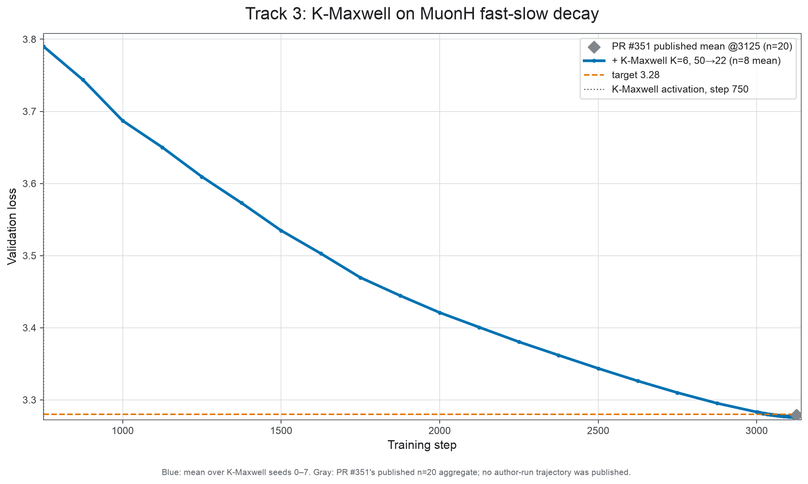
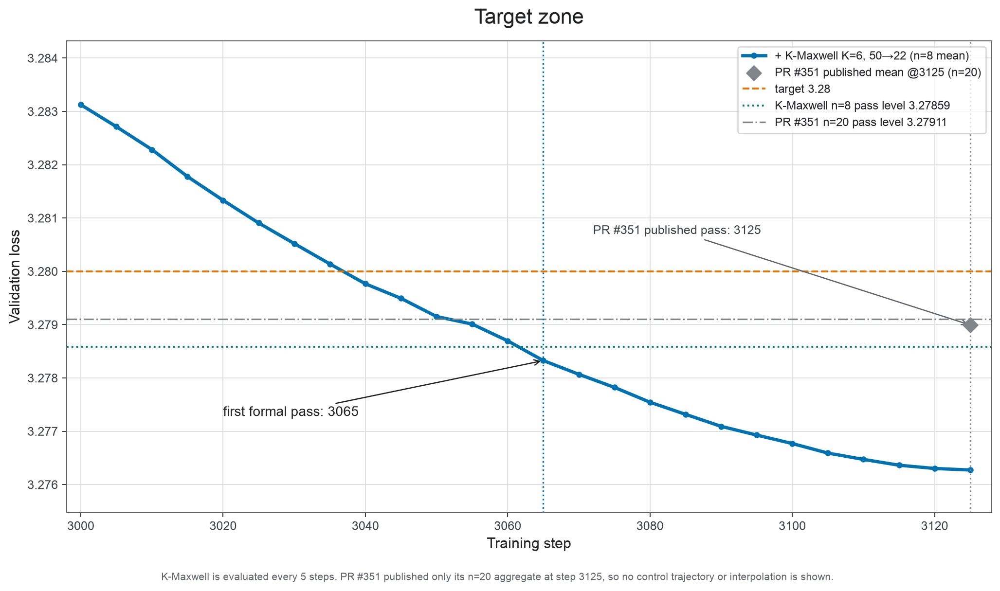
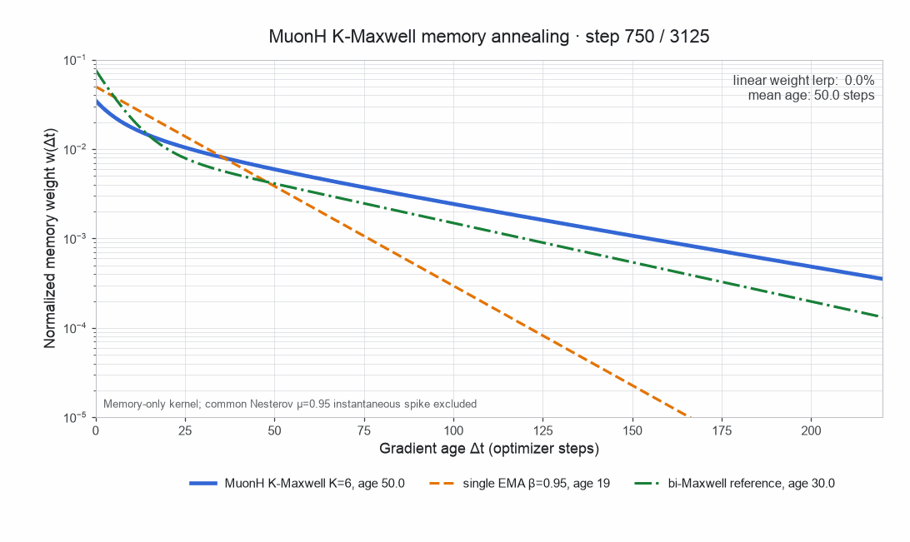
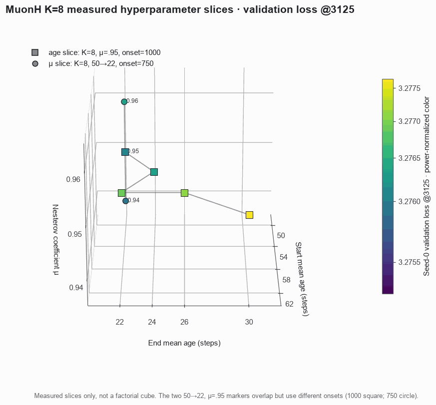
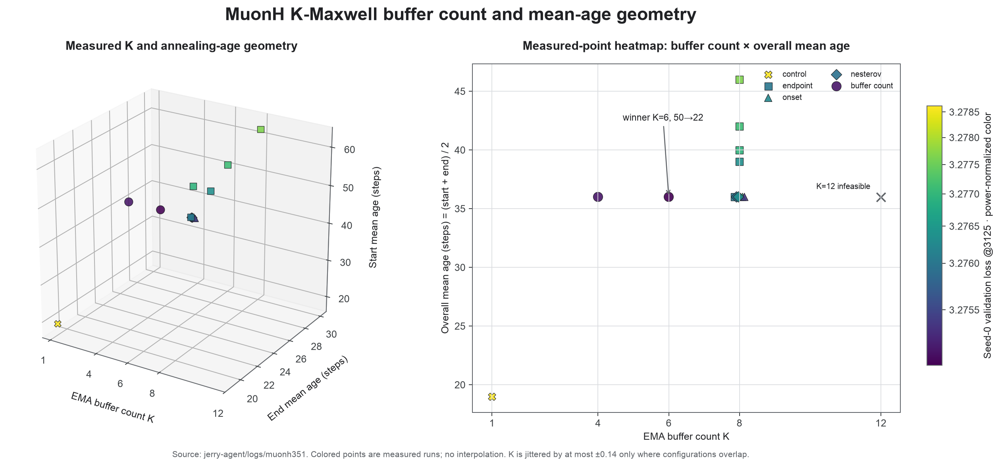

# Record: Track 3 Optimization — K-Maxwell on MuonH fast-slow decay — 3065 steps (n=8)

Collaborator: [Jeffrey Cheng](https://github.com/jeffreyscheng)([@jeffreyscheng](https://github.com/jeffreyscheng))

## Summary

This record applies K-Maxwell to
[PR #351](https://github.com/KellerJordan/modded-nanogpt/pull/351)'s MuonH
fast-slow-decay trainer. The only training change is the first-moment memory:
at step 750, MuonH's single EMA becomes a mixture of six log-spaced EMAs. The
mixture then anneals from a mean gradient age of 50 steps to 22 steps by the end
of training.

Across eight paired seeds, the Track 3 statistic first passes at **3065 steps**,
60 steps earlier than PR #351's 3125-step record:

```text
mean val loss at 3065 = 3.27833
(3.28 - mean) * sqrt(8) = 0.00473 >= 0.004
```

At the common 3125-step boundary, every K-Maxwell run beats its paired control.
The mean validation-loss improvement is `0.00284` (`t=21.2`, `df=7`).

## Method

For each MuonH matrix parameter:

```python
# step > 750; the switch step itself is baseline-identical
for k, beta in enumerate(kmaxwell_decay_rates):  # six log-spaced ages in [3, 64]
    m[k].lerp_(g, 1 - beta)
frac = (step - 750) / (3125 - 750)
w = (1 - frac) * w_age50 + frac * w_age22
m_eff = sum(w[k] * m[k] for k in range(6))
update = g.lerp_(m_eff, 0.95)
```

At the switch, all six buffers lazy-initialize from the just-advanced
single-EMA momentum. The switch-step update is therefore identical to the
baseline. Newton–Schulz orthogonalization, the Frobenius-norm-preserving
hyperball step, parameter groups, initialization, the four-phase MuonH learning
rate, and auxiliary AdamW are unchanged.

## Why the search space was small

As shown in the graphs below, our hyperparameter sweep was relatively limited. This is because our earlier [K-Maxwell result on tuned Muon](../20260824_kmaxwell_3160/README.md) had already identified a winning structure for optimizer momentum:

- log-spaced EMA timescales over approximately `[3, 64]`;
- annealing from older to younger gradient memory;
- Nesterov `μ` near `0.95`; and
- a lazy switch that leaves the baseline trajectory undisturbed at activation.

Our hyperparameter sweep first checked the known `58→26` recipe on MuonH, then tested nearby endpoint ages, activation times, buffer counts, and Nesterov coefficients. The winning `K=6`, `50→22`, step-750 configuration came from that narrow search.

## Generalization across Muon variants

The main generalization result is that the same memory schedule survives a
substantial change to the optimizer around it. K-Maxwell first worked on a
conventional tuned-Muon baseline. It also improves MuonH, which applies the
orthogonalized direction through a Frobenius-norm-preserving hyperball update
and uses a different, four-phase learning-rate schedule.

K-Maxwell changes the temporal filtering of gradient directions before Newton–Schulz orthogonalization and hyperball projection. Its improvement on both trainers suggests that temporal memory shaping works well despite different spatial normalization and step-size rules. The paired result supports that interpretation with all eight seeds improving at the same 3125-step boundary.

The scope is still limited to two Muon-family trainers on the same model,
dataset, and compute regime. It does not establish that K-Maxwell helps every
optimizer or every form of temporal averaging. The earlier study includes an
important counterexample: on a SOAP-CWD stack with Tail-EMA, adding momentum
annealing was redundant and hurt validation loss ([2680 results](https://github.com/jacknzheng/kmaxwell-sota/tree/track3-kmaxwell-sota/records/track_3_optimization/results/20260824_kmaxwell_2680)).

## Configuration

| field                  | value                                                                   |
| ---------------------- | ----------------------------------------------------------------------- |
| K / EMA mean-age range | `6` / `[3, 64]`                                                         |
| mixture anneal         | mean age `50 → 22`, linear                                              |
| K-Maxwell start        | step `750` (lazy-init identity)                                         |
| Nesterov coefficient   | `0.95`                                                                  |
| MuonH schedule         | warmup `100`, plateau to `200`, fast decay to `1750`, linear slow decay |
| MuonH LR               | peak `0.030`, floor `0.006`, minimum `0`, fast-decay exponent `0.6`     |
| training steps         | `3125`                                                                  |

## Result

The paired confirmation compares candidate seeds 0–7 with separate reruns of
the exact PR #351 trainer on the same hardware. Those reruns support the paired
statistics in this table. The loss figures below use the PR authors' published
n=20 result instead. Candidate validation is dense every five steps over
`[3000, 3125]`.

|     seed | candidate at 3125 | control at 3125 | candidate first `< 3.28` |
| -------: | ----------------: | --------------: | -----------------------: |
|        0 |           3.27593 |         3.27859 |                     3035 |
|        1 |           3.27546 |         3.27873 |                     3030 |
|        2 |           3.27800 |         3.28046 |                     3070 |
|        3 |           3.27627 |         3.27878 |                     3040 |
|        4 |           3.27572 |         3.27849 |                     3035 |
|        5 |           3.27664 |         3.28012 |                     3045 |
|        6 |           3.27533 |         3.27836 |                     3025 |
|        7 |           3.27684 |         3.27939 |                     3050 |
| **mean** |       **3.27627** |     **3.27912** |                        — |

- Candidate first statsig-passing boundary: **3065**, margin `0.00473`.
- Candidate margin at 3125: `0.01054`.
- Paired `control − candidate` at 3125: mean `0.00284`, standard deviation
  `0.00038`, `t=21.2`; every seed improves.
- Against PR #351's published n=20 mean (`3.278994`), the equal-step statistic
  is `0.00650`.

## Visualizations

### Loss curves and the formal crossing

The full curve shows the n=8 K-Maxwell trajectory and PR #351's official n=20 endpoint at step 3125 without inferring an unpublished control trajectory.



The target-zone view marks K-Maxwell's first n=8 formal pass at step 3065 and PR #351's official n=20 passing checkpoint at step 3125 against their sample-size-adjusted thresholds.



### The memory kernel becomes more responsive

The winning K=6 kernel shifts from long-horizon averaging toward recent gradients as its mean age anneals from 50 to 22, with single-EMA and bi-Maxwell kernels shown as fixed references.



### Measured endpoint-age and Nesterov slices

The rotating cube shows the two sparse K=8 [hyperparameter sweeps](https://github.com/jacknzheng/kmaxwell-sota/tree/jerry-agent/logs/muonh351) with step-3125 loss and endpoint ages at `μ=0.95` and onset 1000, plus Nesterov values for `50→22` and onset 750.



### The age schedule is robust to buffer count

The measured-point maps show that K=4, K=6, and K=8 perform similarly at the winning age schedule, with K=6 as the best.



## Reproducing

The winning schedule and K-Maxwell recipe are defaults; only the seed varies:

```bash
torchrun --standalone --nproc_per_node=8 \
    records/track_3_optimization/results/20260827_muonh_kmaxwell_3065/train_gpt_muonh_kmaxwell.py \
    --seed 0
```

## Files

- `train_gpt_muonh_kmaxwell.py` — self-contained minimized record trainer.
- `summary.tsv` — n=8 candidate/control values and statistical summary.
- `sweep.tsv` — seed-0 staged screen that selected the winning recipe.
- `H100_seed{0..7}.txt` — raw runs for the winning K=6 configuration.
- `figure.png` — K-Maxwell trajectory and PR #351's official n=20 endpoint.
- `zoomed_figure.png` — both records' formal passing checkpoints.
- `muonh_kmaxwell_kernel_annealing.gif` — winning K=6 memory anneal.
- `muonh_kmaxwell_start_end_mu_cube.gif` — measured endpoint/Nesterov slices.
- `muonh_kmaxwell_k_age_loss_maps.png` — buffer-count/mean-age loss map.

## Other contributors

Thank you to [Jerry Hong](https://github.com/jerryhong21)
([@jerryhong21](https://github.com/jerryhong21)) for assisting with this project.

## Acknowledgements

The MuonH fast-slow-decay baseline is
[PR #351](https://github.com/KellerJordan/modded-nanogpt/pull/351) by
[Yufei Gu](https://github.com/Yufei-Gu-451), with collaboration from
[@zzp1012](https://github.com/zzp1012),
[@Garios2](https://github.com/Garios2), and
[@Juqiu-Wang](https://github.com/Juqiu-Wang).
