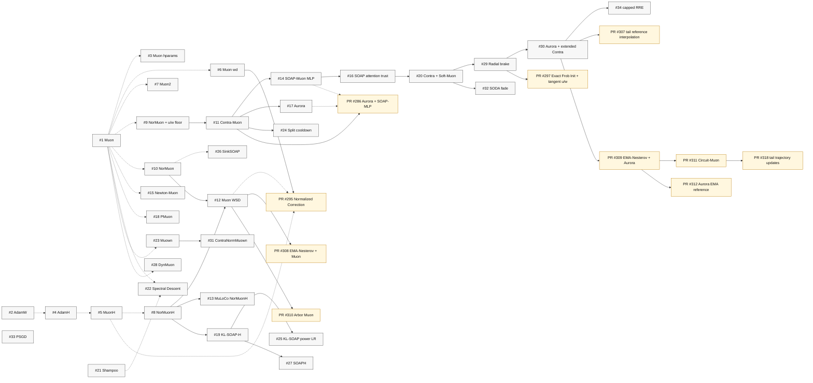

# Track 3 Results Dependency DAG

Solid edges are dependencies stated directly in the README, such as "Setup from #20" or "following #8".
Dotted edges are lighter inferred lineage links for variants of earlier result families.
Nodes labeled `PR #...` are open Track 3 pull requests that have not been accepted into the README results history yet.

Open Track 3 PRs included here:
[PR #286](https://github.com/KellerJordan/modded-nanogpt/pull/286),
[PR #295](https://github.com/KellerJordan/modded-nanogpt/pull/295),
[PR #297](https://github.com/KellerJordan/modded-nanogpt/pull/297),
[PR #307](https://github.com/KellerJordan/modded-nanogpt/pull/307),
[PR #308](https://github.com/KellerJordan/modded-nanogpt/pull/308),
[PR #309](https://github.com/KellerJordan/modded-nanogpt/pull/309),
[PR #310](https://github.com/KellerJordan/modded-nanogpt/pull/310),
[PR #311](https://github.com/KellerJordan/modded-nanogpt/pull/311),
[PR #312](https://github.com/KellerJordan/modded-nanogpt/pull/312),
and [PR #318](https://github.com/KellerJordan/modded-nanogpt/pull/318).

